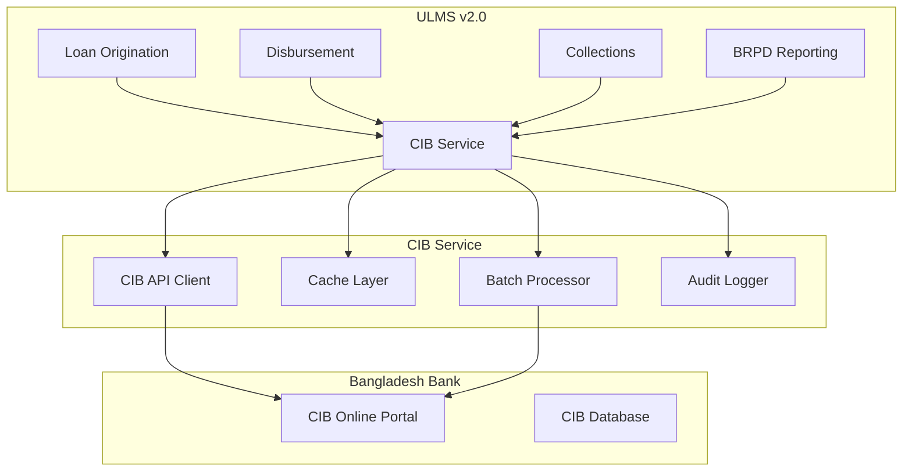
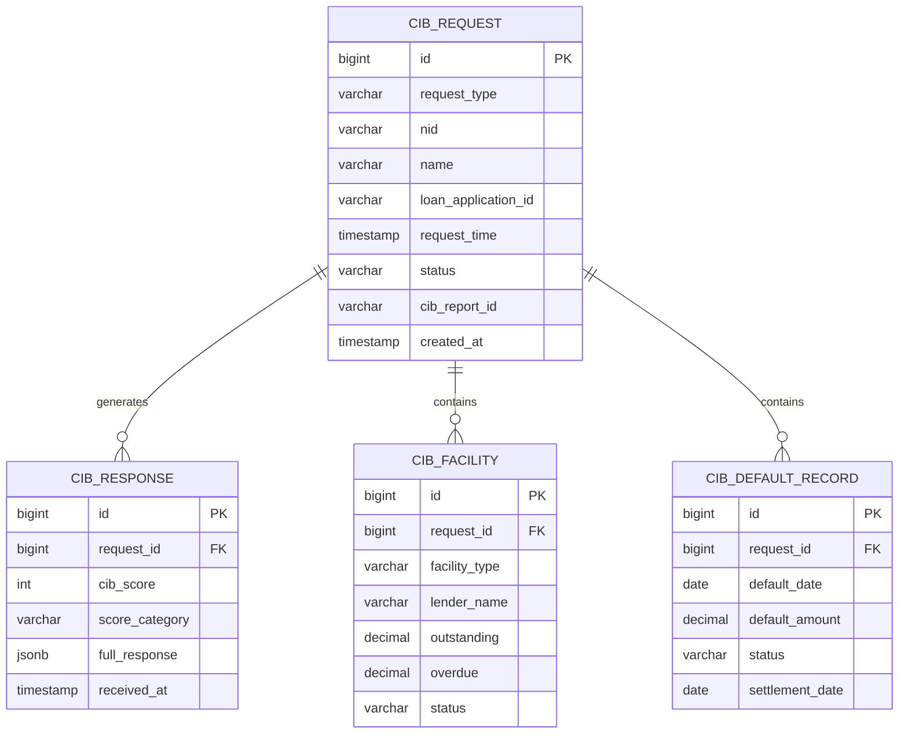

**Document Control**

| Field | Value |
|-------|-------|
| **Document Title** | CIB Service Technical Specification |
| **Project Name** | Unisoft Loan Management System (ULMS) v2.0 |
| **Document Version** | 1.0 |
| **Date** | 2026-02-08 |
| **Prepared By** | Unisoft Technical Team |
| **Reviewed By** | Solution Architect |
| **Classification** | Confidential |
| **Status** | Draft |

**Revision History**

| Version | Date | Author | Description |
|---------|------|--------|-------------|
| 1.0 | 2026-02-08 | Unisoft Team | Initial version |

---

# CIB Service Technical Specification

## 1. Introduction

### 1.1 Purpose
This document specifies the technical architecture and implementation details for the Credit Information Bureau (CIB) integration service, enabling ULMS to interface with Bangladesh Bank's CIB Online system.

### 1.2 Scope
- CIB Online API integration
- Real-time and batch inquiry processing
- Data synchronization and caching
- Security and compliance requirements

### 1.3 References
- Bangladesh Bank CIB Online API Specification
- BRPD Circular on Credit Information Sharing
- PCI-DSS Security Standards

## 2. System Architecture

### 2.1 High-Level Architecture



### 2.2 Component Diagram

| Component | Technology | Purpose |
|-----------|------------|---------|
| CIB Service | Spring Boot 3.2 | Core service implementation |
| API Client | WebClient | HTTP client for CIB API |
| Cache | Redis 7 | Response caching (TTL: 24h) |
| Database | PostgreSQL 16 | Audit trail and request history |
| Message Queue | Kafka | Async batch processing |

## 3. CIB Online API Specification

### 3.1 API Endpoints

| Operation | Endpoint | Method | Description |
|-----------|----------|--------|-------------|
| Individual Inquiry | `/api/v1/inquiry/individual` | POST | Single person CIB inquiry |
| Company Inquiry | `/api/v1/inquiry/company` | POST | Company CIB inquiry |
| Batch Upload | `/api/v1/batch/upload` | POST | Bulk data upload |
| Batch Status | `/api/v1/batch/status/{batchId}` | GET | Check batch processing status |
| Report Download | `/api/v1/report/download/{reportId}` | GET | Download CIB report |

### 3.2 Authentication

```java
public class CibAuthenticationProvider {
    
    private static final String AUTH_ENDPOINT = "/api/v1/auth/token";
    
    /**
     * Obtain OAuth 2.0 access token from CIB Online
     */
    public Mono<CibAuthToken> authenticate() {
        return webClient.post()
            .uri(AUTH_ENDPOINT)
            .header("X-API-Key", apiKey)
            .header("X-Client-ID", clientId)
            .bodyValue(Map.of(
                "grant_type", "client_credentials",
                "scope", "cib:read cib:write"
            ))
            .retrieve()
            .onStatus(HttpStatus::isError, this::handleAuthError)
            .bodyToMono(CibAuthToken.class)
            .doOnNext(token -> log.info("CIB authentication successful"));
    }
}
```

### 3.3 Security Requirements

| Requirement | Implementation |
|-------------|---------------|
| TLS | TLS 1.3 mandatory |
| Authentication | OAuth 2.0 with client credentials |
| Message Signing | HMAC-SHA256 for request signing |
| Certificate | Bangladesh Bank issued client certificate |
| IP Whitelisting | Bank's static IP registered with BB |

## 4. Service Interface

### 4.1 Core Service Interface

```java
package com.unisoft.ulms.cib.service;

import reactor.core.publisher.Mono;
import java.util.List;

/**
 * CIB Service interface for Bangladesh Bank Credit Information Bureau integration
 */
public interface CibService {
    
    /**
     * Perform real-time CIB inquiry for an individual
     * 
     * @param request Individual inquiry request with NID
     * @return CIB report with credit history
     */
    Mono<CibIndividualReport> inquireIndividual(CibIndividualInquiryRequest request);
    
    /**
     * Perform real-time CIB inquiry for a company
     * 
     * @param request Company inquiry request with BIN
     * @return CIB report with company credit history
     */
    Mono<CibCompanyReport> inquireCompany(CibCompanyInquiryRequest request);
    
    /**
     * Perform bulk CIB inquiry for loan application
     * Checks borrower, co-borrowers, and guarantors
     * 
     * @param loanApplicationId Internal loan application ID
     * @return Composite report with all parties
     */
    Mono<LoanApplicationCibReport> inquireLoanApplication(Long loanApplicationId);
    
    /**
     * Submit batch data to CIB (monthly upload)
     * 
     * @param batchRequest Batch upload request
     * @return Batch submission result with tracking ID
     */
    Mono<CibBatchResult> submitBatchUpload(CibBatchUploadRequest batchRequest);
    
    /**
     * Check batch processing status
     * 
     * @param batchId CIB batch ID
     * @return Current batch status
     */
    Mono<CibBatchStatus> checkBatchStatus(String batchId);
    
    /**
     * Download CIB report file
     * 
     * @param reportId CIB report ID
     * @return Report file bytes
     */
    Mono<byte[]> downloadReport(String reportId);
    
    /**
     * Validate NID against CIB database
     * 
     * @param nid National ID number
     * @return Validation result with name matching
     */
    Mono<NidValidationResult> validateNid(String nid);
}
```

### 4.2 Request/Response DTOs

```java
/**
 * Individual CIB Inquiry Request
 */
@Data
@Builder
public class CibIndividualInquiryRequest {
    
    @NotBlank(message = "NID is required")
    @Pattern(regexp = "\\d{10,17}", message = "Invalid NID format")
    private String nid;
    
    @NotBlank(message = "Name is required")
    @Size(max = 100)
    private String name;
    
    @NotBlank(message = "Date of birth is required")
    @Pattern(regexp = "\\d{4}-\\d{2}-\\d{2}", message = "Date format: YYYY-MM-DD")
    private String dateOfBirth;
    
    private String fatherName;
    private String motherName;
    
    @NotNull(message = "Inquiry purpose is required")
    private InquiryPurpose inquiryPurpose;
    
    private String loanApplicationReference;
    
    @Builder.Default
    private LocalDateTime requestTime = LocalDateTime.now();
}

/**
 * CIB Individual Report Response
 */
@Data
@Builder
public class CibIndividualReport {
    
    private String reportId;
    private String nid;
    private String name;
    private LocalDateTime reportDate;
    
    // CIB Score
    private Integer cibScore;
    private String scoreCategory;
    
    // Summary
    private CibSummary summary;
    
    // Facility Details
    private List<CibFacility> facilities;
    
    // Default History
    private List<CibDefaultRecord> defaultHistory;
    
    // Inquiries (last 12 months)
    private List<CibInquiryRecord> recentInquiries;
    
    // Metadata
    private LocalDateTime generatedAt;
    private LocalDateTime expiresAt;
    private String reportHash;
}

/**
 * CIB Summary Information
 */
@Data
public class CibSummary {
    private BigDecimal totalOutstanding;
    private BigDecimal totalOverdue;
    private BigDecimal totalEMI;
    private Integer totalFacilities;
    private Integer performingFacilities;
    private Integer nonPerformingFacilities;
    private Integer defaultedFacilities;
    private Integer settledFacilities;
    private Integer writeOffFacilities;
}
```

## 5. Data Model

### 5.1 Entity Relationship Diagram



### 5.2 Database Schema

```sql
-- CIB Request History
CREATE TABLE cib_requests (
    id BIGSERIAL PRIMARY KEY,
    request_type VARCHAR(20) NOT NULL, -- INDIVIDUAL, COMPANY, BATCH
    nid VARCHAR(17),
    name VARCHAR(100),
    father_name VARCHAR(100),
    mother_name VARCHAR(100),
    date_of_birth DATE,
    company_bin VARCHAR(20),
    company_name VARCHAR(200),
    loan_application_id BIGINT,
    inquiry_purpose VARCHAR(50) NOT NULL,
    
    -- Request Metadata
    request_time TIMESTAMP NOT NULL DEFAULT CURRENT_TIMESTAMP,
    status VARCHAR(20) NOT NULL DEFAULT 'PENDING', -- PENDING, SUCCESS, FAILED, TIMEOUT
    
    -- Response Data
    cib_report_id VARCHAR(100),
    cib_score INTEGER,
    score_category VARCHAR(20),
    response_time TIMESTAMP,
    response_data JSONB,
    error_message TEXT,
    
    -- Audit
    created_by VARCHAR(100) NOT NULL,
    created_at TIMESTAMP NOT NULL DEFAULT CURRENT_TIMESTAMP,
    
    -- Indexes
    CONSTRAINT chk_cib_request_type CHECK (request_type IN ('INDIVIDUAL', 'COMPANY', 'BATCH')),
    CONSTRAINT chk_cib_status CHECK (status IN ('PENDING', 'SUCCESS', 'FAILED', 'TIMEOUT'))
);

CREATE INDEX idx_cib_requests_nid ON cib_requests(nid);
CREATE INDEX idx_cib_requests_loan_app ON cib_requests(loan_application_id);
CREATE INDEX idx_cib_requests_status ON cib_requests(status, request_time);

-- CIB Batch Upload Records
CREATE TABLE cib_batch_uploads (
    id BIGSERIAL PRIMARY KEY,
    batch_id VARCHAR(100) UNIQUE, -- CIB assigned batch ID
    upload_month DATE NOT NULL,
    total_records INTEGER NOT NULL,
    processed_records INTEGER DEFAULT 0,
    failed_records INTEGER DEFAULT 0,
    
    status VARCHAR(20) NOT NULL DEFAULT 'UPLOADING', 
    -- UPLOADING, SUBMITTED, PROCESSING, COMPLETED, FAILED
    
    cib_submitted_at TIMESTAMP,
    cib_completed_at TIMESTAMP,
    cib_response JSONB,
    
    file_path VARCHAR(500),
    checksum VARCHAR(64),
    
    created_by VARCHAR(100) NOT NULL,
    created_at TIMESTAMP NOT NULL DEFAULT CURRENT_TIMESTAMP
);

CREATE INDEX idx_cib_batch_uploads_month ON cib_batch_uploads(upload_month);
CREATE INDEX idx_cib_batch_status ON cib_batch_uploads(status);
```

## 6. CIB Score Interpretation

### 6.1 Score Ranges

| Score Range | Category | Risk Level | Recommendation |
|-------------|----------|------------|----------------|
| 750-900 | Excellent | Very Low | Approve with standard terms |
| 650-749 | Good | Low | Approve with standard terms |
| 550-649 | Fair | Moderate | Approve with caution, additional verification |
| 400-549 | Poor | High | Reject or require collateral/guarantor |
| 0-399 | Very Poor | Very High | Reject application |
| -1 | No History | Unknown | Manual review required |

### 6.2 Decision Matrix

```java
public class CibDecisionEngine {
    
    public CibDecision evaluate(CibIndividualReport report) {
        // Check for active defaults
        if (hasActiveDefault(report)) {
            return CibDecision.REJECT;
        }
        
        // Check for recent write-offs
        if (hasRecentWriteOff(report, 36)) { // 36 months
            return CibDecision.REJECT;
        }
        
        // Check for excessive inquiries
        if (report.getRecentInquiries().size() > 6) { // >6 in 12 months
            return CibDecision.REVIEW;
        }
        
        // Score-based decision
        int score = report.getCibScore();
        if (score >= 650) {
            return CibDecision.APPROVE;
        } else if (score >= 550) {
            return CibDecision.APPROVE_WITH_CONDITIONS;
        } else if (score >= 400) {
            return CibDecision.REVIEW;
        } else {
            return CibDecision.REJECT;
        }
    }
    
    private boolean hasActiveDefault(CibIndividualReport report) {
        return report.getDefaultHistory().stream()
            .anyMatch(d -> d.getStatus() == DefaultStatus.ACTIVE);
    }
}
```

## 7. Performance Requirements

### 7.1 Response Time SLAs

| Operation | Target | Maximum | Measurement |
|-----------|--------|---------|-------------|
| Individual Inquiry | < 3 seconds | 5 seconds | API call to response |
| Company Inquiry | < 5 seconds | 10 seconds | API call to response |
| Batch Upload (10K records) | < 30 minutes | 60 minutes | Submission to confirmation |
| Batch Status Check | < 1 second | 2 seconds | API call to response |

### 7.2 Throughput

| Metric | Target |
|--------|--------|
| Concurrent Inquiries | 50 per second |
| Daily Batch Volume | 100,000 records |
| Cache Hit Rate | > 80% |
| System Availability | 99.9% |

## 8. Error Handling

### 8.1 Error Categories

| Error Code | Description | Retry Strategy |
|------------|-------------|----------------|
| CIB-001 | Invalid credentials | No retry, alert admin |
| CIB-002 | Rate limit exceeded | Exponential backoff, max 5 retries |
| CIB-003 | NID not found | No retry, return empty result |
| CIB-004 | Service unavailable | Exponential backoff, max 10 retries |
| CIB-005 | Timeout | Immediate retry, max 3 retries |
| CIB-006 | Invalid request data | No retry, return validation error |

### 8.2 Circuit Breaker Configuration

```java
@Configuration
public class CibCircuitBreakerConfig {
    
    @Bean
    public Customizer<ReactiveResilience4JCircuitBreakerFactory> cibCircuitBreaker() {
        return factory -> factory.configure(builder -> builder
            .circuitBreakerConfig(CircuitBreakerConfig.custom()
                .failureRateThreshold(50)
                .slowCallRateThreshold(80)
                .slowCallDurationThreshold(Duration.ofSeconds(5))
                .permittedNumberOfCallsInHalfOpenState(10)
                .slidingWindowSize(100)
                .waitDurationInOpenState(Duration.ofSeconds(30))
                .build())
            .timeLimiterConfig(TimeLimiterConfig.custom()
                .timeoutDuration(Duration.ofSeconds(10))
                .build()),
            "cibService");
    }
}
```

---

## Appendices

### A.1 CIB Online API Documentation
- Base URL: `https://cib.bb.org.bd/api/v1`
- Sandbox URL: `https://sandbox-cib.bb.org.bd/api/v1`

### A.2 Contact Information
- Bangladesh Bank CIB Support: cib.support@bb.org.bd
- Technical Integration: integration@bb.org.bd
