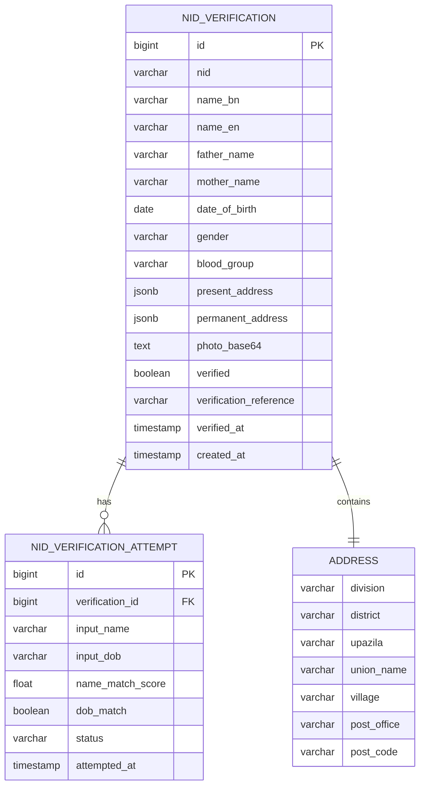

**Document Control**

| Field | Value |
|-------|-------|
| **Document Title** | NID Data Model |
| **Project Name** | Unisoft Loan Management System (ULMS) v2.0 |
| **Document Version** | 1.0 |
| **Date** | 2026-02-08 |
| **Prepared By** | Unisoft Technical Team |
| **Reviewed By** | Solution Architect |
| **Classification** | Internal |
| **Status** | Draft |

---

# NID Data Model

## 1. Entity Relationship Diagram



## 2. Entity Definitions

### 2.1 NidVerification

```java
@Entity
@Table(name = "nid_verifications")
@Data
public class NidVerification {
    
    @Id
    @GeneratedValue(strategy = GenerationType.IDENTITY)
    private Long id;
    
    @Column(name = "nid", nullable = false, unique = true, length = 17)
    private String nid;
    
    @Column(name = "name_bn", length = 100)
    private String nameBn;
    
    @Column(name = "name_en", length = 100)
    private String nameEn;
    
    @Column(name = "father_name", length = 100)
    private String fatherName;
    
    @Column(name = "mother_name", length = 100)
    private String motherName;
    
    @Column(name = "date_of_birth")
    private LocalDate dateOfBirth;
    
    @Column(name = "gender", length = 10)
    @Enumerated(EnumType.STRING)
    private Gender gender;
    
    @Column(name = "blood_group", length = 5)
    private String bloodGroup;
    
    @Embedded
    @AttributeOverrides({
        @AttributeOverride(name = "division", column = @Column(name = "present_division")),
        @AttributeOverride(name = "district", column = @Column(name = "present_district")),
        @AttributeOverride(name = "upazila", column = @Column(name = "present_upazila"))
    })
    private Address presentAddress;
    
    @Embedded
    @AttributeOverrides({
        @AttributeOverride(name = "division", column = @Column(name = "permanent_division")),
        @AttributeOverride(name = "district", column = @Column(name = "permanent_district"))
    })
    private Address permanentAddress;
    
    @Column(name = "photo_hash", length = 64)
    private String photoHash;
    
    @Column(name = "verified")
    private Boolean verified = false;
    
    @Column(name = "verification_reference", length = 50)
    private String verificationReference;
    
    @Column(name = "verified_at")
    private LocalDateTime verifiedAt;
    
    @Column(name = "created_at")
    private LocalDateTime createdAt;
    
    @OneToMany(mappedBy = "verification", cascade = CascadeType.ALL)
    private List<NidVerificationAttempt> attempts = new ArrayList<>();
    
    @PrePersist
    public void prePersist() {
        createdAt = LocalDateTime.now();
        if (verificationReference == null) {
            verificationReference = generateReference();
        }
    }
    
    private String generateReference() {
        return "NID-" + UUID.randomUUID().toString().substring(0, 8).toUpperCase();
    }
}

@Embeddable
@Data
public class Address {
    private String division;
    private String district;
    private String upazila;
    
    @Column(name = "union_name")
    private String union;
    
    private String village;
    private String postOffice;
    private String postCode;
}
```

### 2.2 NidVerificationAttempt

```java
@Entity
@Table(name = "nid_verification_attempts")
@Data
public class NidVerificationAttempt {
    
    @Id
    @GeneratedValue(strategy = GenerationType.IDENTITY)
    private Long id;
    
    @ManyToOne(fetch = FetchType.LAZY)
    @JoinColumn(name = "verification_id", nullable = false)
    private NidVerification verification;
    
    @Column(name = "input_name", length = 100)
    private String inputName;
    
    @Column(name = "input_dob", length = 10)
    private String inputDob;
    
    @Column(name = "name_match_score")
    private Double nameMatchScore;
    
    @Column(name = "dob_match")
    private Boolean dobMatch;
    
    @Column(name = "status", length = 20)
    @Enumerated(EnumType.STRING)
    private VerificationAttemptStatus status;
    
    @Column(name = "failure_reason")
    private String failureReason;
    
    @Column(name = "attempted_at")
    private LocalDateTime attemptedAt;
    
    @PrePersist
    public void prePersist() {
        attemptedAt = LocalDateTime.now();
    }
}

public enum VerificationAttemptStatus {
    SUCCESS,
    NAME_MISMATCH,
    DOB_MISMATCH,
    API_ERROR,
    MANUAL_REVIEW
}

public enum Gender {
    MALE,
    FEMALE,
    OTHER
}
```

## 3. Database Schema

```sql
-- Main verification table
CREATE TABLE nid_verifications (
    id BIGSERIAL PRIMARY KEY,
    nid VARCHAR(17) NOT NULL,
    name_bn VARCHAR(100),
    name_en VARCHAR(100),
    father_name VARCHAR(100),
    mother_name VARCHAR(100),
    date_of_birth DATE,
    gender VARCHAR(10),
    blood_group VARCHAR(5),
    
    -- Present Address
    present_division VARCHAR(50),
    present_district VARCHAR(50),
    present_upazila VARCHAR(50),
    present_union VARCHAR(50),
    present_village VARCHAR(100),
    present_post_office VARCHAR(50),
    present_post_code VARCHAR(10),
    
    -- Permanent Address
    permanent_division VARCHAR(50),
    permanent_district VARCHAR(50),
    permanent_upazila VARCHAR(50),
    permanent_union VARCHAR(50),
    permanent_village VARCHAR(100),
    permanent_post_office VARCHAR(50),
    permanent_post_code VARCHAR(10),
    
    photo_hash VARCHAR(64),
    verified BOOLEAN DEFAULT FALSE,
    verification_reference VARCHAR(50) UNIQUE,
    verified_at TIMESTAMP,
    created_at TIMESTAMP DEFAULT CURRENT_TIMESTAMP,
    
    CONSTRAINT uq_nid_verifications_nid UNIQUE (nid),
    CONSTRAINT chk_nid_format CHECK (nid ~ '^\d{10,17}$')
);

-- Verification attempts tracking
CREATE TABLE nid_verification_attempts (
    id BIGSERIAL PRIMARY KEY,
    verification_id BIGINT NOT NULL,
    input_name VARCHAR(100),
    input_dob VARCHAR(10),
    name_match_score DECIMAL(3,2),
    dob_match BOOLEAN,
    status VARCHAR(20) NOT NULL,
    failure_reason TEXT,
    attempted_at TIMESTAMP DEFAULT CURRENT_TIMESTAMP,
    
    CONSTRAINT fk_verification_attempt 
        FOREIGN KEY (verification_id) REFERENCES nid_verifications(id),
    CONSTRAINT chk_status CHECK (status IN ('SUCCESS', 'NAME_MISMATCH', 
        'DOB_MISMATCH', 'API_ERROR', 'MANUAL_REVIEW'))
);

-- Indexes
CREATE INDEX idx_nid_verifications_nid ON nid_verifications(nid);
CREATE INDEX idx_nid_verifications_ref ON nid_verifications(verification_reference);
CREATE INDEX idx_nid_verifications_created ON nid_verifications(created_at);
CREATE INDEX idx_attempts_verification ON nid_verification_attempts(verification_id);
CREATE INDEX idx_attempts_status ON nid_verification_attempts(status, attempted_at);
```

## 4. Redis Cache Schema

```
# NID Verification Cache
Key: nid:verification:{nid}
Value: JSON serialized NidVerification
TTL: 30 days

# NID Attempt Count (rate limiting)
Key: nid:attempts:{nid}:{date}
Value: Integer count
TTL: 24 hours

# NIDW Response Cache
Key: nidw:response:{nid}
Value: JSON serialized NidwResponse
TTL: 30 days
```

---

## Appendices

### A.1 Data Retention Policy

| Data Type | Retention Period | Action |
|-----------|-----------------|--------|
| Successful verifications | 7 years | Archive after 2 years |
| Failed attempts | 1 year | Auto-delete |
| Cached NIDW responses | 30 days | Auto-expire |
| Audit logs | 10 years | Archive |
