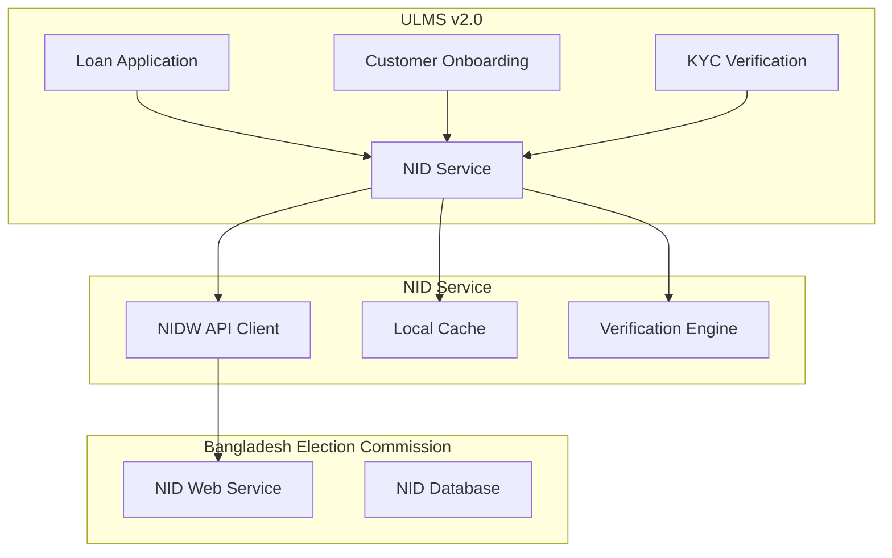
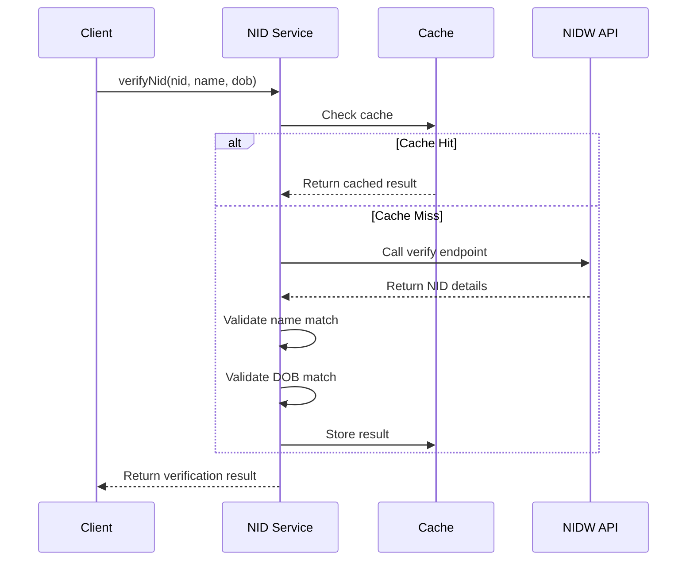

**Document Control**

| Field | Value |
|-------|-------|
| **Document Title** | NID Service Technical Specification |
| **Project Name** | Unisoft Loan Management System (ULMS) v2.0 |
| **Document Version** | 1.0 |
| **Date** | 2026-02-08 |
| **Prepared By** | Unisoft Technical Team |
| **Reviewed By** | Solution Architect |
| **Classification** | Confidential |
| **Status** | Draft |

**Revision History**

| Version | Date | Author | Description |
|---------|------|--------|-------------|
| 1.0 | 2026-02-08 | Unisoft Team | Initial version |

---

# NID Service Technical Specification

## 1. Introduction

### 1.1 Purpose
This document specifies the technical architecture for the National ID (NID) verification service, enabling ULMS to verify customer identities through Bangladesh Election Commission's NID Web Service (NIDW).

### 1.2 Scope
- NID verification and validation
- Biometric verification support
- Address verification
- Integration with e-KYC requirements

## 2. System Architecture

### 2.1 Architecture Overview



### 2.2 Technology Stack

| Component | Technology | Version |
|-----------|------------|---------|
| Service Framework | Spring Boot | 3.2.x |
| API Client | WebClient | - |
| Cache | Redis | 7.x |
| Database | PostgreSQL | 16.x |
| Security | Spring Security | 6.x |

## 3. NIDW API Integration

### 3.1 API Endpoints

| Operation | Endpoint | Description |
|-----------|----------|-------------|
| Verify NID | /nid/verify | Verify NID and basic info |
| Get Details | /nid/details | Get full demographic data |
| Verify Photo | /nid/verify-photo | Face matching |
| Verify Address | /nid/address | Address verification |

### 3.2 Service Interface

```java
package com.unisoft.ulms.nid.service;

import reactor.core.publisher.Mono;

public interface NidService {
    
    /**
     * Verify NID exists and matches provided details
     */
    Mono<NidVerificationResult> verifyNid(NidVerificationRequest request);
    
    /**
     * Get full NID holder details
     */
    Mono<NidDetails> getNidDetails(String nid);
    
    /**
     * Verify photo matches NID record
     */
    Mono<PhotoVerificationResult> verifyPhoto(String nid, byte[] photo);
    
    /**
     * Verify address against NID
     */
    Mono<AddressVerificationResult> verifyAddress(String nid, String address);
}
```

## 4. Data Model

### 4.1 Request/Response DTOs

```java
@Data
@Builder
public class NidVerificationRequest {
    @NotBlank
    @Pattern(regexp = "\\d{10,17}")
    private String nid;
    
    @NotBlank
    private String name;
    
    private String fatherName;
    private String motherName;
    private String dateOfBirth; // YYYY-MM-DD
    private String mobileNumber;
}

@Data
@Builder
public class NidVerificationResult {
    private boolean verified;
    private String nid;
    private String name;
    private String nameEn;
    private String fatherName;
    private String motherName;
    private String dateOfBirth;
    private String gender;
    private String bloodGroup;
    private Address presentAddress;
    private Address permanentAddress;
    private String photoBase64;
    private LocalDateTime verifiedAt;
    private String verificationReference;
}

@Data
@Builder
public class Address {
    private String division;
    private String district;
    private String upazila;
    private String union;
    private String village;
    private String postOffice;
    private String postCode;
}
```

## 5. Verification Flow



## 6. Security Requirements

| Requirement | Implementation |
|-------------|---------------|
| TLS | TLS 1.3 mandatory |
| Authentication | mTLS with client certificate |
| Request Signing | HMAC-SHA256 |
| Rate Limiting | 100 req/min per client |
| Data Encryption | AES-256 for PII at rest |

---

## Appendices

### A.1 NID Validation Rules

| Field | Format | Validation |
|-------|--------|------------|
| NID | 10-17 digits | Numeric only |
| DOB | YYYY-MM-DD | Not future date |
| Mobile | 11 digits | Starts with 01 |

### A.2 Error Codes

| Code | Description |
|------|-------------|
| NID-001 | Invalid NID format |
| NID-002 | NID not found |
| NID-003 | Name mismatch |
| NID-004 | Service unavailable |
