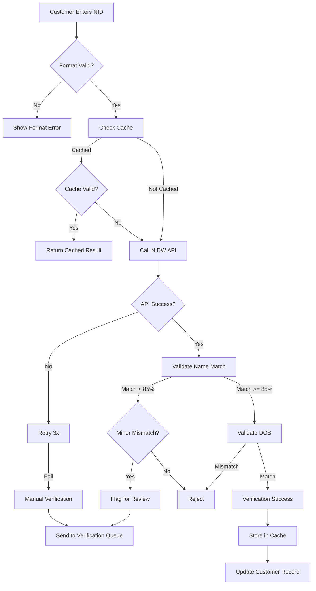

**Document Control**

| Field | Value |
|-------|-------|
| **Document Title** | NID Verification Flow |
| **Project Name** | Unisoft Loan Management System (ULMS) v2.0 |
| **Document Version** | 1.0 |
| **Date** | 2026-02-08 |
| **Prepared By** | Unisoft Technical Team |
| **Reviewed By** | Solution Architect |
| **Classification** | Internal |
| **Status** | Draft |

---

# NID Verification Flow

## 1. Overview

This document describes the complete NID verification flow for customer onboarding and loan applications.

## 2. Verification Flow Diagram



## 3. Verification Steps

### Step 1: Input Validation
- NID must be 10-17 digits
- Date of birth must be valid
- Name must be at least 3 characters

### Step 2: Cache Check
- Check Redis cache for existing verification
- Return cached result if valid (< 30 days old)

### Step 3: API Call
- Call NIDW verification endpoint
- Retry up to 3 times on failure
- Use circuit breaker for resilience

### Step 4: Name Matching
- Normalize both names (uppercase, remove special chars)
- Handle common variations (MD, Mohammad, etc.)
- Calculate Levenshtein distance
- Accept if similarity >= 85%

### Step 5: DOB Validation
- Exact match required
- Reject if mismatch

### Step 6: Result Processing
- Store successful verification in cache
- Update customer record
- Generate verification reference

## 4. Edge Cases

| Scenario | Handling |
|----------|----------|
| NIDW service down | Use stale cache, queue for retry |
| Name significantly different | Flag for manual review |
| Photo mismatch | Trigger biometric verification |
| Multiple NID attempts | Rate limit per customer |

## 5. State Machine

```
[PENDING] -> [API_CALL] -> [VALIDATING]
[VALIDATING] -> [MATCHED] -> [VERIFIED]
[VALIDATING] -> [MISMATCH] -> [REJECTED]
[VALIDATING] -> [UNCERTAIN] -> [MANUAL_REVIEW]
[API_CALL] -> [FAILED] -> [RETRY]
[RETRY] -> [MAX_RETRIES] -> [MANUAL_REVIEW]
```
