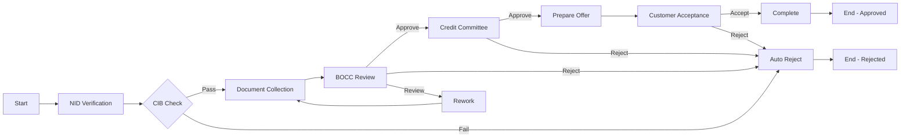
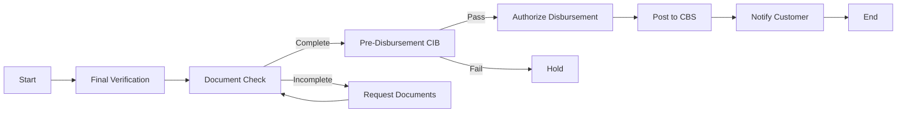
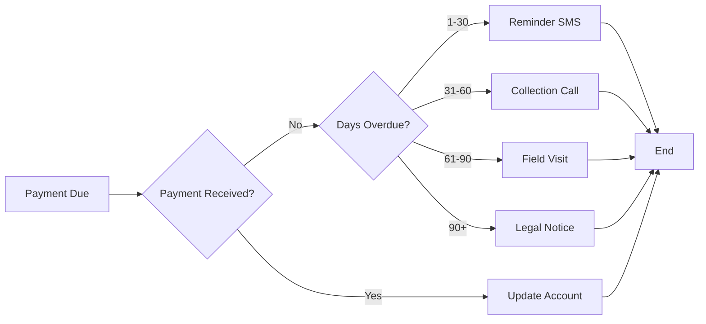

**Document Control**

| Field | Value |
|-------|-------|
| **Document Title** | BPMN Process Definitions |
| **Project Name** | Unisoft Loan Management System (ULMS) v2.0 |
| **Document Version** | 1.0 |
| **Date** | 2026-02-08 |
| **Prepared By** | Unisoft Technical Team |
| **Reviewed By** | Solution Architect |
| **Classification** | Internal |
| **Status** | Draft |

---

# BPMN Process Definitions

## 1. Loan Origination Process

### 1.1 Process Overview
The loan origination process handles new loan applications from submission to approval/rejection.

### 1.2 BPMN Diagram



### 1.3 Process XML

```xml
<?xml version="1.0" encoding="UTF-8"?>
<bpmn:definitions 
    xmlns:bpmn="http://www.omg.org/spec/BPMN/20100524/MODEL"
    xmlns:zeebe="http://camunda.org/schema/zeebe/1.0"
    id="Definitions_1"
    targetNamespace="http://bpmn.io/schema/bpmn">
  
  <bpmn:process id="loan-origination" name="Loan Origination" isExecutable="true">
    
    <!-- Start Event -->
    <bpmn:startEvent id="StartEvent_1" name="Application Received">
      <bpmn:outgoing>Flow_1</bpmn:outgoing>
    </bpmn:startEvent>
    
    <!-- NID Verification -->
    <bpmn:serviceTask id="nid-verification" name="Verify NID">
      <bpmn:extensionElements>
        <zeebe:taskDefinition type="nid-verification" retries="3"/>
      </bpmn:extensionElements>
      <bpmn:incoming>Flow_1</bpmn:incoming>
      <bpmn:outgoing>Flow_2</bpmn:outgoing>
    </bpmn:serviceTask>
    
    <!-- CIB Check -->
    <bpmn:serviceTask id="cib-check" name="CIB Inquiry">
      <bpmn:extensionElements>
        <zeebe:taskDefinition type="cib-inquiry" retries="3"/>
      </bpmn:extensionElements>
      <bpmn:incoming>Flow_2</bpmn:incoming>
      <bpmn:outgoing>Flow_3</bpmn:outgoing>
    </bpmn:serviceTask>
    
    <!-- CIB Decision Gateway -->
    <bpmn:exclusiveGateway id="cib-gateway" name="CIB Passed?">
      <bpmn:incoming>Flow_3</bpmn:incoming>
      <bpmn:outgoing>Flow_4</bpmn:outgoing>
      <bpmn:outgoing>Flow_5</bpmn:outgoing>
    </bpmn:exclusiveGateway>
    
    <!-- Document Collection -->
    <bpmn:userTask id="document-collection" name="Collect Documents">
      <bpmn:extensionElements>
        <zeebe:assignmentDefinition assignee="=documentCollector"/>
        <zeebe:taskSchedule dueDate="=now() + duration("P3D")"/>
      </bpmn:extensionElements>
      <bpmn:incoming>Flow_4</bpmn:incoming>
      <bpmn:outgoing>Flow_6</bpmn:outgoing>
    </bpmn:userTask>
    
    <!-- BOCC Review -->
    <bpmn:userTask id="bocc-review" name="BOCC Review">
      <bpmn:extensionElements>
        <zeebe:assignmentDefinition candidateGroups="bocc"/>
        <zeebe:taskSchedule dueDate="=now() + duration("P2D")"/>
      </bpmn:extensionElements>
      <bpmn:incoming>Flow_6</bpmn:incoming>
      <bpmn:outgoing>Flow_7</bpmn:outgoing>
    </bpmn:userTask>
    
    <!-- BOCC Decision Gateway -->
    <bpmn:exclusiveGateway id="bocc-gateway" name="BOCC Decision">
      <bpmn:incoming>Flow_7</bpmn:incoming>
      <bpmn:outgoing>Flow_8</bpmn:outgoing>
      <bpmn:outgoing>Flow_9</bpmn:outgoing>
      <bpmn:outgoing>Flow_10</bpmn:outgoing>
    </bpmn:exclusiveGateway>
    
    <!-- Credit Committee -->
    <bpmn:userTask id="credit-committee" name="Credit Committee Review">
      <bpmn:extensionElements>
        <zeebe:assignmentDefinition candidateGroups="credit-committee"/>
        <zeebe:taskSchedule dueDate="=now() + duration("P3D")"/>
      </bpmn:extensionElements>
      <bpmn:incoming>Flow_8</bpmn:incoming>
      <bpmn:outgoing>Flow_11</bpmn:outgoing>
    </bpmn:userTask>
    
    <!-- Committee Decision Gateway -->
    <bpmn:exclusiveGateway id="committee-gateway" name="Approved?">
      <bpmn:incoming>Flow_11</bpmn:incoming>
      <bpmn:outgoing>Flow_12</bpmn:outgoing>
      <bpmn:outgoing>Flow_13</bpmn:outgoing>
    </bpmn:exclusiveGateway>
    
    <!-- Prepare Offer -->
    <bpmn:serviceTask id="prepare-offer" name="Prepare Offer Letter">
      <bpmn:extensionElements>
        <zeebe:taskDefinition type="document-generation"/>
      </bpmn:extensionElements>
      <bpmn:incoming>Flow_12</bpmn:incoming>
      <bpmn:outgoing>Flow_14</bpmn:outgoing>
    </bpmn:serviceTask>
    
    <!-- Customer Acceptance -->
    <bpmn:userTask id="customer-acceptance" name="Customer Acceptance">
      <bpmn:extensionElements>
        <zeebe:taskSchedule dueDate="=now() + duration("P7D")"/>
      </bpmn:extensionElements>
      <bpmn:incoming>Flow_14</bpmn:incoming>
      <bpmn:outgoing>Flow_15</bpmn:outgoing>
      <bpmn:outgoing>Flow_16</bpmn:outgoing>
    </bpmn:userTask>
    
    <!-- Rejection Handler -->
    <bpmn:serviceTask id="send-rejection" name="Send Rejection Notice">
      <bpmn:extensionElements>
        <zeebe:taskDefinition type="send-notification"/>
      </bpmn:extensionElements>
      <bpmn:incoming>Flow_5</bpmn:incoming>
      <bpmn:incoming>Flow_9</bpmn:incoming>
      <bpmn:incoming>Flow_13</bpmn:incoming>
      <bpmn:incoming>Flow_16</bpmn:incoming>
      <bpmn:outgoing>Flow_17</bpmn:outgoing>
    </bpmn:serviceTask>
    
    <!-- End Events -->
    <bpmn:endEvent id="end-approved" name="Loan Approved">
      <bpmn:incoming>Flow_15</bpmn:incoming>
    </bpmn:endEvent>
    
    <bpmn:endEvent id="end-rejected" name="Loan Rejected">
      <bpmn:incoming>Flow_17</bpmn:incoming>
    </bpmn:endEvent>
    
    <!-- Sequence Flows with Conditions -->
    <bpmn:sequenceFlow id="Flow_1" sourceRef="StartEvent_1" targetRef="nid-verification"/>
    <bpmn:sequenceFlow id="Flow_2" sourceRef="nid-verification" targetRef="cib-check"/>
    <bpmn:sequenceFlow id="Flow_3" sourceRef="cib-check" targetRef="cib-gateway"/>
    
    <bpmn:sequenceFlow id="Flow_4" sourceRef="cib-gateway" targetRef="document-collection">
      <bpmn:conditionExpression>=cibDecision = "APPROVE" or cibDecision = "APPROVE_WITH_CONDITIONS"</bpmn:conditionExpression>
    </bpmn:sequenceFlow>
    
    <bpmn:sequenceFlow id="Flow_5" sourceRef="cib-gateway" targetRef="send-rejection">
      <bpmn:conditionExpression>=cibDecision = "REJECT"</bpmn:conditionExpression>
    </bpmn:sequenceFlow>
    
    <bpmn:sequenceFlow id="Flow_6" sourceRef="document-collection" targetRef="bocc-review"/>
    <bpmn:sequenceFlow id="Flow_7" sourceRef="bocc-review" targetRef="bocc-gateway"/>
    
    <bpmn:sequenceFlow id="Flow_8" sourceRef="bocc-gateway" targetRef="credit-committee">
      <bpmn:conditionExpression>=boccDecision = "FORWARD"</bpmn:conditionExpression>
    </bpmn:sequenceFlow>
    
    <bpmn:sequenceFlow id="Flow_9" sourceRef="bocc-gateway" targetRef="send-rejection">
      <bpmn:conditionExpression>=boccDecision = "REJECT"</bpmn:conditionExpression>
    </bpmn:sequenceFlow>
    
    <bpmn:sequenceFlow id="Flow_10" sourceRef="bocc-gateway" targetRef="document-collection">
      <bpmn:conditionExpression>=boccDecision = "REWORK"</bpmn:conditionExpression>
    </bpmn:sequenceFlow>
    
    <bpmn:sequenceFlow id="Flow_11" sourceRef="credit-committee" targetRef="committee-gateway"/>
    
    <bpmn:sequenceFlow id="Flow_12" sourceRef="committee-gateway" targetRef="prepare-offer">
      <bpmn:conditionExpression>=approved = true</bpmn:conditionExpression>
    </bpmn:sequenceFlow>
    
    <bpmn:sequenceFlow id="Flow_13" sourceRef="committee-gateway" targetRef="send-rejection">
      <bpmn:conditionExpression>=approved = false</bpmn:conditionExpression>
    </bpmn:sequenceFlow>
    
    <bpmn:sequenceFlow id="Flow_14" sourceRef="prepare-offer" targetRef="customer-acceptance"/>
    
    <bpmn:sequenceFlow id="Flow_15" sourceRef="customer-acceptance" targetRef="end-approved">
      <bpmn:conditionExpression>=accepted = true</bpmn:conditionExpression>
    </bpmn:sequenceFlow>
    
    <bpmn:sequenceFlow id="Flow_16" sourceRef="customer-acceptance" targetRef="send-rejection">
      <bpmn:conditionExpression>=accepted = false</bpmn:conditionExpression>
    </bpmn:sequenceFlow>
    
    <bpmn:sequenceFlow id="Flow_17" sourceRef="send-rejection" targetRef="end-rejected"/>
    
  </bpmn:process>
</bpmn:definitions>
```

## 2. Loan Disbursement Process



## 3. Collections Process



---

## Appendices

### A.1 Process Variables

| Variable | Type | Description |
|----------|------|-------------|
| loanApplicationId | Long | Application ID |
| borrowerNid | String | NID |
| cibDecision | String | CIB result |
| boccDecision | String | BOCC decision |
| approved | Boolean | Approval flag |
| approvedAmount | BigDecimal | Amount |
| accepted | Boolean | Customer accepted |

### A.2 Task Types

| Type | Description |
|------|-------------|
| nid-verification | NID verification |
| cib-inquiry | CIB check |
| document-generation | Generate documents |
| send-notification | Send notifications |
