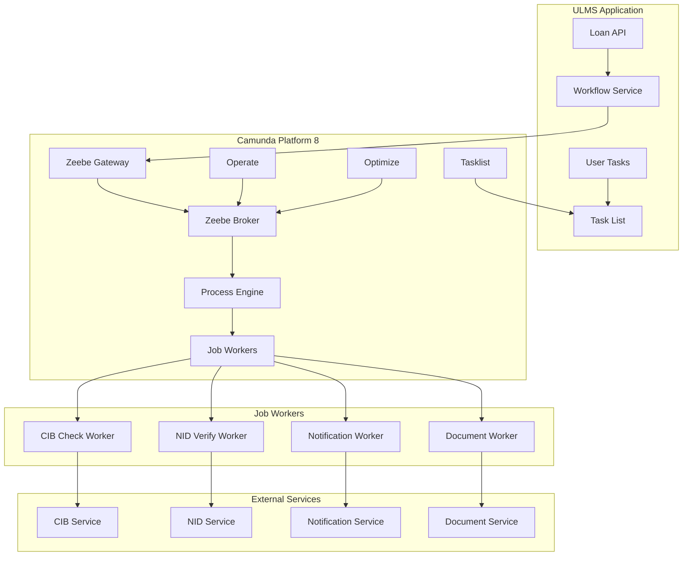
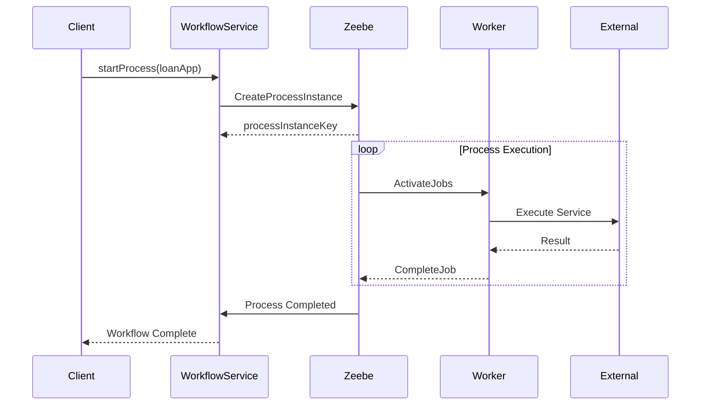

**Document Control**

| Field | Value |
|-------|-------|
| **Document Title** | Camunda Integration Architecture |
| **Project Name** | Unisoft Loan Management System (ULMS) v2.0 |
| **Document Version** | 1.0 |
| **Date** | 2026-02-08 |
| **Prepared By** | Unisoft Technical Team |
| **Reviewed By** | Solution Architect |
| **Classification** | Confidential |
| **Status** | Draft |

---

# Camunda Integration Architecture

## 1. Overview

### 1.1 Purpose
This document describes the architecture for integrating Camunda Platform 8.3 as the workflow engine for ULMS loan processing workflows.

### 1.2 Architecture Goals
- Decouple business processes from application code
- Enable visual process modeling with BPMN
- Support dynamic decision making with DMN
- Provide monitoring and SLA tracking

## 2. Architecture Overview



## 3. Component Architecture

### 3.1 Core Components

| Component | Technology | Purpose |
|-----------|------------|---------|
| Zeebe Gateway | Camunda 8 | API entry point |
| Zeebe Broker | Camunda 8 | Process orchestration |
| Job Workers | Spring Boot | Service task execution |
| Operate | Camunda 8 | Process monitoring |
| Tasklist | Camunda 8 | Human task management |

### 3.2 Integration Points



## 4. Process Models

### 4.1 Loan Origination Process

```bpmn
<?xml version="1.0" encoding="UTF-8"?>
<bpmn:definitions>
  <bpmn:process id="loan-origination" name="Loan Origination">
    
    <bpmn:startEvent id="start" name="Application Received"/>
    
    <bpmn:sequenceFlow id="flow1" sourceRef="start" targetRef="nid-verify"/>
    
    <bpmn:serviceTask id="nid-verify" name="Verify NID"
      zeebe:taskDefinitionType="nid-verification"/>
    
    <bpmn:sequenceFlow id="flow2" sourceRef="nid-verify" targetRef="cib-check"/>
    
    <bpmn:serviceTask id="cib-check" name="CIB Check"
      zeebe:taskDefinitionType="cib-inquiry"/>
    
    <bpmn:sequenceFlow id="flow3" sourceRef="cib-check" targetRef="bocc-review"/>
    
    <bpmn:userTask id="bocc-review" name="BOCC Review"
      zeebe:assignee="bocc-officer"/>
    
    <bpmn:sequenceFlow id="flow4" sourceRef="bocc-review" targetRef="decision-gateway"/>
    
    <bpmn:exclusiveGateway id="decision-gateway" name="Approved?"/>
    
    <bpmn:sequenceFlow id="approve-flow" sourceRef="decision-gateway" 
      targetRef="prepare-offer" conditionExpression="=approved"/>
    
    <bpmn:sequenceFlow id="reject-flow" sourceRef="decision-gateway" 
      targetRef="notify-rejection" conditionExpression="=not approved"/>
    
    <bpmn:serviceTask id="prepare-offer" name="Prepare Offer Letter"
      zeebe:taskDefinitionType="document-generation"/>
    
    <bpmn:endEvent id="end-approved" name="Application Approved"/>
    
    <bpmn:endEvent id="end-rejected" name="Application Rejected"/>
    
  </bpmn:process>
</bpmn:definitions>
```

## 5. Job Worker Implementation

### 5.1 Worker Base Class

```java
@Component
@RequiredArgsConstructor
public abstract class AbstractJobWorker {
    
    protected final ZeebeClient zeebeClient;
    protected final ObjectMapper objectMapper;
    
    protected JobHandler createHandler(BiConsumer<JobClient, ActivatedJob> handler) {
        return (client, job) -> {
            try {
                MDC.put("processInstanceKey", String.valueOf(job.getProcessInstanceKey()));
                MDC.put("jobKey", String.valueOf(job.getKey()));
                
                log.info("Processing job: {}", job.getType());
                handler.accept(client, job);
                
            } catch (Exception e) {
                log.error("Job processing failed", e);
                client.newFailCommand(job.getKey())
                    .retries(job.getRetries() - 1)
                    .errorMessage(e.getMessage())
                    .send()
                    .join();
            } finally {
                MDC.clear();
            }
        };
    }
}
```

### 5.2 CIB Check Worker

```java
@Component
@RequiredArgsConstructor
public class CibCheckWorker extends AbstractJobWorker {
    
    private final CibService cibService;
    
    @PostConstruct
    public void register() {
        zeebeClient.newWorker()
            .jobType("cib-inquiry")
            .handler(createHandler(this::handleCibCheck))
            .timeout(Duration.ofMinutes(5))
            .open();
    }
    
    private void handleCibCheck(JobClient client, ActivatedJob job) {
        Long loanApplicationId = getVariable(job, "loanApplicationId", Long.class);
        
        CibDecision decision = cibService
            .inquireLoanApplication(loanApplicationId)
            .map(LoanApplicationCibReport::getOverallDecision)
            .block();
        
        Map<String, Object> variables = Map.of(
            "cibDecision", decision.name(),
            "cibCheckTime", LocalDateTime.now().toString()
        );
        
        client.newCompleteCommand(job.getKey())
            .variables(variables)
            .send()
            .join();
    }
    
    private <T> T getVariable(ActivatedJob job, String name, Class<T> type) {
        return objectMapper.convertValue(
            job.getVariablesAsMap().get(name), type);
    }
}
```

## 6. SLA Configuration

### 6.1 SLA Tracking

```java
@Component
@RequiredArgsConstructor
public class WorkflowSlaMonitor {
    
    private final MeterRegistry meterRegistry;
    
    public void recordTaskDuration(String taskType, Duration duration) {
        Timer.builder("workflow.task.duration")
            .tag("taskType", taskType)
            .register(meterRegistry)
            .record(duration);
    }
    
    public void recordSlaBreach(String processId, String taskId) {
        Counter.builder("workflow.sla.breach")
            .tag("processId", processId)
            .tag("taskId", taskId)
            .register(meterRegistry)
            .increment();
    }
}
```

### 6.2 SLA Configuration

```yaml
workflow:
  sla:
    loan-origination:
      total: P7D
      tasks:
        nid-verification: PT1H
        cib-inquiry: PT4H
        bocc-review: P2D
        credit-committee: P3D
    disbursement:
      total: P3D
      tasks:
        document-verification: PT4H
        pre-disbursement-check: PT1H
```

---

## Appendices

### A.1 Process Deployment

```bash
# Deploy BPMN process
zbctl deploy resource loan-origination.bpmn \
  --insecure \
  --address localhost:26500

# Deploy DMN decision table
zbctl deploy resource credit-scoring.dmn \
  --insecure \
  --address localhost:26500
```

### A.2 Environment Variables

| Variable | Description |
|----------|-------------|
| ZEEBE_GATEWAY | Zeebe gateway address |
| ZEEBE_SECURITY | Enable TLS (true/false) |
| CAMUNDA_OPERATE_URL | Operate monitoring URL |
| CAMUNDA_TASKLIST_URL | Tasklist URL |
