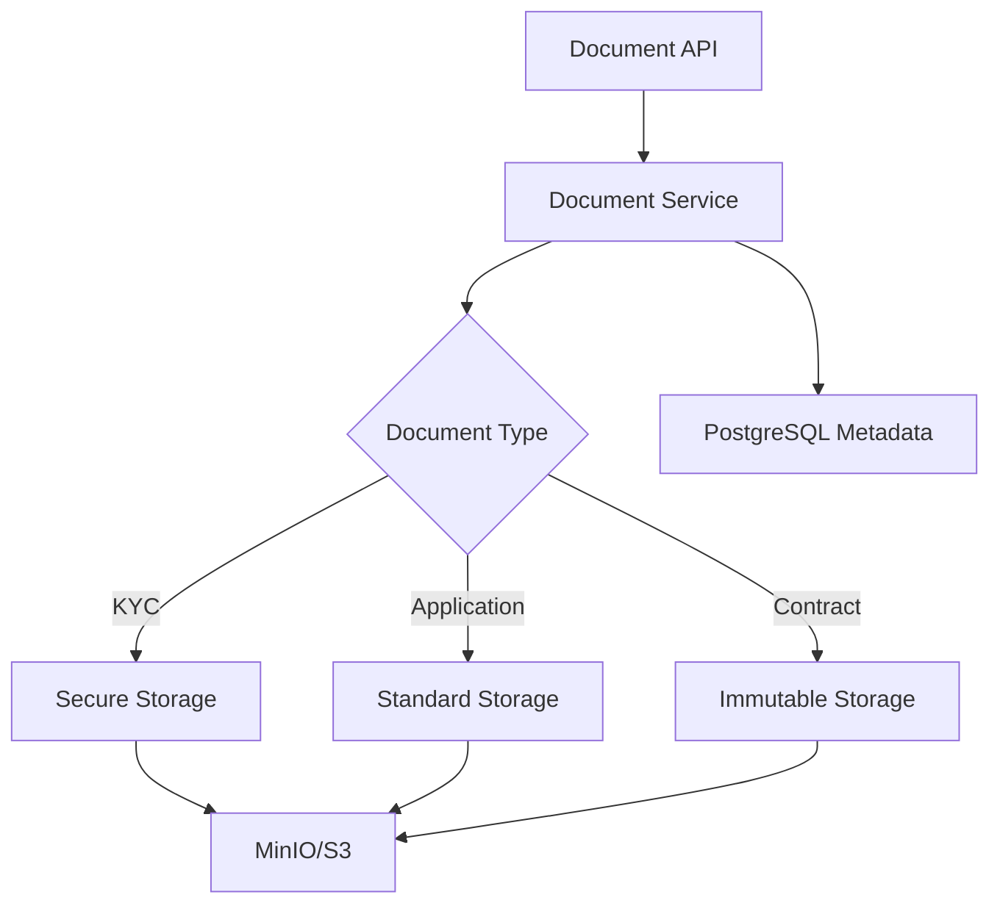

**Document Control**

| Field | Value |
|-------|-------|
| **Document Title** | Document Service Technical Specification |
| **Project Name** | Unisoft Loan Management System (ULMS) v2.0 |
| **Document Version** | 1.0 |
| **Date** | 2026-02-08 |
| **Prepared By** | Unisoft Technical Team |
| **Reviewed By** | Solution Architect |
| **Classification** | Internal |
| **Status** | Draft |

---

# Document Service Technical Specification

## 1. Overview

### 1.1 Purpose
Centralized document management for loan applications, supporting upload, storage, retrieval, and lifecycle management.

### 1.2 Storage Architecture



## 2. Supported Document Types

| Category | Types | Retention |
|----------|-------|-----------|
| KYC | NID, Photo, Address Proof | 7 years |
| Income | Salary Slip, Bank Statement | 7 years |
| Application | Forms, Declarations | 7 years |
| Legal | Contracts, Agreements | 10 years |
| Collateral | Valuation, Title Deeds | Loan term + 10 years |

## 3. API Specification

### 3.1 Upload Document
```java
POST /api/v1/documents
Content-Type: multipart/form-data

file: [binary]
metadata: {
  "loanApplicationId": 123,
  "documentType": "NID",
  "description": "Applicant NID"
}

Response: 201 Created
{
  "documentId": "doc-123456",
  "fileName": "nid_applicant.jpg",
  "fileSize": 2048000,
  "contentType": "image/jpeg",
  "storagePath": "loans/123/nid_applicant_20260208.jpg",
  "checksum": "sha256:abc123...",
  "uploadedAt": "2026-02-08T10:30:00"
}
```

### 3.2 Service Interface

```java
public interface DocumentService {
    
    Document uploadDocument(DocumentUploadRequest request, InputStream fileStream);
    
    Document getDocument(String documentId);
    
    InputStream downloadDocument(String documentId);
    
    void deleteDocument(String documentId);
    
    List<Document> getDocumentsByLoanApplication(Long loanApplicationId);
    
    String generatePresignedUrl(String documentId, Duration expiry);
}
```

## 4. Security

### 4.1 Encryption
- At-rest: AES-256
- In-transit: TLS 1.3
- Key management: HashiCorp Vault

### 4.2 Access Control
```java
@Component
public class DocumentAccessControl {
    
    public boolean canAccess(String documentId, String userId) {
        Document doc = documentRepository.findById(documentId);
        
        // Owner can access
        if (doc.getUploadedBy().equals(userId)) return true;
        
        // Assigned officer can access
        if (isAssignedOfficer(doc.getLoanApplicationId(), userId)) return true;
        
        // Role-based access
        return hasRole(userId, "DOCUMENT_VIEWER");
    }
}
```

---

## Appendices

### A.1 File Size Limits
| Type | Max Size |
|------|----------|
| Image | 10 MB |
| PDF | 50 MB |
| Video | 100 MB |

### A.2 Supported Formats
- Images: JPG, PNG, TIFF
- Documents: PDF
- Scans: PDF/A
