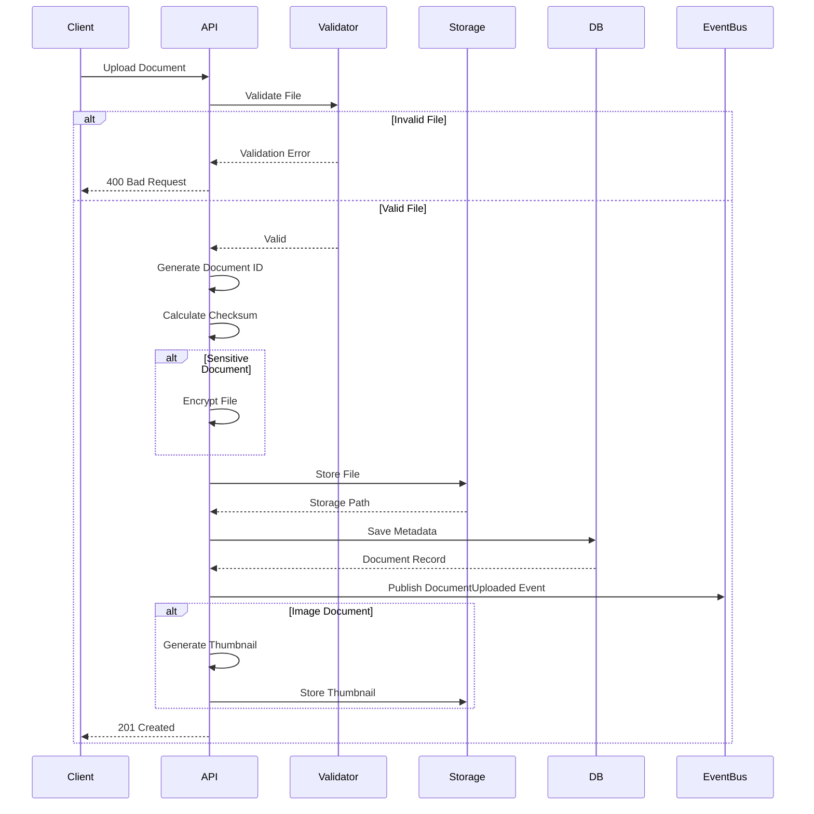

**Document Control**

| Field | Value |
|-------|-------|
| **Document Title** | Document Upload Flow |
| **Project Name** | Unisoft Loan Management System (ULMS) v2.0 |
| **Document Version** | 1.0 |
| **Date** | 2026-02-08 |
| **Prepared By** | Unisoft Technical Team |
| **Reviewed By** | Solution Architect |
| **Classification** | Internal |
| **Status** | Draft |

---

# Document Upload Flow

## 1. Flow Overview



## 2. Validation Rules

| Check | Rule | Error Code |
|-------|------|------------|
| File Size | Max 50MB | FILE_TOO_LARGE |
| File Type | JPEG, PNG, PDF only | INVALID_TYPE |
| File Name | Alphanumeric + ._- | INVALID_NAME |
| Virus Scan | Clean required | VIRUS_DETECTED |
| Duplicate | Checksum comparison | DUPLICATE_FILE |

## 3. Chunked Upload for Large Files

```java
@Service
public class ChunkedUploadService {
    
    public String initiateChunkedUpload(UploadInitiateRequest request) {
        String uploadId = generateUploadId();
        
        ChunkedUploadSession session = ChunkedUploadSession.builder()
            .uploadId(uploadId)
            .fileName(request.getFileName())
            .totalChunks(request.getTotalChunks())
            .totalSize(request.getTotalSize())
            .status(UploadStatus.INITIATED)
            .build();
        
        uploadSessionRepository.save(session);
        return uploadId;
    }
    
    public void uploadChunk(String uploadId, int chunkNumber, byte[] data) {
        ChunkedUploadSession session = getSession(uploadId);
        
        // Store chunk temporarily
        String chunkPath = String.format("temp/%s/chunk_%d", uploadId, chunkNumber);
        storageService.storeTemp(chunkPath, data);
        
        session.markChunkReceived(chunkNumber);
        
        if (session.allChunksReceived()) {
            assembleAndStore(uploadId, session);
        }
    }
    
    private void assembleAndStore(String uploadId, ChunkedUploadSession session) {
        // Combine chunks
        try (OutputStream output = new FileOutputStream(session.getFileName())) {
            for (int i = 0; i < session.getTotalChunks(); i++) {
                byte[] chunk = storageService.readTemp(
                    String.format("temp/%s/chunk_%d", uploadId, i));
                output.write(chunk);
            }
        }
        
        // Move to permanent storage
        // Save metadata
        // Cleanup temp files
    }
}
```

## 4. Virus Scanning

```java
@Component
public class VirusScanner {
    
    private final ClamAVClient clamAVClient;
    
    public ScanResult scan(InputStream fileStream) {
        try {
            boolean isInfected = clamAVClient.scan(fileStream);
            
            return ScanResult.builder()
                .clean(!isInfected)
                .threats(isInfected ? List.of("UNKNOWN_VIRUS") : List.of())
                .scanTime(LocalDateTime.now())
                .build();
                
        } catch (Exception e) {
            log.error("Virus scan failed", e);
            return ScanResult.builder()
                .clean(false)
                .error("SCAN_FAILED")
                .build();
        }
    }
}
```

---

## Appendices

### A.1 Upload Events

| Event | Description |
|-------|-------------|
| DocumentUploaded | New document uploaded |
| DocumentScanCompleted | Virus scan finished |
| DocumentThumbnailGenerated | Thumbnail created |
| DocumentIndexed | Search index updated |
