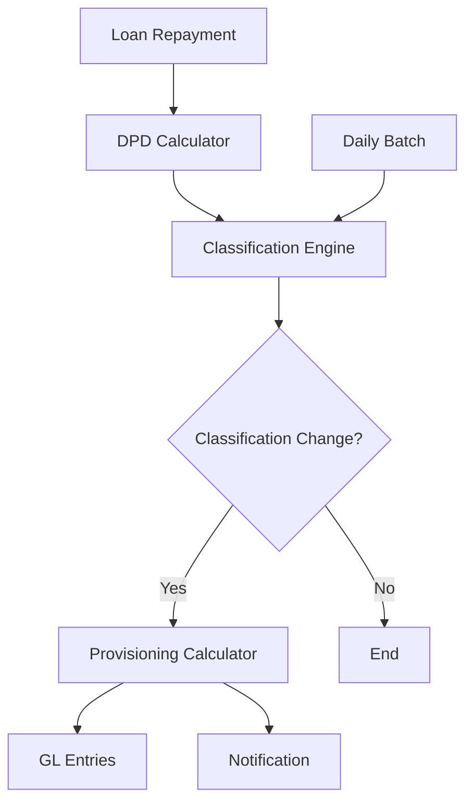

**Document Control**

| Field | Value |
|-------|-------|
| **Document Title** | BRPD Service Technical Specification |
| **Project Name** | Unisoft Loan Management System (ULMS) v2.0 |
| **Document Version** | 1.0 |
| **Date** | 2026-02-08 |
| **Prepared By** | Unisoft Technical Team |
| **Reviewed By** | Solution Architect |
| **Classification** | Confidential |
| **Status** | Draft |

---

# BRPD Service Technical Specification

## 1. Overview

### 1.1 Purpose
BRPD (Banking Regulation and Policy Department) Service implements Bangladesh Bank's loan classification and provisioning requirements per BRPD Circular 15/2024.

### 1.2 Scope
- 7-stage loan classification
- Daily classification batch job
- Provisioning calculation
- Bangladesh Bank reporting

## 2. Classification Framework

### 2.1 BRPD Classification Stages

| Stage | Code | DPD Range | Provision | Description |
|-------|------|-----------|-----------|-------------|
| STD-0 | Standard (Current) | 0 | 1% | Current, no overdue |
| STD-1 | Standard (Watch) | 1-30 | 1% | Slight delay |
| STD-2 | Standard (Caution) | 31-60 | 1% | Moderate delay |
| SMA | Special Mention Account | 61-90 | 5% | Significant delay |
| SS | Substandard | 91-180 | 20% | Serious impairment |
| DF | Doubtful | 181-365 | 50% | Recovery uncertain |
| B/L | Bad/Loss | >365 | 100% | Uncollectible |

### 2.2 Classification Logic

```java
public enum BrpdClassificationStage {
    STD_0("STD-0", "Standard (Current)", 0, 0, new BigDecimal("0.01")),
    STD_1("STD-1", "Standard (Watch)", 1, 30, new BigDecimal("0.01")),
    STD_2("STD-2", "Standard (Caution)", 31, 60, new BigDecimal("0.01")),
    SMA("SMA", "Special Mention Account", 61, 90, new BigDecimal("0.05")),
    SS("SS", "Substandard", 91, 180, new BigDecimal("0.20")),
    DF("DF", "Doubtful", 181, 365, new BigDecimal("0.50")),
    BL("B/L", "Bad/Loss", 366, Integer.MAX_VALUE, new BigDecimal("1.00"));
    
    private final String code;
    private final String description;
    private final int minDpd;
    private final int maxDpd;
    private final BigDecimal provisionRate;
    
    public static BrpdClassificationStage fromDpd(int dpd) {
        return Arrays.stream(values())
            .filter(s -> dpd >= s.minDpd && dpd <= s.maxDpd)
            .findFirst()
            .orElse(STD_0);
    }
}
```

## 3. Service Interface

```java
public interface BrpdService {
    
    /**
     * Classify loan based on DPD
     */
    ClassificationResult classifyLoan(Long loanId, LocalDate classificationDate);
    
    /**
     * Calculate required provision
     */
    ProvisionCalculation calculateProvision(Long loanId, 
        BrpdClassificationStage stage);
    
    /**
     * Run daily classification for all active loans
     */
    BatchClassificationResult runDailyClassification(LocalDate date);
    
    /**
     * Generate Bangladesh Bank scheduled items report
     */
    ScheduledItemsReport generateScheduledItemsReport(LocalDate reportDate);
    
    /**
     * Get classification history
     */
    List<ClassificationHistory> getClassificationHistory(Long loanId);
}
```

## 4. Architecture



---

## Appendices

### A.1 BRPD Circular 15/2024 Key Points
- 7-stage classification effective from January 2024
- Interest suspension required for SS, DF, B/L
- Monthly reporting to Bangladesh Bank
- Special provisions for COVID-affected loans

### A.2 Integration Points
- Core Banking System for balances
- General Ledger for provisions
- Bangladesh Bank portal for reporting
