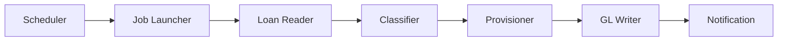

**Document Control**

| Field | Value |
|-------|-------|
| **Document Title** | Daily Classification Batch Job |
| **Project Name** | Unisoft Loan Management System (ULMS) v2.0 |
| **Document Version** | 1.0 |
| **Date** | 2026-02-08 |
| **Prepared By** | Unisoft Technical Team |
| **Reviewed By** | Solution Architect |
| **Classification** | Internal |
| **Status** | Draft |

---

# Daily Classification Batch Job

## 1. Job Overview

### 1.1 Schedule
- **Frequency**: Daily at 23:00 (Bangladesh time)
- **Scope**: All active loans
- **Duration**: Estimated 30-60 minutes for 100K loans

### 1.2 Architecture



## 2. Spring Batch Implementation

### 2.1 Job Configuration

```java
@Configuration
@EnableBatchProcessing
@RequiredArgsConstructor
public class ClassificationBatchConfig {
    
    private final JobRepository jobRepository;
    private final PlatformTransactionManager transactionManager;
    
    @Bean
    public Job dailyClassificationJob(
            Step classificationStep,
            JobExecutionListener listener) {
        
        return new JobBuilder("dailyClassificationJob", jobRepository)
            .listener(listener)
            .start(classificationStep)
            .build();
    }
    
    @Bean
    public Step classificationStep(
            ItemReader<Loan> reader,
            ItemProcessor<Loan, ClassificationResult> processor,
            ItemWriter<ClassificationResult> writer) {
        
        return new StepBuilder("classificationStep", jobRepository)
            .<Loan, ClassificationResult>chunk(100, transactionManager)
            .reader(reader)
            .processor(processor)
            .writer(writer)
            .faultTolerant()
            .skipLimit(100)
            .skip(ClassificationException.class)
            .listener(new ClassificationStepListener())
            .build();
    }
    
    @Bean
    @StepScope
    public ItemReader<Loan> loanReader(
            LoanRepository repository,
            @Value("#{jobParameters['classificationDate']}") Date date) {
        
        return new RepositoryItemReaderBuilder<Loan>()
            .name("loanReader")
            .repository(repository)
            .methodName("findActiveLoans")
            .pageSize(100)
            .sorts(Map.of("id", Sort.Direction.ASC))
            .build();
    }
    
    @Bean
    public ItemProcessor<Loan, ClassificationResult> classificationProcessor(
            BrpdService brpdService) {
        
        return loan -> {
            LocalDate date = LocalDate.now(); // From job params
            return brpdService.classifyLoan(loan.getId(), date);
        };
    }
    
    @Bean
    public ItemWriter<ClassificationResult> classificationWriter() {
        return results -> {
            // Results are already persisted by service
            // This writer can be used for summary reporting
            int changedCount = (int) results.stream()
                .filter(ClassificationResult::isChanged)
                .count();
            
            log.info("Batch written: {} loans processed, {} changed", 
                results.size(), changedCount);
        };
    }
}
```

### 2.2 Job Listener

```java
@Component
@Slf4j
public class ClassificationJobListener implements JobExecutionListener {
    
    private final NotificationService notificationService;
    private final MeterRegistry meterRegistry;
    
    @Override
    public void beforeJob(JobExecution jobExecution) {
        log.info("Starting classification job: {}", 
            jobExecution.getJobInstance().getJobName());
        
        jobExecution.getExecutionContext().putLong("startTime", 
            System.currentTimeMillis());
    }
    
    @Override
    public void afterJob(JobExecution jobExecution) {
        long duration = System.currentTimeMillis() - 
            jobExecution.getExecutionContext().getLong("startTime");
        
        BatchStatus status = jobExecution.getStatus();
        int readCount = jobExecution.getStepExecutions().stream()
            .mapToInt(StepExecution::getReadCount)
            .sum();
        int writeCount = jobExecution.getStepExecutions().stream()
            .mapToInt(StepExecution::getWriteCount)
            .sum();
        int skipCount = jobExecution.getStepExecutions().stream()
            .mapToInt(StepExecution::getSkipCount)
            .sum();
        
        log.info("Classification job completed: status={}, duration={}ms, " +
            "read={}, write={}, skip={}",
            status, duration, readCount, writeCount, skipCount);
        
        // Record metrics
        meterRegistry.timer("classification.job.duration")
            .record(duration, TimeUnit.MILLISECONDS);
        
        // Send notification
        if (status == BatchStatus.COMPLETED) {
            notificationService.sendClassificationComplete(
                readCount, writeCount, duration);
        } else {
            notificationService.sendClassificationFailed(
                jobExecution.getAllFailureExceptions());
        }
    }
}
```

## 3. Monitoring and Alerting

### 3.1 Job Health Checks

```java
@Component
public class ClassificationJobHealthIndicator implements HealthIndicator {
    
    private final JobExplorer jobExplorer;
    
    @Override
    public Health health() {
        // Check last job execution
        JobInstance lastInstance = jobExplorer.getLastJobInstance("dailyClassificationJob");
        
        if (lastInstance == null) {
            return Health.down().withDetail("reason", "No job executions found").build();
        }
        
        JobExecution lastExecution = jobExplorer.getLastJobExecution(lastInstance);
        
        if (lastExecution == null) {
            return Health.down().withDetail("reason", "No executions").build();
        }
        
        // Check if completed successfully today
        LocalDate executionDate = lastExecution.getStartTime().toLocalDate();
        if (!executionDate.equals(LocalDate.now())) {
            return Health.down()
                .withDetail("reason", "Job not run today")
                .withDetail("lastRun", executionDate)
                .build();
        }
        
        if (lastExecution.getStatus() != BatchStatus.COMPLETED) {
            return Health.down()
                .withDetail("reason", "Last execution failed")
                .withDetail("status", lastExecution.getStatus())
                .build();
        }
        
        return Health.up()
            .withDetail("lastRun", executionDate)
            .withDetail("duration", lastExecution.getEndTime().toEpochMilli() - 
                lastExecution.getStartTime().toEpochMilli())
            .build();
    }
}
```

---

## Appendices

### A.1 Job Execution Summary

| Metric | Description |
|--------|-------------|
| Total Loans | Total active loans processed |
| Classified | Loans with classification determined |
| Changed | Loans with classification change |
| Upgraded | Loans moved to worse stage |
| Downgraded | Loans moved to better stage |
| Provision Impact | Total provision change |
| Errors | Failed classifications |
