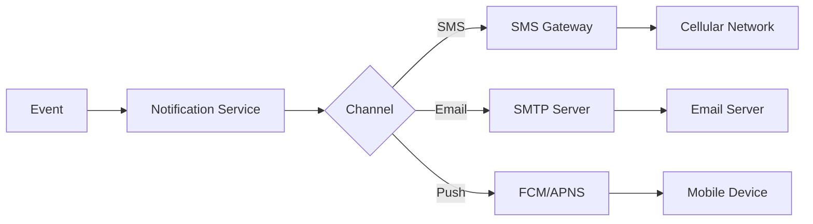

**Document Control**

| Field | Value |
|-------|-------|
| **Document Title** | Notification Service Technical Specification |
| **Project Name** | Unisoft Loan Management System (ULMS) v2.0 |
| **Document Version** | 1.0 |
| **Date** | 2026-02-08 |
| **Prepared By** | Unisoft Technical Team |
| **Reviewed By** | Solution Architect |
| **Classification** | Internal |
| **Status** | Draft |

---

# Notification Service Technical Specification

## 1. Overview

Multi-channel notification service supporting SMS, Email, and Push notifications for ULMS.

## 2. Architecture



## 3. Service Interface

```java
public interface NotificationService {
    
    void sendNotification(NotificationRequest request);
    
    void sendSms(String phoneNumber, String message);
    
    void sendEmail(String to, String subject, String body);
    
    void sendPush(String deviceToken, String title, String body);
    
    void sendTemplated(String templateId, Map<String, Object> data, 
        List<Channel> channels);
}

public enum Channel {
    SMS,
    EMAIL,
    PUSH,
    IN_APP
}
```

## 4. Channels

### 4.1 SMS Gateway Integration (Bangladesh)

| Provider | API Type | Use Case |
|----------|----------|----------|
| SSL Wireless | REST | Primary |
| Robi/Airtel | REST | Backup |
| GP | SMPP | High volume |
| bKash | REST | bKash notifications |

### 4.2 Email Configuration

```yaml
spring:
  mail:
    host: smtp.gmail.com
    port: 587
    username: ${EMAIL_USERNAME}
    password: ${EMAIL_PASSWORD}
    properties:
      mail.smtp.auth: true
      mail.smtp.starttls.enable: true
```

---

## Appendices

### A.1 Notification Types

| Type | Channel | Priority |
|------|---------|----------|
| OTP | SMS | High |
| Loan Approval | SMS+Email | High |
| Payment Due | SMS | Medium |
| Payment Received | SMS | Low |
| Marketing | Email | Low |
