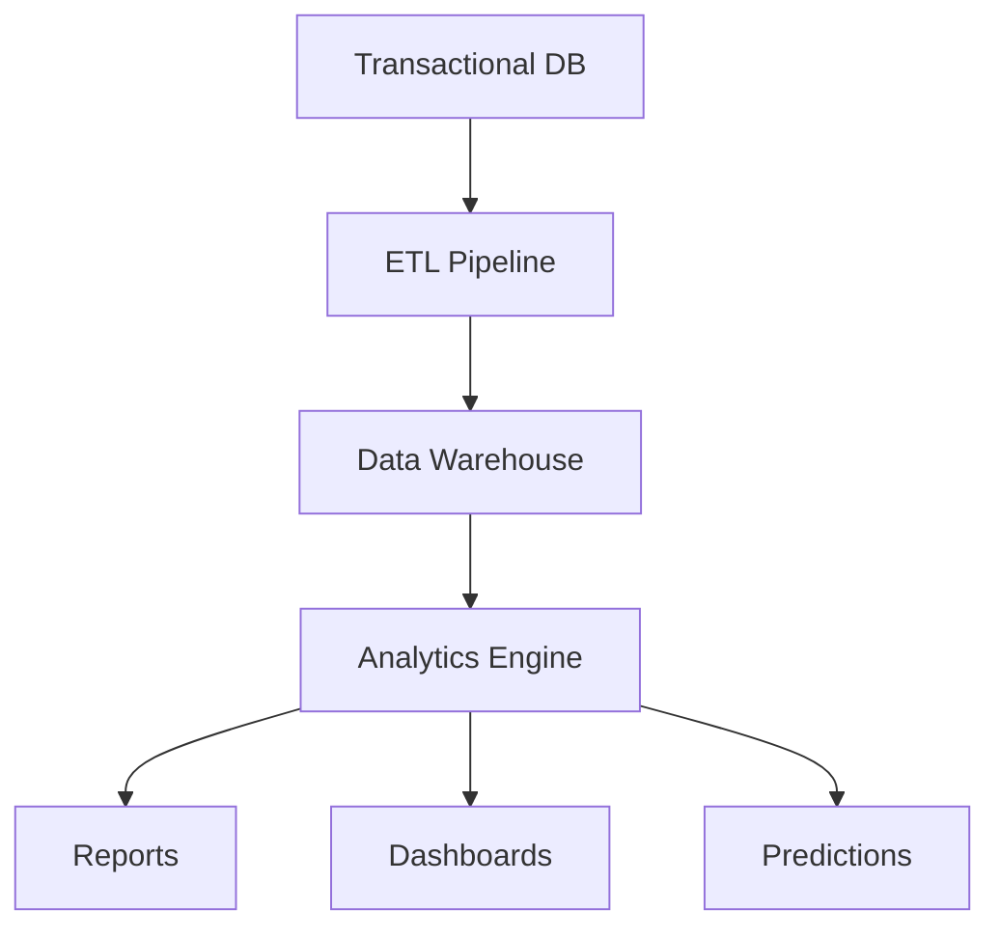

**Document Control**

| Field | Value |
|-------|-------|
| **Document Title** | Analytics Service Technical Specification |
| **Project Name** | Unisoft Loan Management System (ULMS) v2.0 |
| **Document Version** | 1.0 |
| **Date** | 2026-02-08 |
| **Prepared By** | Unisoft Technical Team |
| **Reviewed By** | Solution Architect |
| **Classification** | Internal |
| **Status** | Draft |

---

# Analytics Service Technical Specification

## 1. Overview

Analytics Service provides business intelligence, reporting, and predictive analytics for ULMS.

## 2. Architecture



## 3. Components

### 3.1 Data Warehouse

| Layer | Technology | Purpose |
|-------|------------|---------|
| Staging | PostgreSQL | Raw data landing |
| Warehouse | ClickHouse | Analytics storage |
| Mart | PostgreSQL | Business metrics |

### 3.2 ETL Pipeline

```java
@Component
public class AnalyticsETLPipeline {
    
    @Scheduled(cron = "0 0 1 * * ?")
    public void dailyETL() {
        // Extract
        List<LoanFact> loanFacts = extractLoanData();
        List<PaymentFact> paymentFacts = extractPaymentData();
        
        // Transform
        List<LoanSummary> summaries = transformToSummary(loanFacts);
        
        // Load
        loadToWarehouse(summaries);
        loadToWarehouse(paymentFacts);
        
        // Refresh materialized views
        refreshMetrics();
    }
}
```

## 4. Service Interface

```java
public interface AnalyticsService {
    
    DashboardData getExecutiveDashboard();
    
    List<PortfolioMetric> getPortfolioMetrics(DateRange range);
    
    CreditScore calculateCreditScore(Long customerId);
    
    BigDecimal calculateEcl(Long loanId);
    
    List<TrendAnalysis> getTrends(String metric, DateRange range);
}
```

---

## Appendices

### A.1 Key Metrics

| Metric | Description |
|--------|-------------|
| PAR 30 | Portfolio at Risk (30+ DPD) |
| NPL Ratio | Non-Performing Loan ratio |
| Provision Coverage | Provisions / NPL |
| Disbursement Volume | Monthly disbursements |
