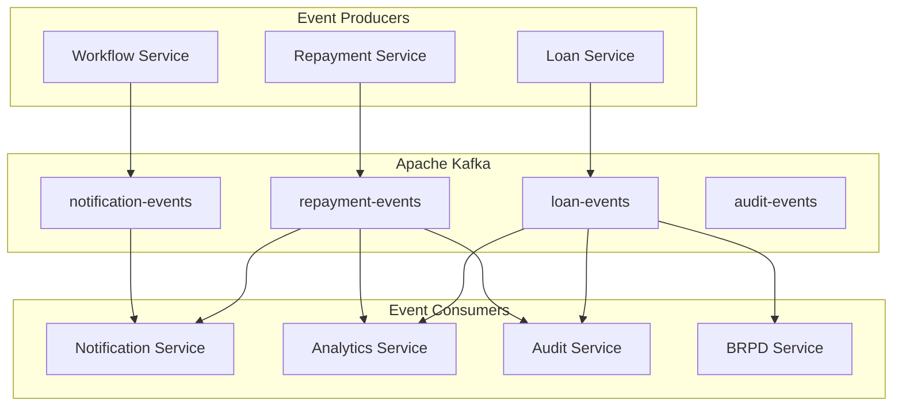

**Document Control**

| Field | Value |
|-------|-------|
| **Document Title** | Event-Driven Architecture Implementation |
| **Project Name** | Unisoft Loan Management System (ULMS) v2.0 |
| **Document Version** | 1.0 |
| **Date** | 2026-02-08 |
| **Prepared By** | Unisoft Technical Team |
| **Reviewed By** | Solution Architect |
| **Classification** | Confidential |
| **Status** | Draft |

---

# Event-Driven Architecture Implementation

## 1. Overview

Event-driven architecture enables loose coupling between services and supports asynchronous processing.

## 2. Event Bus Architecture



## 3. Event Schema

### 3.1 CloudEvents Format

```json
{
  "specversion": "1.0",
  "type": "com.unisoft.ulms.loan.approved",
  "source": "loan-service",
  "id": "event-uuid",
  "time": "2026-02-08T10:30:00Z",
  "datacontenttype": "application/json",
  "data": {
    "loanId": 123,
    "loanApplicationId": 456,
    "customerId": 789,
    "approvedAmount": 500000,
    "approvedAt": "2026-02-08T10:30:00Z"
  }
}
```

## 4. Implementation

### 4.1 Event Publisher

```java
@Service
@RequiredArgsConstructor
public class LoanEventPublisher {
    
    private final KafkaTemplate<String, CloudEvent> kafkaTemplate;
    
    public void publishLoanApproved(Loan loan) {
        CloudEvent event = CloudEventBuilder.v1()
            .withId(UUID.randomUUID().toString())
            .withSource(URI.create("loan-service"))
            .withType("com.unisoft.ulms.loan.approved")
            .withTime(OffsetDateTime.now())
            .withData(PojoCloudEventData.wrap(loan, mapper::writeValueAsBytes))
            .build();
        
        kafkaTemplate.send("loan-events", loan.getId().toString(), event);
    }
}
```

### 4.2 Event Consumer

```java
@Component
@RequiredArgsConstructor
public class LoanEventConsumer {
    
    private final NotificationService notificationService;
    private final AuditService auditService;
    
    @KafkaListener(topics = "loan-events", groupId = "notification-service")
    public void handleLoanEvents(CloudEvent event) {
        switch (event.getType()) {
            case "com.unisoft.ulms.loan.approved" -> 
                handleLoanApproved(event);
            case "com.unisoft.ulms.loan.disbursed" -> 
                handleLoanDisbursed(event);
        }
    }
    
    private void handleLoanApproved(CloudEvent event) {
        LoanApprovedData data = deserialize(event.getData(), LoanApprovedData.class);
        
        notificationService.sendLoanApprovedNotification(data);
        auditService.logLoanApproval(data);
    }
}
```

## 5. Event Types

| Event | Description | Producers | Consumers |
|-------|-------------|-----------|-----------|
| loan.applied | New loan application | Loan Service | Workflow, Audit |
| loan.approved | Loan approved | Workflow | Notification, Analytics |
| loan.rejected | Loan rejected | Workflow | Notification, Analytics |
| loan.disbursed | Loan disbursed | Loan Service | Notification, BRPD |
| repayment.received | Payment received | Repayment | Notification, Analytics |
| repayment.overdue | Payment overdue | Scheduler | Notification, Collections |
| classification.changed | Loan reclassified | BRPD | GL, Analytics |

## 6. Error Handling

```java
@Component
public class EventErrorHandler {
    
    @Autowired
    private DeadLetterPublishingRecoverer recoverer;
    
    @Bean
    public DefaultErrorHandler errorHandler() {
        DefaultErrorHandler handler = new DefaultErrorHandler(recoverer);
        
        // Retry 3 times with exponential backoff
        handler.addRetryableExceptions(RetryableException.class);
        handler.setBackOffFunction((record, ex) -> 
            new FixedBackOff(1000L, 3));
        
        return handler;
    }
}
```

---

## Appendices

### A.1 Kafka Configuration

```yaml
spring:
  kafka:
    bootstrap-servers: localhost:9092
    producer:
      key-serializer: org.apache.kafka.common.serialization.StringSerializer
      value-serializer: io.cloudevents.kafka.CloudEventSerializer
    consumer:
      group-id: ulms-services
      auto-offset-reset: earliest
```
