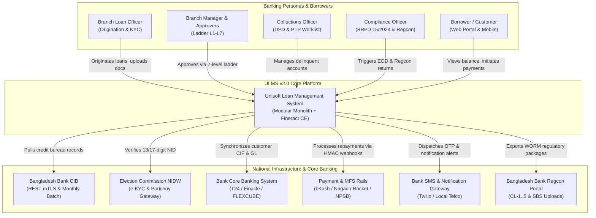
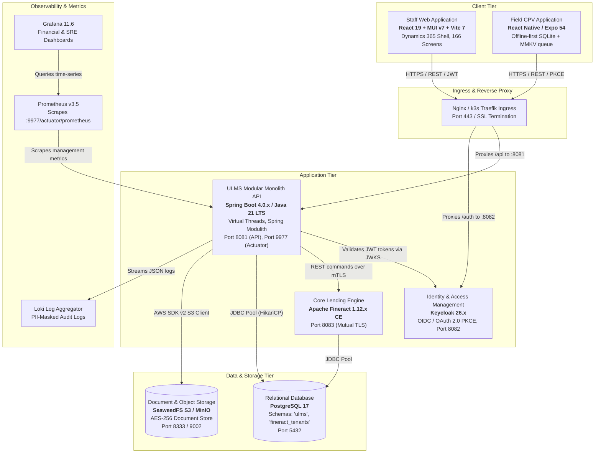
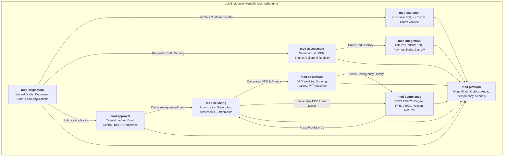

# DOC-01-ARCH-01: System Architecture Blueprint & C4 Topology Guide

**Document Control**

| Field | Value |
|---|---|
| **Document Title** | System Architecture Blueprint & C4 Topology Guide |
| **Project Name** | Unisoft Loan Management System (ULMS v2.0) |
| **Document Version** | 3.0.0 |
| **Date** | 2026-10-07 |
| **Classification** | Enterprise Technical Specification |
| **Status** | Approved Master Architecture Blueprint |
| **Authority Chain** | `Compliance_Validation_Matrix.md` → `Software_Requirements_Specification.md` → `LMS_CODEBASE/PLANNING/01_Architecture_Blueprint.md` → `Technology_Stack_Recommendation_v3.md` |

---

## 1. Executive Architecture Summary

The **Unisoft Loan Management System (ULMS v2.0)** is an enterprise core lending and loan lifecycle automation platform purpose-built for the **62 scheduled commercial banks**, non-bank financial institutions (NBFIs), and microfinance institutions (MFIs) of Bangladesh. 

The architecture is designed to resolve the primary failure modes of legacy core banking loan modules:
1. **Rigid Lending Products:** Slow time-to-market for new Retail, SME, and Islamic financing products.
2. **Regulatory Vulnerability:** Failure to enforce strict Bangladesh Bank guidelines, including the 7-stage classification rules of **BRPD Circular 15/2024**, mandatory debt-burden ratio (DBR $\le 50\%$) caps, and IFRS-9 ECL staging.
3. **Operational Silos:** Fragmented verification across Bangladesh Bank CIB Online, Election Commission NIDW e-KYC, and physical verification.
4. **Architectural Over-Engineering:** Systems designed for 50-person platform engineering teams that collapse under 3-developer operational realities.

### Key Architectural Invariants
- **Modular Monolith Core (ADR-001):** Single Spring Boot 4 application on Java 21 LTS with code-enforced module boundaries via Spring Modulith.
- **Immutable Lending Ledger (ADR-002):** Apache Fineract 1.12.x Community Edition operates as the underlying accounting engine accessed strictly via REST behind `FineractPort`.
- **Database-Backed Workflows (ADR-003):** Zero external Camunda BPM licensing cost; approval ladders and state transitions run on PostgreSQL relational state with ShedLock SLA timers.
- **Transactional Outbox Messaging (ADR-004):** Event rows committed within the same database transaction as domain entity updates; zero message loss without operating a day-one Kafka cluster.
- **Strict Minor-Units Currency Invariant:** All financial values are stored and transferred as `BIGINT` poisha ($1\text{ BDT} = 100\text{ poisha}$). IEEE 754 floating-point numbers are strictly forbidden in monetary calculations.

---

## 2. C4 Model Level 1: System Context Diagram

The System Context diagram illustrates how ULMS v2.0 fits into the commercial banking ecosystem and interacts with internal bank staff, external borrowers, and national regulatory bodies.



---

## 3. C4 Model Level 2: Container Diagram

The Container diagram details the high-level technical runtime components, storage engines, identity providers, and network boundaries.



---

## 4. C4 Model Level 3: Component Diagram for `apps/api`

The Spring Boot 4 application is organized as a **Modular Monolith** comprising 9 core architectural modules. Each module maintains strict encapsulation, interacting via explicit Java API contracts and Spring application events.



---

## 5. Architectural Invariants & Enforced Quality Controls

### 5.1 Strict Modularity (Spring Modulith Verification)
Module boundaries are enforced at compile time and verified during automated CI execution via `ModularityTest.java`:
- Packages outside a module **MUST NOT** directly import internal implementation classes.
- Modules communicate exclusively through public service interfaces annotated with `@NamedInterface`.
- Cyclic dependencies between packages trigger immediate build failure.

### 5.2 The Minor-Units Currency Standard
Floating-point arithmetic is strictly prohibited in monetary domain logic:
```java
// BANNED:
double interest = principal * rate; 

// MANDATED:
long emiMinor = MoneyMath.emiMonthly(principalMinor, tenorMonths, annualRate);
```

### 5.3 Idempotency & Replay Protection
All mutating operations (loan submission, disbursement, payment counter posting, regulatory return submission) require an `Idempotency-Key` HTTP header. 
- Replays within a 48-hour window return the cached response with the HTTP header `Idempotent-Replay: true`.
- Concurrent duplicate requests are rejected with `HTTP 409 Conflict`.

### 5.4 Hash-Chained Audit Trail
Every mutating operation generates an immutable row in `ulms.audit_entry`:
$$\text{Hash}_n = \text{SHA-256}(\text{Hash}_{n-1} \parallel \text{Timestamp} \parallel \text{Actor} \parallel \text{Action} \parallel \text{PayloadJSON})$$
This cryptographic chain guarantees tamper-evident logging conforming to **Bangladesh Bank ICT Security Guidelines V4.0**.

---

## 6. Regulatory & Technology Traceability Matrix

| Component | Code Artifact | Standard / Circular |
|---|---|---|
| **Modular Core** | `apps/api/src/main/java/com/uslbd/ulms/UlmsApplication.java` | ADR-001, Spring Boot 4.0 |
| **Lending Engine** | `apps/api/src/main/java/com/uslbd/ulms/integration/fineract/` | ADR-002, Apache Fineract 1.12.x |
| **7-Stage Classifier** | `apps/api/src/main/java/com/uslbd/ulms/compliance/BrpdClassifier.java` | BRPD Circular 15/2024 |
| **DBR Cap ($\le 50\%$)** | `apps/api/src/main/java/com/uslbd/ulms/platform/MoneyMath.java` | BB PPG Guideline No. 15 |
| **STR Alert ($\ge 10\text{L}$)** | `apps/api/src/main/java/com/uslbd/ulms/aml/AmlService.java` | BFIU Circular 25/26 |
| **Outbox Relay** | `apps/api/src/main/java/com/uslbd/ulms/platform/outbox/OutboxService.java` | ADR-004, PostgreSQL 17 |
| **Identity Provider** | `deploy/compose/docker-compose.yml` (Keycloak service) | Keycloak 26.x, RFC 7636 PKCE |

---

*— End of Architecture Blueprint —*
