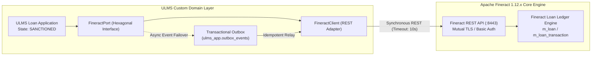
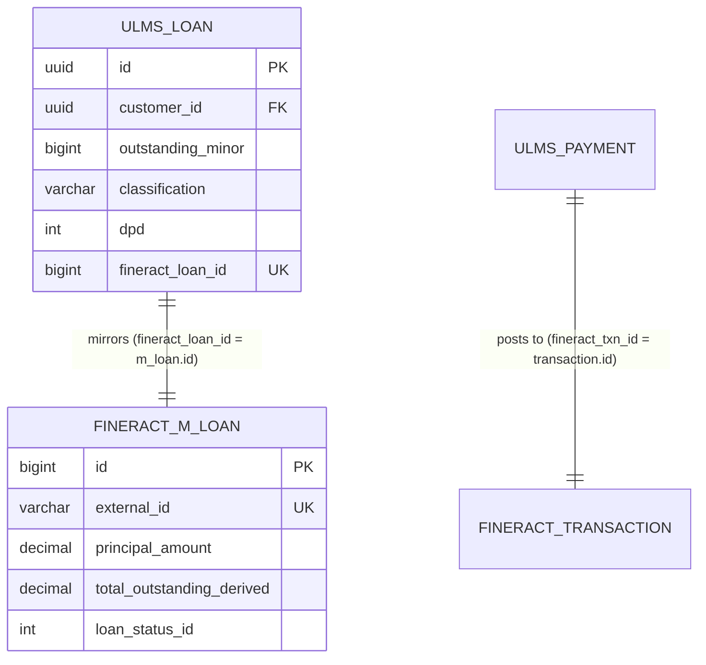

# DOC-01-ARCH-02: Apache Fineract 1.12.x Core Banking Integration Specification

**Document Control**

| Field | Value |
|---|---|
| **Document Title** | Apache Fineract 1.12.x Core Banking Integration & REST Adapter Specification |
| **Project Name** | Unisoft Loan Management System (ULMS v2.0) |
| **Document Version** | 3.0.0 |
| **Date** | 2026-10-07 |
| **Classification** | Enterprise Technical Specification |
| **Status** | Approved Master Specification |
| **Authority Chain** | `LMS_CODEBASE/docs/adr/ADR-002-fineract-as-engine.md` → `Technology_Stack_Recommendation_v3.md` (§3.1) → `audit/09_FINERACT_INTEGRATION_AND_CORE_BANKING_AUDIT.md` |
| **Target Codebase** | `c:\software_project\mim_project\LMS\LMS_CODEBASE` |

---

## 1. Architectural Strategy & Decision Rationale (ADR-002)

ULMS v2.0 integrates with **Apache Fineract 1.12.x Community Edition (CE)** as its underlying core lending ledger. To insulate the commercial bank deployment from upstream release churn and maintain strict adherence to Bangladesh Bank accounting standards, the integration strictly enforces **ADR-002**:



### The Three Absolute Rules of Fineract Integration:
1. **Zero Upstream Schema Alterations:** ULMS **MUST NEVER** alter, patch, add triggers to, or create foreign keys against Fineract database tables (`fineract_tenants` or `mifostenant-default`).
2. **REST-Only Data Mutation:** All lending operations (client registration, loan creation, approval, disbursal, repayment, and write-off) **MUST** execute strictly via Fineract's authenticated REST endpoints. Direct SQL `INSERT` or `UPDATE` statements into Fineract tables are strictly prohibited.
3. **Digest-Pinned Upstream Containers:** Production deployments pin the exact immutable commit-SHA container digest (`apache/fineract:1.12.0@sha256:7f9...`) to prevent breaking changes from upstream release train movements.

---

## 2. Dual-Schema PostgreSQL Database Layout

ULMS and Apache Fineract co-exist within the same PostgreSQL 17 cluster but are strictly isolated into distinct logical schemas:

| Schema Name | Owner Role | Purpose & Contents |
|---|---|---|
| **`ulms_app`** | `ulms` | Custom loan origination, BRPD 15/2024 classification, CIB/NID cache, collections worklist, and mirror tables. |
| **`fineract_tenants`** | `fineract` | Tenant metadata, tenant connection pools, server configuration, and tenant license state. |
| **`mifostenant-default`** | `fineract` | The core double-entry accounting ledger, chart of accounts (`acc_gl_account`), client profiles (`m_client`), and loans (`m_loan`). |



---

## 3. Hexagonal Ports & Core Banking API Endpoints

All core banking interactions are decoupled behind hexagonal interfaces in `com.uslbd.ulms.integration.fineract`:

### 3.1 Client Registration Bridge (`FineractPort`)
```java
package com.uslbd.ulms.integration.fineract;

public interface FineractPort {
    long createClient(FineractClient client);
    java.util.Optional<Long> findClientIdByMobile(String mobile);

    record FineractClient(
        String nameEn, 
        String nameBn, 
        String mobile, 
        String branchCode, 
        String nationalId
    ) {}
}
```

### 3.2 Lending Account Operations (`FineractLoanPort`)
```java
package com.uslbd.ulms.integration.fineract;

public interface FineractLoanPort {
    long createLoan(LoanSpec spec);
    long disburseLoan(long fineractLoanId, long amountMinor);
    long repayLoan(long fineractLoanId, long amountMinor, String externalTxnId);
    long waiveInterest(long fineractLoanId, long amountMinor);
    long chargeFee(long fineractLoanId, long amountMinor, String chargeName);

    record LoanSpec(
        long fineractClientId, 
        String productExternalId, 
        long principalMinor,
        int tenorMonths, 
        java.math.BigDecimal annualRate
    ) {}
}
```

### 3.3 Core Endpoint Mappings & Payloads

| Action | ULMS Trigger Event | Fineract REST Endpoint | HTTP Method |
|---|---|---|---|
| **Client Registration** | Customer e-KYC Verified | `/fineract-provider/api/v1/clients` | `POST` |
| **Loan Creation** | Application Sanctioned | `/fineract-provider/api/v1/loans` | `POST` |
| **Loan Approval** | Approval Ladder Complete | `/fineract-provider/api/v1/loans/{id}?command=approve` | `POST` |
| **Disbursement** | Dual-Auth Release Complete | `/fineract-provider/api/v1/loans/{id}?command=disburse` | `POST` |
| **Repayment** | MFS / Counter Payment Verified | `/fineract-provider/api/v1/loans/{id}/transactions?command=repayment` | `POST` |
| **Fee Charge** | Servicing Penalty / Late Fee | `/fineract-provider/api/v1/loans/{id}/charges` | `POST` |
| **GL Provision JV** | Nightly BRPD EOD Batch Sign-off | `/fineract-provider/api/v1/journalentries` | `POST` |

#### Sample Loan Creation Payload (`POST /fineract-provider/api/v1/loans`)
```json
{
  "clientId": 1042,
  "productId": 3,
  "principal": "2000000.00",
  "loanTermFrequency": 36,
  "loanTermFrequencyType": 2,
  "numberOfRepayments": 36,
  "repaymentEvery": 1,
  "repaymentFrequencyType": 2,
  "interestRatePerPeriod": "9.0",
  "amortizationType": 1,
  "interestType": 0,
  "interestCalculationPeriodType": 1,
  "transactionProcessingStrategyCode": "mifos-standard-strategy",
  "expectedDisbursementDate": "07 October 2026",
  "submittedOnDate": "07 October 2026",
  "dateFormat": "dd MMMM yyyy",
  "locale": "en"
}
```

---

## 4. Currency Units Conversion Standard

ULMS stores all monetary amounts as **64-bit integer minor currency units (poisha)**, whereas Fineract accepts major units (BDT) formatted as decimal strings:
- **Disbursement Amount in ULMS:** `200000000` poisha $\implies$ `"2000000.00"` BDT sent to Fineract REST API.
- **Conversion Function:**
  ```java
  public static BigDecimal minorToMajor(long poisha) {
      return BigDecimal.valueOf(poisha)
          .divide(BigDecimal.valueOf(100), 2, RoundingMode.UNNECESSARY);
  }
  ```

---

## 5. Ledger Synchronization & Drift Reconciliation Runbook

To guarantee 100% balance consistency between ULMS mirror tables and Fineract ledger accounts:

### 5.1 Automated Nightly Balance Audit
The nightly EOD batch executes a SQL reconciliation probe comparing `ulms_app.loans.outstanding_minor` against Fineract's `m_loan.total_outstanding_derived`:
```sql
SELECT 
    u.id AS ulms_loan_id,
    u.fineract_loan_id,
    u.outstanding_minor,
    ROUND(f.total_outstanding_derived * 100) AS fineract_minor,
    ABS(u.outstanding_minor - ROUND(f.total_outstanding_derived * 100)) AS variance_poisha
FROM ulms_app.loans u
JOIN mifostenant-default.m_loan f ON f.id = u.fineract_loan_id
WHERE ABS(u.outstanding_minor - ROUND(f.total_outstanding_derived * 100)) > 0;
```

### 5.2 Drift Resolution Action
If any variance is detected ($> 0\text{ poisha}$), the system raises Prometheus alert `FineractReconMismatch` and executes the automated resync reconciliation API:
```bash
curl -s -X POST -H "Authorization: Bearer $TOKEN" \
  http://localhost:8081/api/v1/servicing/reconcile-ledger
```

---

*— End of Apache Fineract 1.12.x Core Banking Integration Specification —*
