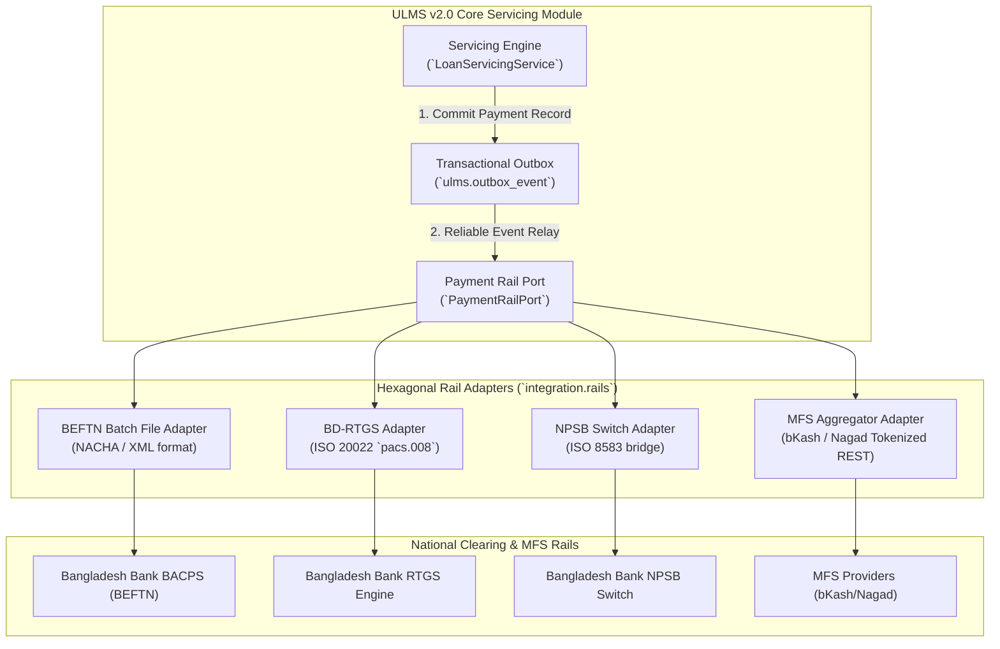

# DOC-01-ARCH-03: National Payment Rails, Bangladesh Bank RTGS, BEFTN & NPSB Integration Architecture

**Document Control**

| Field | Value |
|---|---|
| **Document Title** | National Payment Rails & Clearing Integration Architecture |
| **Project Name** | Unisoft Loan Management System (ULMS v2.0) |
| **Document Version** | 3.0.0 |
| **Date** | 2026-10-07 |
| **Classification** | Enterprise Technical Specification |
| **Status** | Approved Master Specification |
| **Authority Chain** | `Compliance_Validation_Matrix.md` → `Software_Requirements_Specification.md` → `LMS_CODEBASE/PLANNING/11_External_Integrations_Plan.md` |

---

## 1. Executive Summary & Regulatory Context

In Bangladesh commercial banking, loan disbursement and installment collection traverse national clearing and settlement rails regulated by **Bangladesh Bank Payment Systems Department (PSD)**. ULMS v2.0 integrates with four primary payment channels:
1. **Bangladesh Electronic Funds Transfer Network (BEFTN):** Batch automated clearing for corporate and retail loan disbursements and scheduled Standing Orders.
2. **Real-Time Gross Settlement (BD-RTGS):** High-value (BDT $\ge 100,000$) instant fund transfers using ISO 20022 message schemas (`pacs.008`, `pacs.009`).
3. **National Payment Switch Bangladesh (NPSB):** Real-time retail interbank fund transfers and card-based collections.
4. **Mobile Financial Services (MFS):** Real-time retail loan repayments via bKash, Nagad, and Rocket APIs.



---

## 2. Architectural Design Patterns & Resiliency

### 2.1 The Hexagonal Rail Port Interface
ULMS abstracts all physical rail complexities behind the clean domain port `com.uslbd.ulms.integration.rails.PaymentRailPort`:

```java
package com.uslbd.ulms.integration.rails;

public interface PaymentRailPort {
    PaymentDisbursementResult disburse(DisbursementInstruction instruction);
    PaymentInquiryResult queryStatus(String idempotencyKey);
    PaymentReversalResult reverse(ReversalInstruction instruction);
}
```

### 2.2 Strict Idempotency Key Enforcement
Every outbound clearing instruction generates a deterministic SHA-256 idempotency key composed of:
$$	ext{Key} = 	ext{SHA256}(	ext{account\_no} \parallel 	ext{installment\_no} \parallel 	ext{amount\_minor} \parallel 	ext{tx\_date})$$
Stored in `ulms.payment`, preventing double-crediting during network timeouts or retry loops.

### 2.3 Clearing Settlement Cutoff Schedule

| Rail | Settlement Frequency | Cutoff Window | Latency SLA | Fallback Protocol |
|---|---|---|---|---|
| **BEFTN** | 3 Sessions Daily | S1 12:00–15:00 · S2 15:00–23:59 · S3 00:00–10:00 (same-day cut-off 12:30; closed Fri/Sat/holidays) | $T+0$ to $T+1$ | Next clearing cycle |
| **BD-RTGS** | Real-Time Continuous | per current PSD schedule (Sunday–Thursday; illustrative 09:00–16:30) | $< 15$ seconds | Queue in Outbox until RTGS open |
| **NPSB** | Real-Time $24/7$ | Continuous | $< 3$ seconds | Retry 3 times, fail to BEFTN |
| **bKash / Nagad** | Real-Time $24/7$ | Continuous | $< 5$ seconds | Asynchronous webhook reconciliation |

---

## 3. Discrepancy Reconciliation & Ledger Balancing

Every morning at 06:00 AM, the ULMS Reconciliation Batch executes:
1. Downloads clearing return files from BACPS SFTP.
2. Matches external settlement references against `ulms.payment`.
3. In case of returned items, reverses loan credits and restores borrower DPD counters.
4. Generates an unbalanced clearing exceptions alert to the treasury desk.


---

## Addendum — v3.1.0 corrections (Independent Forensic Re-audit, 8 October 2026)

- BEFTN session data refreshed (v3.1.0): three settlement sessions per working day per current Bangladesh Bank PSD operating schedule; RTGS window shown as illustrative pending the current PSD circular.
