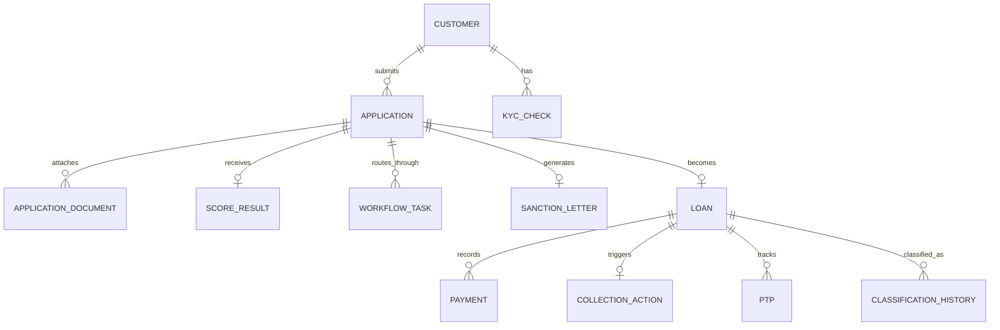

# DOC-01-ARCH-04: Enterprise Data Dictionary & PostgreSQL Dual-Schema Reference

**Document Control**

| Field | Value |
|---|---|
| **Document Title** | Enterprise Data Dictionary & PostgreSQL Dual-Schema Reference |
| **Project Name** | Unisoft Loan Management System (ULMS v2.0) |
| **Document Version** | 3.0.0 |
| **Date** | 2026-10-07 |
| **Classification** | Database Technical Reference |
| **Status** | Approved Master Schema Specification |
| **Authority Chain** | `LMS_CODEBASE/apps/api/src/main/resources/db/migration/` (V1–V18) → `LMS_CODEBASE/PLANNING/04_Data_Model_and_Migration_Plan.md` → `audit/07_DATABASE_SCHEMA_AND_JPA_AUDIT.md` |

---

## 1. Schema Evolution Ledger (Flyway V1–V18: 67 Tables Total)

The ULMS relational schema comprises **67 authoritative tables** managed strictly via forward-only Flyway migrations in PostgreSQL 17:

| Version | Migration Script | Scope & Domain Addressed |
|---|---|---|
| **V1** | `V1__init.sql` | Base schema, customer master (`customer`), audit entry (`audit_entry`), outbox (`outbox_event`). |
| **V2** | `V2__origination_workflow.sql` | Loan origination (`application`), documents (`application_document`), sanction letters (`sanction_letter`), approval bands (`approval_band`), and workflow engine (`workflow_definition`, `workflow_instance`, `workflow_task`, `workflow_transition`). |
| **V3** | `V3__customer_compliance.sql` | KYC verification history (`kyc_check`), sanctions screening hits (`screening_hit`), idempotency key store (`idempotency_key`). |
| **V4** | `V4__actor_width.sql` | Actor column expansion for Keycloak UUID compatibility across workflows. |
| **V5** | `V5__credit_approval.sql` | CIB reports & facilities (`cib_report`, `cib_facility`), scorecard results (`score_result`), collateral registry (`collateral`), dual-authorization disbursements (`disbursement`, `dual_authorization`), loan mirror (`loan`), and EOD provision runs (`provision_run`, `classification_history`). |
| **V6** | `V6__cib_compliance.sql` | CIB batch schedule and deduplication indexes (`uq_cib_dedupe`). |
| **V7** | `V7__concurrency_audit.sql` | Collateral valuation history (`collateral_valuation`), optimistic locking version columns, and hash-chain audit triggers. |
| **V8** | `V8__servicing_collections.sql` | Servicing ledger mirrors, repayment schedules, statements (`statement_run`), payments (`payment`, `payment_intent`), early settlement quotes (`settlement_quote`), reschedules (`reschedule_request`), and collections (`collection_action`, `ptp`, `field_task`). |
| **V9** | `V9__collections_parity.sql` | Legal case management (`legal_case`), PTP state machine, and dunning action history. |
| **V10** | `V10__regcon_reporting.sql` | Bangladesh Bank Regcon return catalog (`regulatory_return`) and 12-return WORM storage tables (`ecl_snapshot`). |
| **V11** | `V11__regcon_audit_g.sql` | Regcon 3-distinct-officer sign-off audit constraints (`report_definition`, `provision_jv`). |
| **V12** | `V12__r3_r4_r5_modules.sql` | Product catalog (`loan_product`, `loan_product_charge`), partner channels (`partner_channel`), BOCC meetings (`bocc_meeting`, `bocc_agenda_item`, `bocc_attendance`, `bocc_vote`), AML STR reports (`str_report`), guarantors (`guarantor`), notifications (`notification_template`, `notification_delivery`), recoveries (`recovery_entry`), and write-offs (`write_off`). |
| **V13** | `V13__loan_stage_width.sql` | Loan stage column width expansion for `WRITTEN_OFF` and `RESTRUCTURED`. |
| **V14** | `V14__r10_business_logic.sql` | Base Lending Rate (`blr_rate`), capital base (`capital_base`), risk weights (`risk_weight`), SLA policies (`sla_policy`), rate cards (`rate_card`), CTR reports (`ctr_report`), dunning steps (`dunning_step`), monitoring alerts (`monitoring_alert`), and OTP verification (`otp_request`). |
| **V15** | `V15__q3_uat_flips.sql` | goAML submission records (`goaml_submission`) and Basel parallel run logs (`basel_parallel_run`). |
| **V16** | `V16__q1_workflow_depth.sql` | Multi-tiered credit committee approval conditions (`approval_condition`) and delegation proxies. |
| **V17** | `V17__q1_collections_depth.sql` | Delinquency severity buckets, watchlist entries (`watchlist_entry`), and collateral auctions (`auction_entry`). |
| **V18** | `V18__field_gateway.sql` | Mobile field visits (`field_visit`), sync checkpoints, and emergency distress signals (`sos_alert`). |

---

## 2. Core Entity-Relationship Diagram

---

## 3. Data Dictionary: Core Tables Specification

### 3.1 `ulms.customer` (Customer Master Table)
Stores primary demographic and identification details for borrowers.
| Column | Type | Constraints | Description |
|---|---|---|---|
| `id` | `UUID` | `PRIMARY KEY` | Unique customer identifier (UUIDv7). |
| `cif` | `VARCHAR(32)` | `UNIQUE NOT NULL` | Bank Customer Information File identifier. |
| `name_en` | `VARCHAR(128)` | `NOT NULL` | Full customer name in English. |
| `name_bn` | `VARCHAR(128)` | `NOT NULL` | Full customer name in Bengali. |
| `mobile` | `VARCHAR(16)` | `NOT NULL` | Bangladeshi mobile number (`+8801...`). |
| `nid_masked` | `VARCHAR(32)` | `NOT NULL` | Masked National ID (`XXXXXXXXX1234`). |
| `segment` | `VARCHAR(32)` | `NOT NULL` | `RETAIL`, `SME`, `CORPORATE`. |
| `branch_code` | `VARCHAR(16)` | `NOT NULL` | Onboarding branch identifier (e.g., `BR-001`). |
| `version` | `BIGINT` | `DEFAULT 0` | Optimistic concurrency control version. |
| `created_at` | `TIMESTAMPTZ` | `DEFAULT now()` | Record creation timestamp. |

### 3.2 `ulms.application` (Loan Origination Table)
Tracks the end-to-end lifecycle of a loan origination request (created in `V2__origination_workflow.sql`, expanded in `V5`).
| Column | Type | Constraints | Description |
|---|---|---|---|
| `id` | `UUID` | `PRIMARY KEY` | Application unique identifier. |
| `app_no` | `VARCHAR(16)` | `UNIQUE NOT NULL` | Unique application tracking number (`APP-7xxxx`). |
| `customer_id` | `UUID` | `NOT NULL REFERENCES customer(id)` | Foreign key to applicant customer master. |
| `product_code` | `VARCHAR(20)` | `NOT NULL` | Product configuration key (e.g., `sme-term`). |
| `amount_minor` | `BIGINT` | `NOT NULL` | Requested loan principal in Poisha minor units. |
| `tenor_months` | `INT` | `NOT NULL` | Loan duration in months. |
| `rate_type` | `VARCHAR(10)` | `NOT NULL DEFAULT 'FIXED'` | Interest calculation type (`FIXED` or `FLOATING`). |
| `stage` | `VARCHAR(20)` | `NOT NULL DEFAULT 'SCREENING'` | Workflow stage (`SCREENING`, `CPV`, `SANCTIONED`, `DISBURSED`, `REJECTED`). |
| `dbr_percent` | `NUMERIC(5,2)` | `NULL` | Calculated Debt Burden Ratio ($\le 50.0\%$). |
| `branch_code` | `VARCHAR(8)` | `NOT NULL` | Originating branch code. |
| `income_minor` | `BIGINT` | `NULL` | Monthly verified net income snapshot in Poisha. |
| `existing_emi_minor` | `BIGINT` | `NULL` | Monthly existing bank commitments in Poisha. |
| `cib_obligation_minor`| `BIGINT` | `NULL` | Monthly verified CIB credit obligations in Poisha. |
| `fineract_loan_id` | `BIGINT` | `NULL` | Upstream Fineract core loan reference ID. |
| `created_by` | `VARCHAR(40)` | `NOT NULL` | Actor identifier (Maker officer). |
| `created_at` | `TIMESTAMPTZ` | `DEFAULT now()` | Creation timestamp. |
| `updated_at` | `TIMESTAMPTZ` | `DEFAULT now()` | Last update timestamp. |

### 3.3 `ulms.loan` (Active Loan Portfolio Mirror Table)
Active lending ledger state mirrored from Apache Fineract and managed by ULMS servicing/compliance (`V5__credit_approval.sql`).
| Column | Type | Constraints | Description |
|---|---|---|---|
| `id` | `UUID` | `PRIMARY KEY` | Unique loan identifier. |
| `application_id`| `UUID` | `REFERENCES application(id)` | Originating application (nullable for migrated legacy loans). |
| `customer_id` | `UUID` | `NOT NULL REFERENCES customer(id)` | Borrower customer identifier. |
| `loan_no` | `VARCHAR(16)` | `UNIQUE NOT NULL` | Human-readable loan account number. |
| `fineract_loan_id` | `BIGINT` | `UNIQUE` | Direct identifier in Fineract `m_loan`. |
| `principal_minor` | `BIGINT` | `NOT NULL` | Disbursed principal amount in Poisha. |
| `outstanding_minor`| `BIGINT` | `NOT NULL` | Current outstanding principal balance in Poisha. |
| `dpd` | `INT` | `DEFAULT 0 NOT NULL` | Days Past Due calculated at EOD. |
| `stage` | `VARCHAR(10)` | `DEFAULT 'ACTIVE' NOT NULL` | Lifecycle state (`ACTIVE`, `CLOSED`, `WRITTEN_OFF`). |
| `classification`| `VARCHAR(6)` | `DEFAULT 'STD-0' NOT NULL` | BRPD 15/2024 category (`STD-0`, `STD-1`, `STD-2`, `SMA`, `SS`, `DF`, `B/L`). |
| `interest_suspense`| `BOOLEAN` | `DEFAULT false NOT NULL` | Suspends revenue recognition when `SS`, `DF`, or `B/L`. |
| `disbursed_at` | `TIMESTAMPTZ` | `NULL` | Timestamp of core disbursement. |
| `created_at` | `TIMESTAMPTZ` | `DEFAULT now()` | Record creation timestamp. |

### 3.4 `ulms.approval_band` (7-Level Approval Ladder Policy)
Authoritative policy table mapping loan amount thresholds to required approval roles (`V2__origination_workflow.sql`).
| Level | Role Key | Role Name (English) | Min Minor (৳) | Max Minor (৳) |
|---|---|---|---|---|
| **1** | `ladder-1` | Branch Officer (L1) | `0` | `50000000` ($\le \text{৳}5\text{ Lakh}$) |
| **2** | `ladder-2` | Branch Manager (L2) | `50000001` | `100000000` ($\le \text{৳}10\text{ Lakh}$) |
| **3** | `ladder-3` | Regional Manager (L3) | `100000001` | `250000000` ($\le \text{৳}25\text{ Lakh}$) |
| **4** | `ladder-4` | Divisional Head (L4) | `250000001` | `500000000` ($\le \text{৳}50\text{ Lakh}$) |
| **5** | `ladder-5` | Head of Credit (L5) | `500000001` | `2500000000` ($\le \text{৳}2.5\text{ Crore}$) |
| **6** | `ladder-6` | Credit Committee (L6) | `250000001` | `10000000000` ($\le \text{৳}10\text{ Crore}$) |
| **7** | `ladder-7` | Managing Director (L7) | `10000000001` | `NULL` ($> \text{৳}10\text{ Crore}$) |

### 3.5 `ulms.classification_history` (BRPD 15/2024 EOD Classification Snapshots)
Contains daily snapshots generated by the nightly 23:30 EOD classification batch (`V5__credit_approval.sql`).
| Column | Type | Constraints | Description |
|---|---|---|---|
| `id` | `UUID` | `PRIMARY KEY` | Snapshot identifier. |
| `loan_id` | `UUID` | `REFERENCES loan(id)` | Foreign key to active loan. |
| `run_date` | `DATE` | `NOT NULL` | Classification date. |
| `dpd` | `INT` | `NOT NULL` | Days Past Due calculated at EOD. |
| `stage` | `VARCHAR(16)` | `NOT NULL` | `STD-0`, `STD-1`, `STD-2`, `SMA`, `SS`, `DF`, `B/L`. |
| `provision_rate_bp` | `INT` | `NOT NULL` | Provision rate in basis points (100 = 1%, 500 = 5%, etc.). |
| `provision_amount_minor`| `BIGINT` | `NOT NULL` | Statutory provision amount in Poisha. |
| `interest_suspense` | `BOOLEAN` | `NOT NULL` | `true` if loan is in SS, DF, or B/L. |

---

## 4. Platform Audit & Outbox Tables

### 4.1 `ulms.outbox_event` (Transactional Outbox)
Guarantees at-least-once asynchronous event delivery without message loss.
| Column | Type | Constraints | Description |
|---|---|---|---|
| `id` | `UUID` | `PRIMARY KEY` | Unique event identifier. |
| `aggregate_type` | `VARCHAR(64)` | `NOT NULL` | Domain aggregate (`APPLICATION`, `LOAN`, `PAYMENT`). |
| `aggregate_id` | `VARCHAR(64)` | `NOT NULL` | Identifier of affected entity. |
| `event_type` | `VARCHAR(64)` | `NOT NULL` | Event name (`LOAN_DISBURSED`, `PAYMENT_POSTED`). |
| `payload` | `JSONB` | `NOT NULL` | Serialized event payload. |
| `dispatched_at` | `TIMESTAMPTZ` | `NULL` | Null until successfully dispatched. |
| `retry_count` | `INT` | `DEFAULT 0` | Dispatch failure retry counter. |

### 4.2 `ulms.audit_entry` (Cryptographically Chained Audit Trail)
| Column | Type | Constraints | Description |
|---|---|---|---|
| `id` | `BIGSERIAL` | `PRIMARY KEY` | Monotonically increasing sequence. |
| `actor` | `VARCHAR(64)` | `NOT NULL` | User identifier from Keycloak JWT `sub`. |
| `action` | `VARCHAR(64)` | `NOT NULL` | Executed action (e.g., `DISBURSE_LOAN`). |
| `payload_hash` | `VARCHAR(64)` | `NOT NULL` | SHA-256 hash of masked payload JSON. |
| `previous_hash` | `VARCHAR(64)` | `NOT NULL` | Hash of preceding record ($n-1$). |
| `current_hash` | `VARCHAR(64)` | `NOT NULL` | SHA-256($\text{previous\_hash} \parallel \text{payload\_hash}$). |
| `created_at` | `TIMESTAMPTZ` | `DEFAULT now()` | Immutable timestamp. |

---

*— End of Data Dictionary Specification —*
