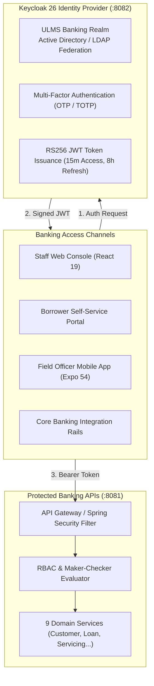

# DOC-01-ARCH-06: Identity, Authentication & Role-Based Access Control Specification

**Document Control**

| Field | Value |
|---|---|
| **Document Title** | Identity, Authentication & Role-Based Access Control Specification |
| **Project Name** | Unisoft Loan Management System (ULMS v2.0) |
| **Document Version** | 3.0.0 |
| **Date** | 2026-10-07 |
| **Classification** | Enterprise Security Architecture Specification |
| **Status** | Approved Master Security Specification |
| **Authority Chain** | `LMS_CODEBASE/deploy/seed/realm-ulms.json` → `Technology_Stack_Recommendation_v3.md` → `Bangladesh Bank ICT Security Guidelines V4.0` |
| **Target Codebase** | `c:\software_project\mim_project\LMS\LMS_CODEBASE` |

---

## 1. Identity Architecture & Trust Domain

ULMS v2.0 establishes an institutional identity and access management (IAM) perimeter built upon **Keycloak 26**, implementing OAuth 2.0 and OpenID Connect (OIDC) with JSON Web Tokens (JWT):



---

## 2. Institutional Role-Based Access Control (RBAC) Matrix

The system defines 12 standard banking personas with fine-grained capability scopes across all 9 core modules:

| Banking Persona | Primary Functional Scope | Permitted Capabilities & Scopes |
|---|---|---|
| **`teller`** | Front-desk cash & repayment | View customer balances, post cash/cheque repayment, generate mini-statement. |
| **`loan-officer`** | Loan origination & customer onboarding | Onboard customers, initiate e-KYC, create loan drafts, enter collateral particulars. |
| **`credit-analyst`** | Underwriting & credit assessment | Request CIB reports, execute credit scorecards, evaluate DBR, draft credit memos. |
| **`branch-manager`** | Branch supervisory approval (Tier 1) | Approve loans up to BDT 1,000,000; refer back; sanction letters. |
| **`regional-credit-manager`**| Regional credit approval (Tier 2) | Approve loans up to BDT 5,000,000; manage regional underwriting queues. |
| **`head-of-credit`** | Head Office credit risk approval (Tier 3) | Approve loans up to BDT 20,000,000; policy exception management. |
| **`md-ceo`** | Executive management sanction (Tier 4) | Approve loans up to BDT 50,000,000; executive committee escalation. |
| **`board-member`** | Board Credit Committee (BCC) (Tier 5) | Review and sanction syndicated/large exposures exceeding BDT 50,000,000. |
| **`disbursement-officer`** | Loan disbursement execution | Dual-control loan fund release to core banking CASA accounts. |
| **`compliance-officer`** | Regulatory reporting & BRPD | Run nightly EOD batch, generate CIB monthly exports, manage court stay orders. |
| **`recovery-agent`** | Delinquency & collections management | Manage DPD worklists, record Promise-to-Pay (PTP), issue dunning notices. |
| **`field-officer`** | On-site contact point verification (CPV)| Perform geo-tagged site visits, upload collateral photos via mobile app. |

---

## 3. Maker-Checker Segregation of Duties

Under **Bangladesh Bank ICT Security Guidelines V4.0 §3.2**, financial applications must enforce dual authorization to prevent internal fraud and collusion:

### Technical Enforcement Rules:
1. **Subject Matching Invariant:** A loan application cannot be approved or sanctioned by an officer whose Keycloak `sub` (user identifier) matches the `maker_user_id` recorded on the application draft. Attempted self-approval returns **`HTTP 409 Conflict (ULMS-AUTH-0002)`**.
2. **Disbursement Dual-Control:** Loan fund release requires two distinct officers:
   - **Disbursement Maker:** Verifies documentation and initiates disbursement schedule.
   - **Disbursement Checker:** Verifies CASA account particulars and confirms fund release.
3. **High-Value Step-Up Verification:** Any transaction or disbursement exceeding **BDT 500,000** triggers an out-of-band SMS OTP verification prompt.

---

## 4. JWT Token Claims Structure

```json
{
  "iss": "https://auth.ulms.bank.com.bd/realms/ulms",
  "sub": "usr_8f2b3e4a-912c-4d8e-b567-0e12b3c4d567",
  "aud": "ulms-api",
  "exp": 1791389400,
  "nbf": 1791388500,
  "iat": 1791388500,
  "jti": "d63b2f18-6c89-4d2a-89bc-9902b3c4d501",
  "preferred_username": "tariq.ahmed",
  "email": "tariq.ahmed@bank.com.bd",
  "realm_access": {
    "roles": [
      "loan-officer",
      "branch-maker"
    ]
  },
  "branch_id": "BR-DHN-042",
  "branch_name": "Dhanmondi Branch, Dhaka",
  "approval_limit_minor": 100000000,
  "mfa_verified": true
}
```

---

## 5. Session Governance & Audit Logging

- **Access Token TTL:** **15 minutes** (short-lived to minimize exposure if token is intercepted).
- **Refresh Token TTL:** **8 hours** (matches standard banking working shift).
- **Session Revocation:** Logout or administrator revocation publishes a token invalidation event to Redis, instantly blacklisting the token across all API gateway instances.
- **Audit Logging:** Every authorization decision (success or denial) writes an immutable record into `ulms_app.audit_entries` capturing `timestamp`, `user_id`, `client_ip`, `action`, `resource_id`, and `http_status`.

---

*— End of Identity, Authentication & Role-Based Access Control Specification —*
