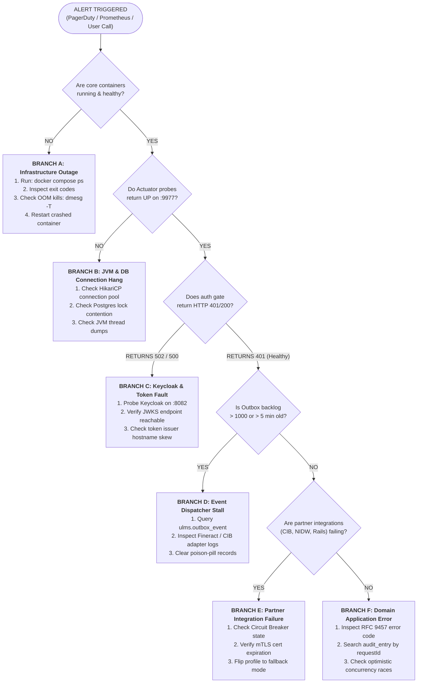

# DOC-02-TS-01: SRE Incident Response & Diagnostic Decision Trees

**Document Control**

| Field | Value |
|---|---|
| **Document Title** | SRE Incident Response & Diagnostic Decision Trees |
| **Project Name** | Unisoft Loan Management System (ULMS v2.0) |
| **Document Version** | 3.0.0 |
| **Date** | 2026-10-07 |
| **Classification** | Operational Runbook / High-Priority Playbook |
| **Status** | Approved Master SRE Runbook |
| **Authority Chain** | `LMS_CODEBASE/docs/runbooks/RB-01_incident_response.md` → `LMS_CODEBASE/PLANNING/10_DevOps_Deployment_and_Runbook.md` → `Technology_Stack_Recommendation_v3.md` |

---

## 1. Executive Purpose & Severity Classification

This runbook governs the **first 30 minutes** of any technical incident, degradation, or operational outage affecting the ULMS v2.0 core lending platform. It establishes rapid triage workflows, diagnostic decision trees, and root-cause isolation steps.

### Severity Classification Matrix

| Severity Level | Operational Impact | Central Bank Notification | Target MTTR | Immediate Escalation |
|---|---|---|---|---|
| **SEV-1 (Critical)** | Core lending halted; disbursements failing; payment repayments dropping; database down. | **Mandatory** within 2 hours to Bangladesh Bank BRPD. | $< 30$ mins | On-Call Lead + CTO + Head of Credit + BISO |
| **SEV-2 (Major)** | Major workflow degraded; CIB online down (falling back to batch); 23:30 EOD batch stalled; approval ladder slow. | Internal notification only unless duration exceeds 6 hours. | $< 2$ hours | Senior Backend Eng + DevOps Lead |
| **SEV-3 (Minor)** | Isolated UI glitch; report download timeout; non-critical field photo upload failure. | None. | $< 8$ hours | Bug triage channel |

---

## 2. Interactive Diagnostic Decision Tree

Follow this systematic decision tree to isolate the root cause within the first 5 minutes of an alert:



---

## 3. Step-by-Step Triage Checklist (First 15 Minutes)

Execute all commands from the deployment environment directory (`deploy/compose` or via `kubectl`):

### Step 1: Rapid Infrastructure Scope Check
```bash
# Check container status
docker compose ps
# Expected healthy baseline:
# postgres: Up (healthy)
# keycloak: Up (healthy)
# fineract: Up (healthy)
# minio: Up (healthy)
# api: Up (healthy)
# web: Up
```

### Step 2: Unauthenticated Health Probe Sweep
Verify service listeners without requiring an OAuth2 token:
```bash
# 1. ULMS API Actuator Probe (Management port 9977)
curl -s -m 5 http://localhost:9977/actuator/health
# Expected: {"status":"UP","components":{"db":{"status":"UP"},"diskSpace":{"status":"UP"}}}

# 2. Apache Fineract CE Internal TLS Listener
curl -sk -m 5 https://localhost:8083/fineract-provider/actuator/health
# Expected: {"status":"UP"}

# 3. Keycloak Realm Discovery
curl -s -m 5 -o /dev/null -w "%{http_code}\n" http://localhost:8082/realms/ulms
# Expected: 200

# 4. S3 Object Storage Gateway
curl -s -m 5 -o /dev/null -w "%{http_code}\n" http://localhost:9002/ulms-documents
# Expected: 200
```

### Step 3: Auth-Gate Verification
Determine whether an issue is in the application routing layer or identity provider:
```bash
curl -s -o /dev/null -w "%{http_code}\n" http://localhost:8081/api/v1/compliance/classification
```
- **`401 Unauthorized`**: **NORMAL.** Proves the API is alive, network routing works, and the JWT filter is intercepting requests.
- **`502 Bad Gateway` / `000 Connection Refused`**: **API DOWN.** The API container has crashed or hung.
- **`500 Internal Server Error`**: **CONFIGURATION FAULT.** Database pool exhausted or Keycloak JWKS fetch failure.

### Step 4: Transactional Outbox Backlog Check
An outbox backlog indicates downstream dispatcher failure (Fineract REST calls failing, CIB network down, or SMS gateway stall):
```bash
docker compose exec -T postgres psql -U ulms -d ulms -c \
  "SELECT count(*) AS undelivered, max(age(now(), created_at))::text AS oldest_age 
   FROM ulms.outbox_event WHERE dispatched_at IS NULL;"
```
- **Normal Baseline:** `undelivered = 0`, `oldest_age = null`.
- **Alert Condition:** `undelivered > 1000` OR `oldest_age > 5 minutes`.

### Step 5: Focused Error Log Capture
Avoid dumping hundreds of thousands of lines. Capture only the last 100 lines filtered for errors:
```bash
docker compose logs --tail 100 api | grep -E "ERROR|WARN|Exception"
docker compose logs --tail 100 fineract | grep -E "ERROR|Exception"
docker compose logs --tail 100 keycloak | grep -E "ERROR|WARN"
```

---

## 4. Branch Resolution Procedures

### Procedure A: Core Container Crash Recovery
1. Identify the exited container:
   ```bash
   docker compose ps -a | grep -v "Up"
   ```
2. Inspect the exit reason:
   ```bash
   docker compose logs --tail 50 <SERVICE_NAME>
   ```
3. If killed by Linux Out-Of-Memory (OOM) Killer:
   - Verify host memory: `free -m`
   - Adjust JVM `-Xmx` ceiling in `deploy/compose/docker-compose.yml`.
4. Restart the service cleanly:
   ```bash
   docker compose restart <SERVICE_NAME>
   ```

### Procedure B: Database Pool Exhaustion Recovery
1. Query active PostgreSQL connections:
   ```bash
   docker compose exec -T postgres psql -U ulms -d ulms -c \
     "SELECT pid, age(clock_timestamp(), query_start), usename, state, query 
      FROM pg_stat_activity 
      WHERE state != 'idle' ORDER BY query_start ASC LIMIT 10;"
   ```
2. Terminate long-running blocking queries ($> 60$ seconds):
   ```bash
   docker compose exec -T postgres psql -U ulms -d ulms -c \
     "SELECT pg_terminate_backend(<BLOCKING_PID>);"
   ```

### Procedure C: Outbox Poison-Pill Resolution
If an outbox event encounters an unrecoverable exception, preventing downstream processing:
1. Identify the stuck event:
   ```bash
   docker compose exec -T postgres psql -U ulms -d ulms -c \
     "SELECT id, aggregate_type, aggregate_id, error_detail 
      FROM ulms.outbox_event 
      WHERE dispatched_at IS NULL AND retry_count >= 5 LIMIT 5;"
   ```
2. Quarantine the poison-pill record to a dead-letter state:
   ```bash
   docker compose exec -T postgres psql -U ulms -d ulms -c \
     "UPDATE ulms.outbox_event 
      SET dispatched_at = now(), status = 'DEAD_LETTER' 
      WHERE id = '<STUCK_EVENT_ID>';"
   ```
3. Trigger a manual outbox dispatcher sweep via Actuator:
   ```bash
   curl -X POST http://localhost:9977/actuator/outbox/dispatch
   ```

---

## 5. Escalation & Communication Protocol

1. **Incident Scribe Assignment:** One team member records timestamps, findings, and decisions in the incident channel.
2. **Bank Management Notification Template:**
   ```
   INCIDENT NOTIFICATION: ULMS Core Lending System
   Severity: SEV-1 (Critical)
   Time Detected: YYYY-MM-DD HH:MM BST
   Impact: Loan disbursement processing delayed for Branch X.
   Current Actions: SRE team investigating outbox connection pool saturation.
   Next Update: HH:MM BST (+30 minutes)
   ```
3. **Regulatory Central Bank Reporting:**
   For SEV-1 incidents exceeding 30 minutes, prepare the **Bangladesh Bank ICT Incident Notification Form** per Guideline V4.0 §7.3.

---

*— End of SRE Incident Runbook —*
