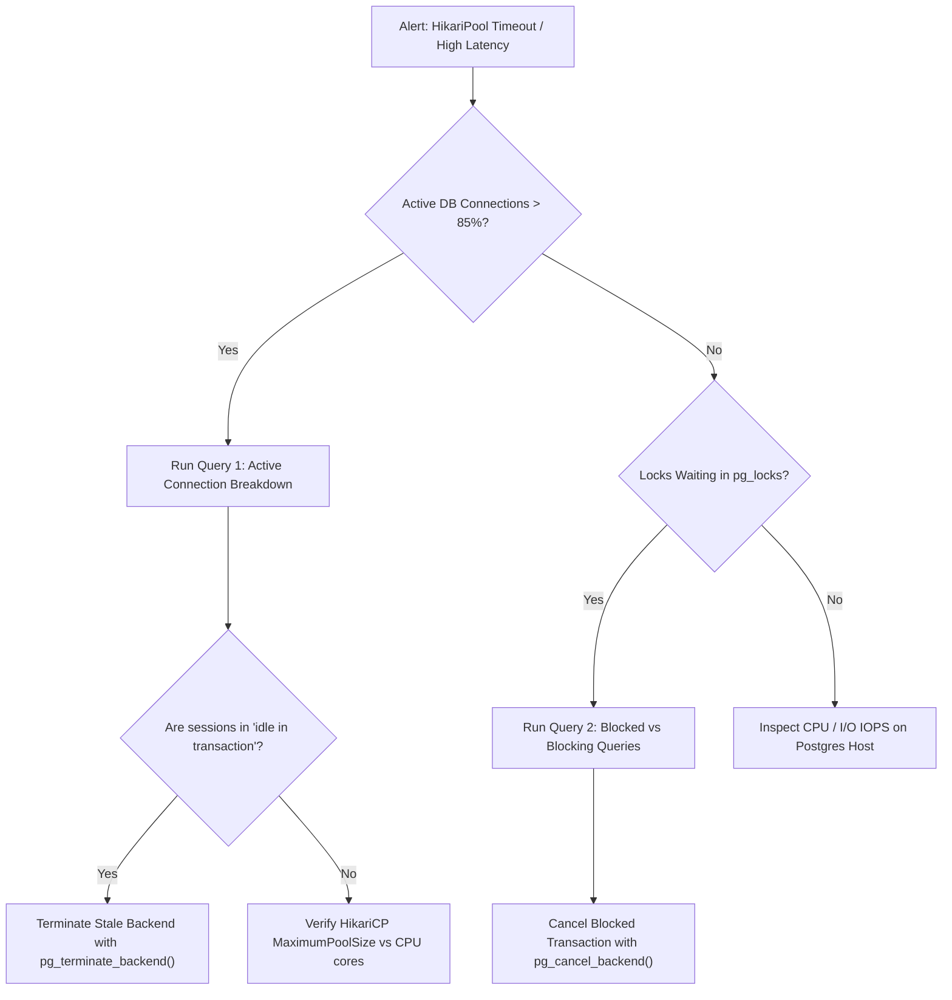

# DOC-02-TS-03: PostgreSQL Connection Pool Exhaustion & Lock Contention Diagnostic Runbook

**Document Control**

| Field | Value |
|---|---|
| **Document Title** | PostgreSQL Pool & Lock Contention Diagnostic Runbook |
| **Project Name** | Unisoft Loan Management System (ULMS v2.0) |
| **Document Version** | 3.0.0 |
| **Date** | 2026-10-07 |
| **Classification** | Operational SRE Diagnostic Runbook |
| **Status** | Approved Master Specification |
| **Authority Chain** | `DOC-02-TS-01` → PostgreSQL 17 Performance Tuning Standard |

---

## 1. Problem Statement & Symptoms

During high-concurrency periods (e.g., month-end loan disbursement surges or nightly EOD batch execution at 23:30), the API tier may exhibit:
- HTTP 503 / 504 errors on `/api/v1/applications` or `/api/v1/loans`.
- Log entries containing: `ConnectionTimeoutException: HikariPool-1 - Connection is not available, request timed out after 30000ms`.
- Spike in PostgreSQL active sessions approaching `max_connections = 250`.
- Application threads blocked on `SELECT ... FOR UPDATE` waiting for row locks.

---

## 2. Rapid Triage Decision Tree



---

## 3. Immediate Diagnostic SQL Queries

### Query 1: Inspect Connection Pool Breakdown
```sql
SELECT state, count(*), 
       max(now() - state_change) as longest_state_duration
FROM pg_stat_activity 
WHERE datname = 'ulms'
GROUP BY state;
```

### Query 2: Identify Blocking vs Blocked Sessions (Deadlock Prevention)
```sql
SELECT 
    blocked_locks.pid     AS blocked_pid,
    blocked_activity.usename  AS blocked_user,
    blocking_locks.pid    AS blocking_pid,
    blocking_activity.usename AS blocking_user,
    blocked_activity.query    AS blocked_statement,
    blocking_activity.query   AS current_statement_in_blocking_process
FROM  pg_catalog.pg_locks         blocked_locks
JOIN pg_catalog.pg_stat_activity blocked_activity ON blocked_activity.pid = blocked_locks.pid
JOIN pg_catalog.pg_locks         blocking_locks 
    ON blocking_locks.locktype = blocked_locks.locktype
    AND blocking_locks.database IS NOT DISTINCT FROM blocked_locks.database
    AND blocking_locks.relation IS NOT DISTINCT FROM blocked_locks.relation
    AND blocking_locks.page IS NOT DISTINCT FROM blocked_locks.page
    AND blocking_locks.tuple IS NOT DISTINCT FROM blocked_locks.tuple
    AND blocking_locks.virtualxid IS NOT DISTINCT FROM blocked_locks.virtualxid
    AND blocking_locks.transactionid IS NOT DISTINCT FROM blocked_locks.transactionid
    AND blocking_locks.classid IS NOT DISTINCT FROM blocked_locks.classid
    AND blocking_locks.objid IS NOT DISTINCT FROM blocked_locks.objid
    AND blocking_locks.objsubid IS NOT DISTINCT FROM blocked_locks.objsubid
    AND blocking_locks.pid != blocked_locks.pid
JOIN pg_catalog.pg_stat_activity blocking_activity ON blocking_activity.pid = blocking_locks.pid
WHERE NOT blocked_locks.granted;
```

---

## 4. Remediation Actions

1. **Terminate Culprit Session:**
   ```sql
   SELECT pg_terminate_backend(<blocking_pid>);
   ```
2. **Permanent HikariCP Pool Sizing Rule:**
   $$	\t\t\text{MaximumPoolSize} = (	ext{CPU\_Cores} 	imes 2) + 	\t\t\text{Effective\_Spindle\_Count}$$
   For a 4-vCPU database instance, configure `spring.datasource.hikari.maximum-pool-size=9` and `idle-timeout=30000`.


---

## Addendum — v3.1.0 corrections (Independent Forensic Re-audit, 8 October 2026)

- Corrections (v3.1.0): database name unified to ulms (psql -d ulms); the HikariCP pool-size recommendation reconciled with the stated formula (4 vCPU → ≈9 per instance, not 20); LaTeX rendering of the formula repaired. The HA cluster figure depicts the target-state synchronous-standby topology — the current compose stack ships a single PostgreSQL 17 node (see MNT-03 for the canonical RPO/RTO baseline).
