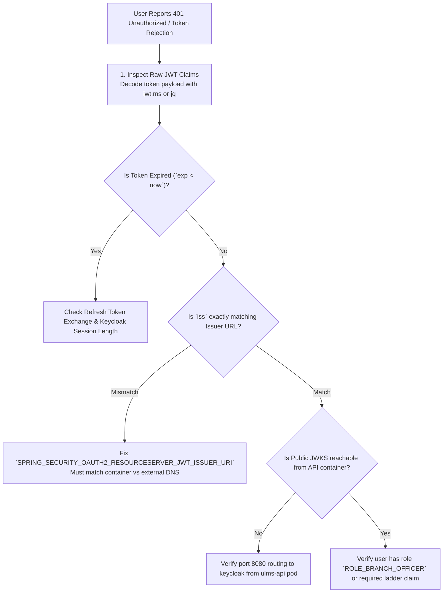

# DOC-02-TS-04: Keycloak SSO, OAuth2/OIDC Token Validation & JWT Expiry Diagnostic Guide

**Document Control**

| Field | Value |
|---|---|
| **Document Title** | Keycloak SSO & OAuth2 Token Validation Diagnostics |
| **Project Name** | Unisoft Loan Management System (ULMS v2.0) |
| **Document Version** | 3.0.0 |
| **Date** | 2026-10-07 |
| **Classification** | Operational Troubleshooting Guide |
| **Status** | Approved Master Specification |
| **Authority Chain** | `DOC-01-ARCH-06` → OpenID Connect Core 1.0 → RFC 7519 (JWT) |

---

## 1. Problem Statement & Common Error Signatures

Users attempting to access the ULMS Staff Portal or API experience unexpected authentication failures:
- HTTP 401 Unauthorized with response `Bearer error="invalid_token", error_description="The Token's Signature resulted in an error"`.
- Browser redirect loop between `http://lms.bank.local/auth` and Keycloak realm login.
- Clock skew errors: `JwtValidationException: An error occurred while attempting to decode the Jwt: The JWT is not yet valid (nbf)`.
- Keycloak container log: `WARN [org.keycloak.events] (executor-thread-1) type=LOGIN_ERROR, error=invalid_user_credentials`.

---

## 2. Systematic Troubleshooting Steps



---

## 3. High-Frequency Root Causes & Solutions

### 3.1 Docker / Kubernetes Issuer URI Mismatch
- **Root Cause:** When accessing via browser, issuer is `http://keycloak.local/realms/ulms`, but Spring Boot container resolves `http://keycloak:8080/realms/ulms`.
- **Solution:** Configure Keycloak frontend URL in `deploy/compose/docker-compose.yml`:
  ```yaml
  KC_HOSTNAME_URL: "http://keycloak:8080"
  KC_HOSTNAME_ADMIN_URL: "http://keycloak:8080"
  KC_HOSTNAME_STRICT: "false"
  ```

### 3.2 Clock Skew Remediation
Spring Boot allows a default 60-second leeway. If host servers drift by $> 60$ seconds:
```bash
# Sync NTP on all host nodes
sudo chronyc -a makestep
```
