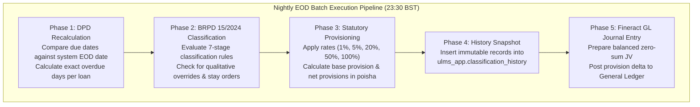

# DOC-02-TS-05: Nightly EOD Batch & Classification Diagnostic Guide

**Document Control**

| Field | Value |
|---|---|
| **Document Title** | Nightly EOD Batch & Classification Diagnostic Guide |
| **Project Name** | Unisoft Loan Management System (ULMS v2.0) |
| **Document Version** | 3.0.0 |
| **Date** | 2026-10-07 |
| **Classification** | Operational Troubleshooting Guide |
| **Status** | Approved Master Troubleshooting Guide |
| **Authority Chain** | `LMS_CODEBASE/docs/runbooks/RB-03_eod_rerun.md` → `LMS_CODEBASE/apps/api/src/main/java/com/uslbd/ulms/compliance/EodBatchService.java` → `Bangladesh Bank BRPD Circular 15/2024` |
| **Target Codebase** | `c:\software_project\mim_project\LMS\LMS_CODEBASE` |

---

## 1. Executive Overview & Batch Rhythm (23:30 BST SLA)

Every night at **23:30 Bangladesh Standard Time (BST)**, the ULMS automated End-of-Day (EOD) batch service evaluates all active loans across the bank's portfolio. The batch job enforces statutory classification, calculates required loan loss provisioning in poisha, and generates balanced accounting journal vouchers (JVs) for the general ledger.



### Batch SLA & Performance Thresholds
- **Target Execution Window:** 23:30 BST to 00:15 BST (Maximum 45 minutes for 500,000 active loans).
- **Critical Threshold Alert:** Prometheus triggers `EodBatchDurationExceeded` if batch execution exceeds 45 minutes.
- **Transaction Chunk Size:** Evaluated in cursor-based batches of 1,000 loans per transaction to prevent memory saturation and excessive row locks.

---

## 2. Common Failure Modes & SRE Diagnostic Decision Trees

### Failure Mode 1: Batch Stalled Due to Database Row Lock Contention
- **Symptom:** Batch progress stops; log output freezes at a specific chunk; `EodBatchDurationExceeded` alert fires.
- **Root Cause:** A long-running analytical query or uncommitted interactive transaction holds an exclusive lock on `customers` or `loans`.
- **Triage Query:**
  ```sql
  SELECT 
    blocked_locks.pid     AS blocked_pid,
    blocked_activity.usename  AS blocked_user,
    blocking_locks.pid    AS blocking_pid,
    blocking_activity.usename AS blocking_user,
    blocking_activity.query   AS blocking_statement,
    now() - blocking_activity.query_start AS blocking_duration
  FROM  pg_catalog.pg_locks         blocked_locks
  JOIN pg_catalog.pg_stat_activity blocked_activity ON blocked_activity.pid = blocked_locks.pid
  JOIN pg_catalog.pg_locks         blocking_locks 
      ON blocking_locks.locktype = blocked_locks.locktype
      AND blocking_locks.database IS NOT DISTINCT FROM blocked_locks.database
      AND blocking_locks.relation IS NOT DISTINCT FROM blocked_locks.relation
      AND blocking_locks.page IS NOT DISTINCT FROM blocked_locks.page
      AND blocking_locks.tuple IS NOT DISTINCT FROM blocked_locks.tuple
      AND blocking_locks.virtualxid IS NOT DISTINCT FROM blocked_locks.virtualxid
      AND blocking_locks.transactionid IS NOT DISTINCT FROM blocked_locks.transactionid
      AND blocking_locks.classid IS NOT DISTINCT FROM blocked_locks.classid
      AND blocking_locks.objid IS NOT DISTINCT FROM blocked_locks.objid
      AND blocking_locks.objsubid IS NOT DISTINCT FROM blocked_locks.objsubid
      AND blocking_locks.pid != blocked_locks.pid
  JOIN pg_catalog.pg_stat_activity blocking_activity ON blocking_activity.pid = blocking_locks.pid
  WHERE NOT blocked_locks.granted;
  ```
- **Remediation Action:**
  1. Identify the blocking query PID. If it is an unapproved ad-hoc reporting query, terminate it safely:
  ```sql
  SELECT pg_cancel_backend($BLOCKING_PID);
  -- If still hung after 30 seconds:
  SELECT pg_terminate_backend($BLOCKING_PID);
  ```
  2. The batch worker will resume automatically once the lock is cleared.

---

### Failure Mode 2: Fineract GL Posting Rejection (The 409 Conflict Drifted JV Trap)
- **Symptom:** Phases 1–4 succeed, but Phase 5 fails with `HTTP 409 Conflict: Provision JV already posted for batch date`.
- **Root Cause:** The batch was run earlier in the evening or a preliminary run took place, and a provision Journal Voucher (JV) was already created in Fineract. Re-running the batch changes the provision amount, causing Fineract to reject the duplicate booking date.
- **The Golden Rule:** **Never manually edit or delete general ledger rows in PostgreSQL.**
- **Remediation Action:**
  1. The Compliance Officer and Finance Lead must execute a dual-authorized JV Reversal for the prior entry:
  ```bash
  # Step 1: Inquire existing provision JV reference
  curl -s -X GET -H "Authorization: Bearer $TOKEN" \
    http://localhost:8081/api/v1/compliance/provision-jv/by-date/2026-10-06

  # Step 2: Post reversing entry
  curl -s -X POST -H "Authorization: Bearer $TOKEN" -H "Content-Type: application/json" \
    -d '{"reversalReason": "EOD recomputation adjustment", "dualAuthOfficerId": "fin_head_01"}' \
    http://localhost:8081/api/v1/compliance/provision-jv/$ORIGINAL_JV_ID/reverse
  ```
  2. Re-trigger Phase 5 GL posting to post the newly adjusted, balanced journal entry.

---

## 3. Safe Historical EOD Rerun Procedure (`RB-03`)

When a scheduled batch fails, a court stay order is processed retroactively, or the 23:30 window is missed due to an infrastructure outage, execute the following deterministic rerun runbook:

### Step 1: Freeze Pre-Rerun Evidence (Regulatory Audit Requirement)
Before modifying classification snapshots, capture current counts and totals to an audit file:
```bash
docker compose exec -T postgres psql -U ulms -d ulms -c "
  SELECT 
    run_date,
    loans_classified,
    total_standard_minor,
    total_classified_minor,
    total_provision_minor,
    created_at
  FROM ulms_app.provision_run 
  WHERE run_date >= CURRENT_DATE - INTERVAL '3 days'
  ORDER BY run_date DESC;" > /var/log/ulms/eod_pre_rerun_audit_$(date +%Y%m%d_%H%M%S).txt
```

### Step 2: Acquire Dual-Authorized Compliance Token
```bash
TOKEN=$(curl -s http://localhost:8082/realms/ulms/protocol/openid-connect/token \
  -d grant_type=password \
  -d client_id=ulms-web \
  -d username=compliance_officer \
  -d password="$COMPLIANCE_PASSWORD" | jq -r .access_token)
```

### Step 3: Trigger Idempotent Date-Bound Rerun API
```bash
curl -s -X POST -H "Authorization: Bearer $TOKEN" \
  -H "Content-Type: application/json" \
  -d '{
    "targetDate": "2026-10-06",
    "forceRecalculate": true,
    "authorizationCode": "AUTH-EOD-RERUN-20261006-01"
  }' \
  http://localhost:8081/api/v1/compliance/eod/run | jq .
```
*Expected Response:*
```json
{
  "status": "COMPLETED",
  "targetDate": "2026-10-06",
  "loansProcessed": 48210,
  "standardLoans": 46150,
  "specialMention": 1240,
  "classifiedLoans": 820,
  "totalProvisionBDT": "99452300.00",
  "glPostingStatus": "POSTED",
  "glJournalVoucherId": "JV-20261006-PROV-02"
}
```

---

## 4. Court Stay Orders & Qualitative Overrides

Under Bangladesh Bank regulations, High Court stay orders or credit committee qualitative assessments can freeze or reclassify a loan account regardless of its objective DPD:

### 4.1 Applying a Legal Stay Order
```bash
curl -s -X POST -H "Authorization: Bearer $TOKEN" \
  -H "Content-Type: application/json" \
  -d '{
    "loanId": "a1b2c3d4-e5f6-7890-abcd-ef1234567890",
    "overrideClassification": "STD-0",
    "reason": "High Court Writ Petition No. 14205/2026 stay order",
    "expiryDate": "2027-04-30",
    "supportingDocumentRef": "DOC-STAY-WP14205"
  }' \
  http://localhost:8081/api/v1/compliance/overrides
```
When evaluated by the EOD batch, the engine detects the active stay order, retains `STD-0` classification, logs a `QUALITATIVE_OVERRIDE` event, and flags the account on the CIB Monthly Export statement.

---

*— End of Nightly EOD Batch & Classification Diagnostic Guide —*
