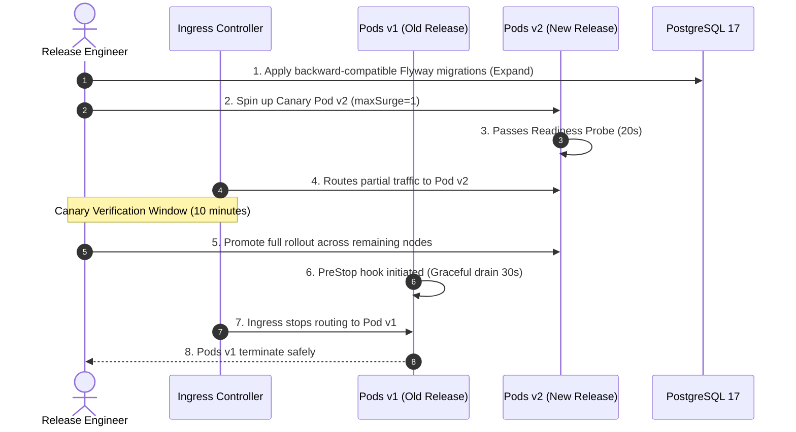

# DOC-03-MNT-01: Zero-Downtime Rolling Upgrade & Release Playbook

**Document Control**

| Field | Value |
|---|---|
| **Document Title** | Zero-Downtime Rolling Upgrade & Release Playbook |
| **Project Name** | Unisoft Loan Management System (ULMS v2.0) |
| **Document Version** | 3.0.0 |
| **Date** | 2026-10-07 |
| **Classification** | Operational Release Management Guide |
| **Status** | Approved Master Release Playbook |
| **Authority Chain** | `LMS_CODEBASE/PLANNING/10_DevOps_Deployment_and_Runbook.md` → `Technology_Stack_Recommendation_v3.md` |
| **Target Codebase** | `c:\software_project\mim_project\LMS\LMS_CODEBASE` |

---

## 1. Zero-Downtime Architecture & Release Mandate

In commercial banking, scheduled downtime for software deployments disrupts customer digital channels, branches, and payment gateways. ULMS v2.0 enforces a strict **Zero-Downtime Rolling Release Policy** where production updates occur with zero dropped HTTP connections and zero degraded banking sessions.



---

## 2. Pod Graceful Shutdown Configuration

To guarantee that active loan transactions or disbursement requests are never terminated mid-flight during a rollout, Spring Boot and Kubernetes are configured with synchronized graceful drain timeouts:

### 2.1 Spring Boot Configuration (`application.yml`)
```yaml
server:
  shutdown: graceful

spring:
  lifecycle:
    timeout-per-shutdown-phase: 30s
```

### 2.2 Pod Spec PreStop Hook
```yaml
lifecycle:
  preStop:
    exec:
      command: ["/bin/sh", "-c", "sleep 15"]
```
*Purpose:* When Kubernetes initiates pod termination, the `preStop` hook introduces a 15-second delay to ensure the Ingress Controller and endpoints controller fully remove the pod IP before the container receives `SIGTERM`.

---

## 3. Four-Phase Production Release Playbook

### Phase 1: Pre-Flight Verification & Database Expansion
```bash
# 1. Verify cluster health and resource capacity
kubectl get nodes -o wide
kubectl get pods -n ulms-prod

# 2. Execute backward-compatible Flyway database migration
kubectl run flyway-migrator --rm -i --restart=Never \
  --image=internal-registry.bank.com.bd/ulms/api:2.1.0 (Flyway runs on app boot; standalone migrator only for break-glass) \
  --namespace=ulms-prod --command -- ./flyway migrate
```

### Phase 2: Canary Pod Promotion
```bash
# Deploy single canary replica receiving 5% traffic
helm upgrade ulms-prod ./deploy/chart/ulms \
  --namespace ulms-prod \
  --set canary.enabled=true \
  --set canary.image.tag="2.1.0" \
  --set canary.weight=5
```
*SRE Observation Gate (10 Minutes):*
- Inspect error rates: Prometheus metric `sum(rate(http_server_requests_seconds_count{status=~"5.."}[1m])) == 0`.
- Inspect P99 response time: `histogram_quantile(0.99, sum(rate(http_server_requests_seconds_bucket[1m])) by (le)) < 0.5`.

### Phase 3: Full Production Promotion
```bash
# Promote new version across all production replicas
helm upgrade ulms-prod ./deploy/chart/ulms \
  --namespace ulms-prod \
  --set image.tag="2.1.0" \
  --set canary.enabled=false \
  --atomic \
  --timeout=8m
```

### Phase 4: Post-Release Smoke Verification
```bash
# Execute headless automated route verification against live cluster
cd c:\software_project\mim_project\LMS\LMS_CODEBASE\e2e
TARGET_URL=https://api.ulms.bank.com.bd npx playwright test spec/walking-skeleton.spec.ts
```

---

## 4. Emergency Instant Rollback Runbook

If error rates breach 0.1% or P99 latency spikes during or immediately following rollout:

```bash
# 1. Trigger atomic Helm rollback to previous revision
helm rollback ulms-prod <PREVIOUS-REVISION> --namespace ulms-prod  # revisions start at 1; find via: helm history ulms-prod -n ulms-prod

# 2. Verify all pods revert to previous image version
kubectl rollout status deployment/ulms-api -n ulms-prod

# 3. Confirm zero traffic reaches drifted pods
kubectl get pods -n ulms-prod -l app=ulms-api -o wide
```

Because all database migrations strictly adhere to the Expand-Contract pattern (DOC-03-MNT-02), the prior software version is 100% compatible with the expanded database schema, ensuring rollback completes in **under 45 seconds** with zero data loss.

---

*— End of Zero-Downtime Rolling Upgrade & Release Playbook —*


---

## Addendum — v3.1.0 corrections (Independent Forensic Re-audit, 8 October 2026)

- Corrections (v3.1.0): chart path is deploy/chart/ulms (values at deploy/chart/ulms/values.yaml + environment overlays); helm rollback requires a real revision number (history first); canary --set keys require the corresponding values.yaml block — verify against deploy/chart/ulms/values.yaml before use.
