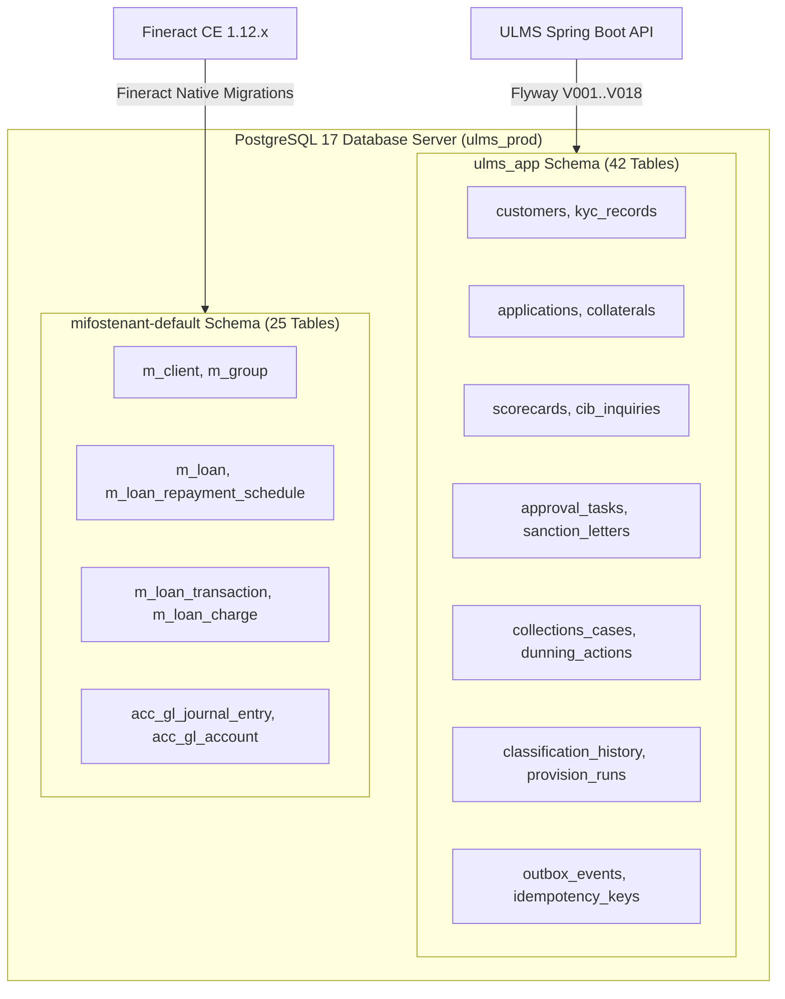
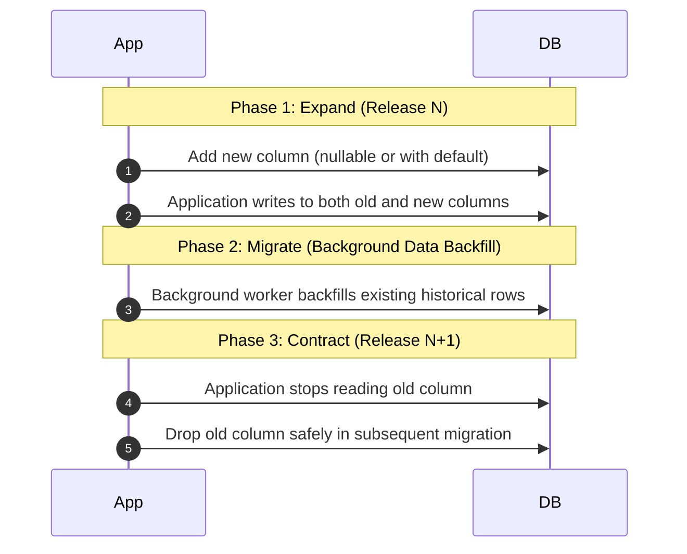

# DOC-03-MNT-02: Flyway Database Migration & Schema Evolution Guide

**Document Control**

| Field | Value |
|---|---|
| **Document Title** | Flyway Database Migration & Schema Evolution Guide |
| **Project Name** | Unisoft Loan Management System (ULMS v2.0) |
| **Document Version** | 3.0.0 |
| **Date** | 2026-10-07 |
| **Classification** | Database Administration & Evolution Guide |
| **Status** | Approved Master Migration Guide |
| **Authority Chain** | `LMS_CODEBASE/apps/api/src/main/resources/db/migration/` → `LMS_CODEBASE/PLANNING/04_Data_Model_and_Migration_Plan.md` |
| **Target Codebase** | `c:\software_project\mim_project\LMS\LMS_CODEBASE` |

---

## 1. Relational Topology & Dual-Schema Architecture

ULMS v2.0 maintains a strictly partitioned dual-schema physical database architecture within PostgreSQL 17 to preserve clean separation between the loan origination workflow engine and the core banking accounting ledger:



### Key Schema Responsibilities:
- **`ulms_app` (Managed by Flyway):** High-speed customer onboarding, e-KYC documents, loan application wizards, risk scorecards, credit committee approval ladder tasks, BRPD 15/2024 classification board, and transactional outbox events.
- **`mifostenant-default` (Managed by Fineract Engine):** Authoritative general ledger balances, double-entry accounting journal vouchers, loan amortization schedules, and interest accrual ledgers.

---

## 2. Chronological Flyway Migration Inventory (V001 to V018)

All schema changes in `ulms_app` are version-controlled, immutable, and sequentially executed via Flyway:

| Migration File | Released | Core Tables Created / Altered | Architectural Purpose |
|---|---|---|---|
| **`V001__init_extensions.sql`** | Phase P0 | `uuid-ossp`, `pgcrypto` extensions | Enables cryptographic UUID generation and hashing. |
| **`V002__create_customer_tables.sql`** | Phase P1 | `customers`, `customer_kyc`, `addresses` | Core customer master register and biometric KYC metadata. |
| **`V003__create_application_tables.sql`** | Phase P1 | `applications`, `application_co_borrowers` | Loan origination pipeline drafts and co-borrower relationships. |
| **`V004__create_collateral_tables.sql`** | Phase P1 | `collaterals`, `collateral_valuations` | Immovable/movable asset registers with forced sale values. |
| **`V005__create_cib_tables.sql`** | Phase P2 | `cib_inquiries`, `cib_contracts` | Bangladesh Bank CIB inquiry cache and contract records. |
| **`V006__create_assessment_tables.sql`** | Phase P2 | `scorecard_results`, `dbr_calculations` | Risk model scoring breakdown and DBR evaluation history. |
| **`V007__create_approval_tables.sql`** | Phase P2 | `approval_tasks`, `approval_actions` | 7-stage credit committee delegation ladder and audit trail. |
| **`V008__create_sanction_tables.sql`** | Phase P2 | `sanction_letters`, `sanction_covenants` | Formal loan sanction letters and credit covenants. |
| **`V009__create_servicing_tables.sql`** | Phase P3 | `servicing_disbursements`, `prepayments` | Disbursement tracking and early settlement records. |
| **`V010__create_repayment_tables.sql`** | Phase P3 | `repayment_transactions`, `repayment_allocations` | Teller and gateway cash/cheque repayment journal cache. |
| **`V011__create_webhook_tables.sql`** | Phase P3 | `payment_webhooks`, `webhook_deliveries` | Asynchronous MFS webhook idempotency and replay buffer. |
| **`V012__create_collections_tables.sql`** | Phase P4 | `collections_cases`, `ptp_records` | Delinquency worklist and Promise-to-Pay (PTP) tracking. |
| **`V013__create_dunning_tables.sql`** | Phase P4 | `dunning_actions`, `legal_notices` | Statutory dunning letters, SMS reminders, and legal notices. |
| **`V014__create_compliance_tables.sql`** | Phase P4 | `classification_history`, `provision_runs` | BRPD Circular 15/2024 classification snapshots and provision JVs. |
| **`V015__create_outbox_tables.sql`** | Phase P0 | `outbox_events`, `outbox_dead_letters` | Transactional outbox table for resilient domain event publishing. |
| **`V016__create_idempotency_tables.sql`**| Phase P0 | `idempotency_records` | Distributed idempotency locks with TTL timestamps. |
| **`V017__add_indexes_and_constraints.sql`**| Phase P5 | Foreign keys, composite B-tree indexes | Performance tuning for high-density customer/loan lookups. |
| **`V018__audit_trail_triggers.sql`** | Phase P5 | `audit_entries`, change capture triggers | Bangladesh Bank regulatory compliance immutable audit log. |

---

## 3. Zero-Downtime Database Evolution: The Expand-Contract Pattern

In a 24/7 banking environment, database schema changes must never require scheduled system downtime or lock tables during active branch banking hours. ULMS mandates the **Expand-Contract Pattern**:



### Golden Rules of Non-Locking SQL:
1. **Never add a `NOT NULL` column without a default:** Adding `NOT NULL` without a `DEFAULT` scans and locks the entire table. Always add as nullable first, backfill data, and then add the constraint asynchronously:
   ```sql
   -- Safe Column Addition
   ALTER TABLE ulms_app.customers 
   ADD COLUMN IF NOT EXISTS national_id_v2 VARCHAR(17);
   ```
2. **Never build indexes synchronously on large tables:** Always use `CONCURRENTLY` to avoid blocking writes:
   ```sql
   CREATE INDEX CONCURRENTLY IF NOT EXISTS idx_customers_nid_v2 
   ON ulms_app.customers (national_id_v2);
   ```
3. **Never rename columns in-place:** A column rename instantly breaks older running API pods during a rolling upgrade. Expand with a new column, dual-write, and contract in the next release cycle.

---

## 4. Emergency Database Runbooks

### Runbook 1: Resolving Flyway Checksum Mismatches (`flyway repair`)
- **Symptom:** API fails to start with `FlywayException: Validate failed: Migration checksum mismatch for migration version V004`.
- **Root Cause:** A developer modified the text or whitespace of an already applied migration script instead of creating a new version.
- **Remediation Procedure:**
  1. Inspect differences between the Git migration file and the recorded checksum in `flyway_schema_history`:
  ```sql
  SELECT version, description, checksum, installed_on 
  FROM ulms_app.flyway_schema_history 
  WHERE version = '004';
  ```
  2. If the modification was cosmetic (e.g., adding a comment) and schema integrity is verified:
  ```bash
  cd apps/api
  ./gradlew flywayRepair
  ```
  3. The `flywayRepair` command recalculates checksums in `flyway_schema_history` and re-aligns validation.

### Runbook 2: Resolving Failed Migrations
- **Symptom:** Migration fails mid-execution; `flyway_schema_history` records `success = false`. Subsequent boots are blocked.
- **Remediation Procedure:**
  1. Review PostgreSQL server logs to identify the exact failing SQL statement.
  2. In PostgreSQL, DDL inside migrations is wrapped in transactions. Manually correct the underlying issue.
  3. Delete the failed history row:
  ```sql
  DELETE FROM ulms_app.flyway_schema_history WHERE version = '$FAILED_VERSION' AND success = false;
  ```
  4. Fix the SQL script and re-run `./gradlew flywayMigrate`.

---

*— End of Flyway Database Migration & Schema Evolution Guide —*
