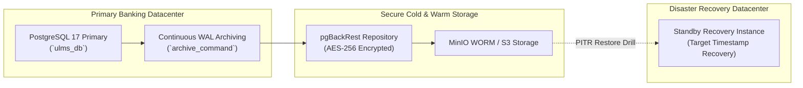

# DOC-03-MNT-03: PostgreSQL Backup, Point-In-Time Recovery (PITR) & Disaster Recovery Runbook

**Document Control**

| Field | Value |
|---|---|
| **Document Title** | PostgreSQL Backup, Point-In-Time Recovery & DR Runbook |
| **Project Name** | Unisoft Loan Management System (ULMS v2.0) |
| **Document Version** | 3.0.0 |
| **Date** | 2026-10-07 |
| **Classification** | Operational SRE & Database Runbook |
| **Status** | Approved Master Specification |
| **Authority Chain** | Bangladesh Bank ICT Security Guidelines V4.0 §4.2 → ISO 22301 (BCMS) |

---

## 1. RPO & RTO SLA Mandates

Scheduled commercial banks operating ULMS v2.0 must enforce the following business continuity targets:
- **Recovery Point Objective (RPO):** $< 15$ minutes (Maximum allowable data loss window).
- **Recovery Time Objective (RTO):** $< 60$ minutes (Full service restoration from cold/warm backup).



---

## 2. Automated Backup Strategy

ULMS uses **pgBackRest** with differential and incremental WAL archiving:
- **Full Backup:** Every Friday at 23:00 (synthetic full backup).
- **Differential Backup:** Daily Monday through Thursday at 23:00.
- **Continuous WAL Archiving:** Every 16MB WAL segment or 5-minute timeout (`archive_timeout = 300`).

---

## 3. Step-by-Step Point-In-Time Recovery (PITR) Drill

If human operator error occurs at `2026-10-07 14:32:00 UTC` (e.g., accidental batch run):
```bash
# 1. Stop current PostgreSQL instance
sudo systemctl stop postgresql-17

# 2. Restore database files to target timestamp
sudo -u postgres pgbackrest --stanza=ulms \
    --type=time \
    "--target=2026-10-07 14:30:00" \
    --target-action=promote \
    restore

# 3. Start PostgreSQL and verify recovery status
sudo systemctl start postgresql-17
sudo -u postgres psql -c "SELECT pg_is_in_recovery();"
```


---

## Addendum — v3.1.0 corrections (Independent Forensic Re-audit, 8 October 2026)

- Continuity targets (v3.1.0 canonical): baseline single-node deployment = RPO ≤ 15 min (WAL archiving), RTO ≤ 60 min; the stronger RPO 0 / RTO < 15 min figures quoted elsewhere describe the aspirational synchronous-DR topology and must not be mixed. The drill script is deploy/drills/backup-restore.sh.
