# DOC-04-DEP-01: Bank On-Premises k3s & Kubernetes Production Deployment Guide

**Document Control**

| Field | Value |
|---|---|
| **Document Title** | Bank On-Premises k3s & Kubernetes Production Deployment Guide |
| **Project Name** | Unisoft Loan Management System (ULMS v2.0) |
| **Document Version** | 3.0.0 |
| **Date** | 2026-10-07 |
| **Classification** | Enterprise Infrastructure Production Guide |
| **Status** | Approved Master Deployment Guide |
| **Authority Chain** | `LMS_CODEBASE/deploy/k3s/` → `Technology_Stack_Recommendation_v3.md` → `Bangladesh Bank ICT Security Guidelines V4.0` |
| **Target Codebase** | `c:\software_project\mim_project\LMS\LMS_CODEBASE` |

---

## 1. Executive Summary & Air-Gapped Banking Topology

Under Bangladesh Bank regulations, scheduled commercial banks operating core loan management platforms must deploy within sovereign, on-premises data centers with strict air-gapped network segmentation.

ULMS v2.0 utilizes **lightweight enterprise Kubernetes (k3s)** optimized for bare-metal bank infrastructure, combining high availability with minimal control-plane overhead:

```mermaid
flowchart TD
    subgraph Data_Center ["Bank Sovereign Tier-III Data Center (Motijheel / Gulshan)"]
        subgraph Ingress_Layer ["Dual Hardware Load Balancers (F5 / HAProxy)"]
            LB1["HAProxy Active (VIP :443)"]
            LB2["HAProxy Standby"]
        end
        subgraph K3s_Cluster ["High-Availability k3s Production Cluster"]
            CP1["Control Plane Node 1 (etcd)"]
            CP2["Control Plane Node 2 (etcd)"]
            CP3["Control Plane Node 3 (etcd)"]
            W1["Worker Node 1: ulms-api (Replica 1) + Keycloak"]
            W2["Worker Node 2: ulms-api (Replica 2) + Fineract"]
            W3["Worker Node 3: ulms-web + Object Storage (SeaweedFS)"]
            W4["Worker Node 4: Batch scheduler (in-monolith) + Observability"]
        end
        subgraph DB_Tier ["Dedicated Bare-Metal Database Tier"]
            DB_PRI["PostgreSQL 17 Primary (NVMe RAID-10)"]
            DB_SBY["PostgreSQL 17 Standby (Streaming Sync)"]
        end
    end
    Ingress_Layer --> K3s_Cluster
    K3s_Cluster --> DB_Tier
```



---

## 2. Hardware Sizing & Capacity Planning Matrix

| Node Role | Node Count | Min vCPU | Min RAM | Disk Configuration | Recommended OS |
|---|---|---|---|---|---|
| **k3s Control Plane** | 3 Nodes | 4 vCPU | 16 GB | 100 GB SSD (etcd dedicated) | RHEL 9 / Rocky Linux 9 |
| **k3s Worker Nodes** | 4 Nodes | 16 vCPU | 64 GB | 500 GB NVMe (Container storage) | RHEL 9 / Rocky Linux 9 |
| **PostgreSQL Primary/Standby** | 2 Nodes | 32 vCPU | 128 GB | 2.0 TB Enterprise NVMe (RAID-10) | RHEL 9 / Rocky Linux 9 |
| **External Ingress Load Balancers** | 2 Nodes | 4 vCPU | 8 GB | 50 GB SSD | Alpine / Rocky Linux 9 |

---

## 3. Production Kubernetes Manifests & Pod Hardening

### 3.1 Spring Boot API Deployment (`ulms-api.yaml`)
```yaml
apiVersion: apps/v1
kind: Deployment
metadata:
  name: ulms-api
  namespace: ulms-prod
  labels:
    app.kubernetes.io/name: ulms-api
    app.kubernetes.io/version: "2.0.0"
spec:
  replicas: 4
  strategy:
    type: RollingUpdate
    rollingUpdate:
      maxSurge: 1
      maxUnavailable: 0
  selector:
    matchLabels:
      app: ulms-api
  template:
    metadata:
      labels:
        app: ulms-api
    spec:
      containers:
      - name: api
        image: internal-registry.bank.com.bd/ulms/api:2.0.0
        imagePullPolicy: IfNotPresent
        resources:
          requests:
            cpu: "2000m"
            memory: "4Gi"
          limits:
            cpu: "4000m"
            memory: "8Gi"
        envFrom:
        - configMapRef:
            name: ulms-api-config
        - secretRef:
            name: ulms-db-secrets
        ports:
        - containerPort: 8081
          name: http
        livenessProbe:
          httpGet:
            path: /actuator/health/liveness
            port: 9977
          initialDelaySeconds: 45
          periodSeconds: 10
          failureThreshold: 3
        readinessProbe:
          httpGet:
            path: /actuator/health/readiness
            port: 9977
          initialDelaySeconds: 20
          periodSeconds: 5
          failureThreshold: 2
        securityContext:
          runAsNonRoot: true
          runAsUser: 10001
          readOnlyRootFilesystem: true
          allowPrivilegeEscalation: false
          capabilities:
            drop: ["ALL"]
```

---

## 4. Air-Gapped Deployment & Installation Runbook

In a bank environment with zero outbound internet access, all container images and Helm charts must be ingested via signed offline tar bundles:

### Step 1: Pre-Load Offline Images into Internal Harbor Registry
```bash
# On secure bastion jump-host
docker load -i ulms-bundle-v2.0.0.tar

docker tag ulms-api:2.0.0 internal-registry.bank.com.bd/ulms/api:2.0.0
docker push internal-registry.bank.com.bd/ulms/api:2.0.0
```

### Step 2: Initialize HA k3s Cluster
```bash
# On First Control Plane Node (Server 1)
INSTALL_K3S_SKIP_DOWNLOAD=true $AIRGAP/install-k3s.sh -s - server \
  --cluster-init \
  --tls-san=api.ulms.bank.com.bd \
  --disable=traefik \
  --data-dir=/var/lib/rancher/k3s

# On Control Plane Nodes 2 and 3
INSTALL_K3S_SKIP_DOWNLOAD=true $AIRGAP/install-k3s.sh -s - server \
  --server https://10.10.1.10:6443 \
  --token-file /etc/rancher/node-token \
  --data-dir=/var/lib/rancher/k3s
```

### Step 3: Deploy Application via Helm
```bash
helm upgrade --install ulms-prod ./deploy/k3s/helm/ulms \
  --namespace ulms-prod \
  --create-namespace \
  --values ./deploy/k3s/helm/ulms/values-production.yaml \
  --atomic \
  --timeout 10m
```

---

## 5. Backup, Disaster Recovery & High Availability SLAs

- **Recovery Point Objective (RPO):** **0 seconds** for committed transactions (PostgreSQL synchronous streaming replication to hot standby).
- **Recovery Time Objective (RTO):** **$< 15$ minutes** automated failover via Patroni / pg_auto_failover.
- **Nightly WAL Archiving:** Automated continuous archiving to air-gapped SAN storage with 30-day point-in-time recovery (PITR).

---

*— End of Bank On-Premises k3s & Kubernetes Production Deployment Guide —*


---

## Addendum — v3.1.0 corrections (Independent Forensic Re-audit, 8 October 2026)

- Corrections (v3.1.0): actuator probes must target the management port 9977 (not 8081); the chart path is deploy/chart/ulms; in an air-gapped zone the k3s installer is pre-staged from the airgap bundle (INSTALL_K3S_SKIP_DOWNLOAD) — never fetched from the public internet; Redis removed from the topology (deferred by Tech Stack v3). Continuity targets: see the canonical RPO/RTO note in MNT-03.
