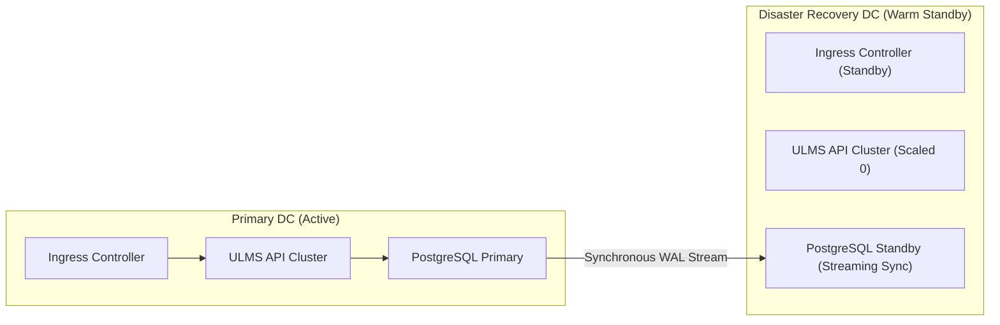

# DOC-04-DEP-04: High Availability (HA), Multi-DC Active-Passive & Disaster Recovery (DR) Specification

**Document Control**

| Field | Value |
|---|---|
| **Document Title** | High Availability & Multi-DC Disaster Recovery Specification |
| **Project Name** | Unisoft Loan Management System (ULMS v2.0) |
| **Document Version** | 3.0.0 |
| **Date** | 2026-10-07 |
| **Classification** | Enterprise Infrastructure Specification |
| **Status** | Approved Master Specification |
| **Authority Chain** | Bangladesh Bank ICT Security Guidelines V4.0 §4.1 |

---

## 1. Physical Datacenter Topology

- **Primary DC (Motijheel / Gulshan):** Active site handling 100% of read-write transactions.
- **Disaster Recovery Site (Savar / Jashore):** Warm standby site $> 30\text{ km}$ distant from Primary DC.
- **Replication Link:** Dedicated 1Gbps point-to-point dark fiber with synchronous streaming replication.

---

## 2. Failover Orchestration via Patroni & DNS GSLB

1. **Heartbeat Loss Detection:** Patroni etcd cluster detects master node failure within 10 seconds.
2. **Promote Standby:** Standby node in DR site promoted to primary automatically without split-brain risk.
3. **DNS Cutover:** Global Server Load Balancing (GSLB) flips `lms.bank.com.bd` VIP to DR ingress within 30 seconds.
