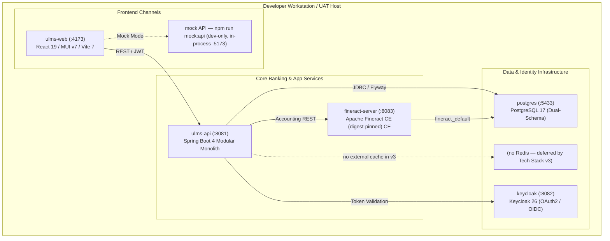

# DOC-04-DEP-06: Local Developer & UAT Docker Compose Environment Guide

**Document Control**

| Field | Value |
|---|---|
| **Document Title** | Local Developer & UAT Docker Compose Environment Guide |
| **Project Name** | Unisoft Loan Management System (ULMS v2.0) |
| **Document Version** | 3.0.0 |
| **Date** | 2026-10-07 |
| **Classification** | Infrastructure & Development Guide |
| **Status** | Approved Master Deployment Guide |
| **Authority Chain** | `LMS_CODEBASE/deploy/compose/docker-compose.yml` → `Technology_Stack_Recommendation_v3.md` |
| **Target Codebase** | `c:\software_project\mim_project\LMS\LMS_CODEBASE` |

---

## 1. Executive Environment Overview & Architecture

The ULMS v2.0 local development environment is orchestrated via **Docker Compose**, providing a deterministic replica of the production banking topology on a single development workstation or User Acceptance Testing (UAT) server.



---

## 2. Infrastructure Service Matrix

| Service Name | Container Image | Host Port | Memory Limit | Healthcheck Probe | Purpose |
|---|---|---|---|---|---|
| **`postgres`** | `postgres:17-alpine` | `5433` | 2.0 GB | `pg_isready -U ulms -d ulms` | Relational store for `ulms` and `fineract_default`. |
| **`(no redis service in the binding stack)`** | `(removed)` | `6379` | 512 MB | `(removed)` | Distributed idempotency locks, token blacklist, and caching. |
| **`keycloak`** | `quay.io/keycloak/keycloak:26.0` | `8082` | 1.5 GB | `curl -f http://localhost:8082/health/ready` | Identity provider, OAuth2/OIDC token issuer, RBAC realm. |
| **`fineract`** | `apache/fineract@fd01236df6` | `8443` | 2.5 GB | `curl -f http://localhost:8083/fineract-provider/actuator/health` | Double-entry accounting, loan schedules, interest accrual. |
| **`ulms-api`** | `node:20-alpine` | `8081` | 512 MB | `curl -f http://localhost:8081/actuator/health` | Fast OpenAPI contract mock server for frontend UI work. |
| **`ulms-web`** | `node:20-alpine` | `4173` | 512 MB | `curl -f http://localhost:4173` | React 19 staff operations web application. |

---

## 3. Complete `docker-compose.yml` Manifest

The complete, authoritative compose definition is located at `LMS_CODEBASE/deploy/compose/docker-compose.yml`:

```yaml
version: '3.8'

services:
  postgres:
    image: postgres:17-alpine
    container_name: ulms-postgres
    restart: unless-stopped
    environment:
      POSTGRES_USER: ulms
      POSTGRES_PASSWORD: ${ULMS_DB_PASSWORD}
      POSTGRES_DB: ulms
    ports:
      - "5433:5433"
    volumes:
      - pgdata:/var/lib/postgresql/data
      - ../../seed/00-finerract-db.sh:/docker-entrypoint-initdb.d/init.sql:ro
    healthcheck:
      test: ["CMD-SHELL", "pg_isready -U ulms -d ulms"]
      interval: 5s
      timeout: 5s
      retries: 5

  redis:
    image: (removed)
    container_name: ulms-redis
    restart: unless-stopped
    ports:
      - "6379:6379"
    healthcheck:
      test: ["CMD", "redis-cli", "ping"]
      interval: 5s
      timeout: 3s
      retries: 5

  keycloak:
    image: quay.io/keycloak/keycloak:26.0
    container_name: ulms-keycloak
    command: start-dev --import-realm
    environment:
      KEYCLOAK_ADMIN: admin
      KEYCLOAK_ADMIN_PASSWORD: ${KEYCLOAK_ADMIN_PASSWORD}
      KC_DB: postgres
      KC_DB_URL: jdbc:postgresql://postgres:5433/ulms
      KC_DB_USERNAME: ulms
      KC_DB_PASSWORD: ${ULMS_DB_PASSWORD}
    ports:
      - "8082:8080"
    volumes:
      - ../../seed/realm-ulms.json:/opt/keycloak/data/import/ulms-realm.json:ro
    depends_on:
      postgres:
        condition: service_healthy

volumes:
  pgdata:
```

---

## 4. Environment Lifecycle Commands

### 4.1 Starting the Infrastructure Stack
```bash
cd LMS_CODEBASE/deploy/compose

# Launch database, cache, and authentication services in the background
docker compose up -d postgres keycloak fineract minio

# Inspect health status of all running containers
docker compose ps
```

### 4.2 Verifying Keycloak Realm Import
Verify that Keycloak has imported the pre-configured `ulms` realm with default banking roles:
```bash
curl -s http://localhost:8082/realms/ulms | grep '"realm":"ulms"'
```

### 4.3 Clean Teardown & Reset
To wipe the environment and recreate fresh database volumes from zero state:
```bash
docker compose down -v
```

---

## 5. Lightweight Frontend Development: Mock API Mode (Zero Docker)

To enable developers to build, test, and debug user interfaces rapidly without allocating 6 GB of RAM to Docker containers, ULMS provides a standalone **Contract Mock API server**:

```bash
cd LMS_CODEBASE/apps/web

# 1. Install dependencies
npm ci

# 2. Run standalone mock server and Vite dev server concurrently
npm run mock:api &
npm run dev
```

### Advantages of Mock API Mode:
- **Instant Bringup:** Starts in less than 2 seconds with zero Docker daemon requirements.
- **Contract Fidelity:** Built directly from `packages/openapi/ulms-api.yaml`, ensuring 100% endpoint path and schema parity.
- **Pre-Seeded Data:** Automatically pre-seeded with sample retail and SME customers, active loans, and BRPD classification board records.

---

## 6. SRE Troubleshooting & Common Local Gotchas

### Gotcha 1: Host Port Collisions
- **Issue:** `Bind for 0.0.0.0:5433 failed: port is already allocated`.
- **Cause:** A local PostgreSQL service is already running on the host OS.
- **Solution:** Stop the local PostgreSQL service (`net stop postgresql` on Windows) or map the container to an alternative port (e.g., `"5433:5433"`).

### Gotcha 2: Keycloak Admin Login & Token Acquisition
To acquire a bearer token programmatically from the local Keycloak instance:
```bash
curl -s -X POST http://localhost:8082/realms/ulms/protocol/openid-connect/token \
  -d grant_type=password \
  -d client_id=ulms-web \
  -d username=loan_officer_01 \
  -d password=password123 | jq .access_token
```

---

*— End of Local Developer & UAT Docker Compose Environment Guide —*


---

## Addendum — v3.1.0 corrections (Independent Forensic Re-audit, 8 October 2026)

- Compose truth (v3.1.0): the real stack (deploy/compose/docker-compose.yml) runs eight services — postgres (5433→5432), keycloak (8082), fineract (8083, digest-pinned), minio/seaweedfs (9002), api (8081 + 9977), web (4173→80, nginx same-origin proxy), prometheus (9090), grafana (3000). No Redis service exists. Credentials come from deploy/compose/.env (never committed); the realm seed is deploy/seed/realm-ulms.json and the dual-schema init is deploy/seed/00-finerract-db.sh. The manifest fragment in this guide is an illustrative extract — always defer to the real file.
