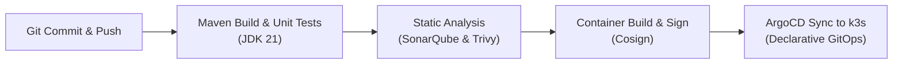

# DOC-04-DEP-07: CI/CD Pipeline Automation, Security Scanning & GitOps Deployment Guide

**Document Control**

| Field | Value |
|---|---|
| **Document Title** | CI/CD Pipeline Automation & GitOps Deployment Guide |
| **Project Name** | Unisoft Loan Management System (ULMS v2.0) |
| **Document Version** | 3.0.0 |
| **Date** | 2026-10-07 |
| **Classification** | DevOps & Automation Guide |
| **Status** | Approved Master Specification |
| **Authority Chain** | NIST SP 800-218 (SSDF) → ISO/IEC 5055 |

---

## 1. Automated Pipeline Architecture

---

## 2. Automated Quality Gates

Every build must pass 4 mandatory quality gates before artifact release:
1. **Compilation & Unit Tests:** Zero test failures across Spring Modulith tests.
2. **SAST Security Gate:** Zero critical or high vulnerabilities detected by SonarQube.
3. **Container CVE Scan:** Zero unpatched CVEs in base images via Trivy.
4. **GitOps Canary Validation:** Automatic rollback if HTTP 5xx errors $> 0.1\%$ within 5 minutes.
