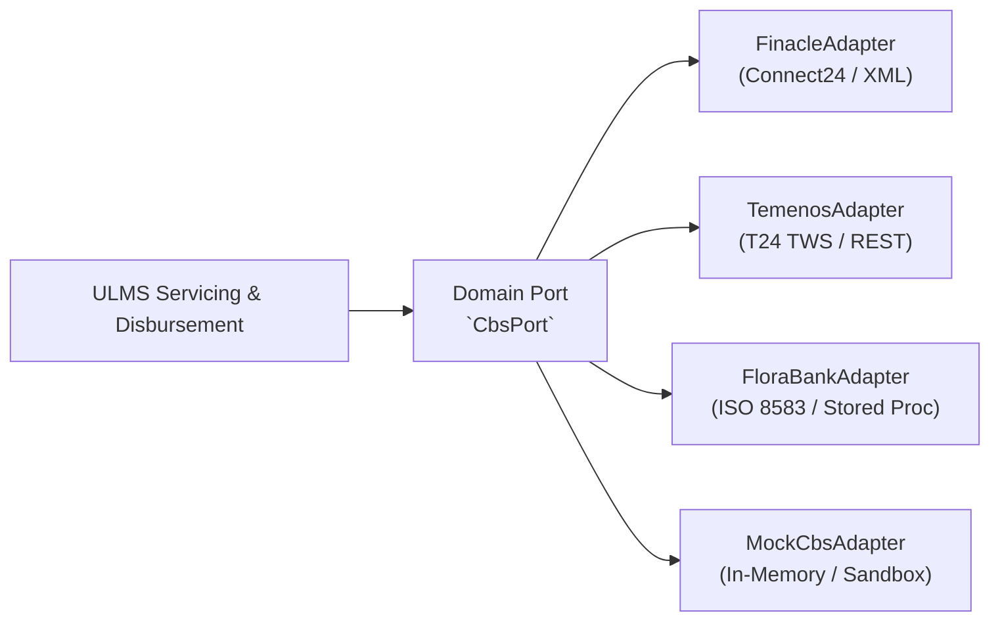

# DOC-05-EXT-04: Custom Core Banking (CBS) Hexagonal Adapter Development Guide

**Document Control**

| Field | Value |
|---|---|
| **Document Title** | Custom CBS Hexagonal Adapter Development Guide |
| **Project Name** | Unisoft Loan Management System (ULMS v2.0) |
| **Document Version** | 3.0.0 |
| **Date** | 2026-10-07 |
| **Classification** | Developer Extension Guide |
| **Status** | Approved Master Specification |
| **Authority Chain** | `DOC-01-ARCH-01` → Spring Modulith Hexagonal Port Architecture |

---

## 1. Hexagonal Port Architecture Overview

ULMS v2.0 is completely decoupled from specific CBS platforms (e.g., Finacle, Temenos Transact, TCS BaNCS, or Flora Bank). All interactions flow through the clean hexagonal domain port `com.uslbd.ulms.integration.cbs.FinacleCbsAdapter (implements the CBS port)`:



---

## 2. Implementing a Custom CBS Adapter

To integrate a new bank's CBS:
1. Implement the `CbsPort` interface:
```java
package com.uslbd.ulms.integration.cbs;

@Component
@Profile("cbs-finacle")
public class FinacleCbsAdapter implements CbsPort {
    @Override
    public CbsCustomerAccount lookupAccount(String accountNo) {
        // Invoke Finacle XML Web Service
    }

    @Override
    public CbsDisbursementResponse postDisbursement(CbsDisbursementRequest req) {
        // Enforce idempotency key and post debit/credit vouchers
    }
}
```
2. Enable the adapter via Spring profile: `SPRING_PROFILES_ACTIVE=prod,cbs-finacle`.
