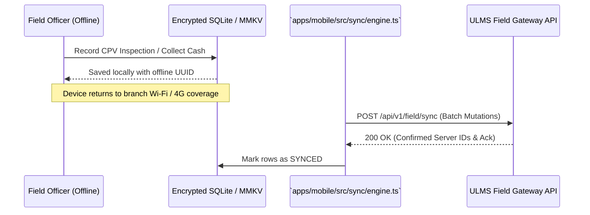

# DOC-05-EXT-06: Expo React Native Field Mobility App Extension & Offline SQLite Sync Guide

**Document Control**

| Field | Value |
|---|---|
| **Document Title** | Field Mobility App Extension & Offline Sync Guide |
| **Project Name** | Unisoft Loan Management System (ULMS v2.0) |
| **Document Version** | 3.0.0 |
| **Date** | 2026-10-07 |
| **Classification** | Mobile Developer Guide |
| **Status** | Approved Master Specification |
| **Authority Chain** | Expo SDK 54+ → `apps/mobile/src/sync/engine.ts` |

---

## 1. Field Operations in Rural Bangladesh

Field recovery and loan verification officers operate in remote rural upazilas where 4G cellular connectivity is intermittent or unavailable. The mobile app must operate 100% offline using local encrypted SQLite.

---

## 2. Offline Sync Engine Protocol

