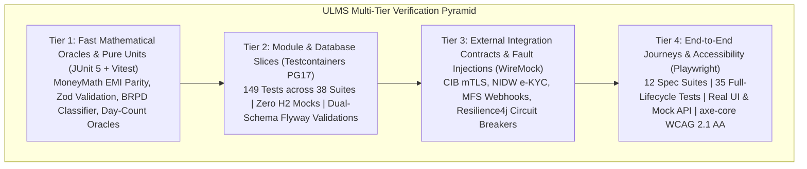
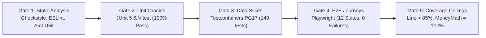

# DOC-06-QA-01: Automated Test Harness Architecture & Verification Suite

**Document Control**

| Field | Value |
|---|---|
| **Document Title** | Automated Test Harness Architecture & Verification Suite |
| **Project Name** | Unisoft Loan Management System (ULMS v2.0) |
| **Document Version** | 3.0.0 |
| **Date** | 2026-10-07 |
| **Classification** | Quality Assurance Technical Specification |
| **Status** | Approved Master QA Specification |
| **Authority Chain** | `LMS_CODEBASE/PLANNING/09_Testing_and_QA_Strategy.md` → `LMS_CODEBASE/.gitlab-ci.yml` → `LMS_CODEBASE/e2e/` |
| **Target Codebase** | `c:\software_project\mim_project\LMS\LMS_CODEBASE` |

---

## 1. Testing Pyramid & Multi-Tier Verification Strategy

ULMS v2.0 enforces a multi-tier automated test harness that guarantees bank-grade correctness across functional, mathematical, and regulatory domains. Every build must satisfy rigorous quality gates spanning four distinct verification tiers:



### The Zero-Mock Data Invariant
In accordance with ULMS architectural principles, **in-memory database mocks (H2, SQLite) are strictly prohibited** for backend data testing. All repository, transaction, and outbox tests execute exclusively against ephemeral **PostgreSQL 17** container instances orchestrated via Testcontainers. This eliminates SQL dialect drift, concurrency masking, and transaction isolation discrepancies before code reaches staging.

---

## 2. Tier 1 & Tier 2: Backend Test Harness (JUnit 5 + Testcontainers PG17)

The backend test harness exercises the Spring Boot 4 modular monolith across business logic, domain invariants, and database persistence.

### 2.1 Suite Execution Commands
```bash
# Navigate to the API service directory
cd c:\software_project\mim_project\LMS\LMS_CODEBASE\apps\api

# Run full backend test suite (unit + integration slices)
./gradlew test

# Run specific test suite with full stacktraces
./gradlew test --tests com.uslbd.ulms.ModularityTest --info

# Run financial arithmetic oracle verification
./gradlew test --tests com.uslbd.ulms.assessment.MoneyMathTest

# Run regulatory classification boundary lock tests
./gradlew test --tests com.uslbd.ulms.compliance.BrpdBoundaryLockTest
```

### 2.2 Key Backend Test Suites Breakdown

| Test Class | Path | Core Assertions & Banking Invariants Tested |
|---|---|---|
| **`ModularityTest.java`** | `apps/api/src/test/java/com/uslbd/ulms/ModularityTest.java` | Spring Modulith module boundary enforcement. ArchUnit assertions forbidding direct cross-module entity references, circular dependencies, and floating-point money types. |
| **`BrpdBoundaryLockTest.java`** | `apps/api/src/test/java/com/uslbd/ulms/compliance/BrpdBoundaryLockTest.java` | Verifies exact $\pm 1$ DPD boundary transitions under BRPD Circular 15/2024: STD-0 (0), STD-1 (1–30), STD-2 (31–60), SMA (61–90), SS (91–180), DF (181–365), B/L (>365). |
| **`BrpdClassifierTest.java`** | `apps/api/src/test/java/com/uslbd/ulms/compliance/BrpdClassifierTest.java` | Verifies statutory provisioning basis points: 1% for standard, 5% for SMA, 20% for SS, 50% for DF, 100% for B/L, including qualitative objective overrides. |
| **`AssessmentServiceTest.java`** | `apps/api/src/test/java/com/uslbd/ulms/assessment/AssessmentServiceTest.java` | Verifies the single `MoneyMath.emiMonthly` oracle, scorecard factor weighting (50/30/20), and strict Debt Burden Ratio (DBR) 50% ceiling enforcement. |
| **`G2CreditToCashJourneyTest.java`** | `apps/api/src/test/java/com/uslbd/ulms/approval/G2CreditToCashJourneyTest.java` | Full 7-level credit committee approval ladder: verifies role gating and returns HTTP 409 Conflict when a Maker attempts self-authorization. |
| **`OutboxServiceTest.java`** | `apps/api/src/test/java/com/uslbd/ulms/platform/outbox/OutboxServiceTest.java` | Asserts at-least-once transactional event dispatch, poison-pill dead-letter queue routing, and exponential backoff retry. |

---

## 3. Tier 3: External Integration Contracts & Fault Injection (WireMock)

Partner banking integrations (Bangladesh Bank CIB Online, Election Commission NIDW, MFS payment rails) operate behind WireMock simulations during automated testing to validate resilience:

### Simulated Failure Scenarios
1. **CIB Rate Limiting (HTTP 429):** Simulates 50 requests/sec bursts returning HTTP 429 with `Retry-After: 30` headers to assert that callers queue gracefully without dropping customer application requests.
2. **Partner 500 Outage Storms:** Simulates upstream 502/503/504 errors to assert that Resilience4j circuit breakers trip open after 5 consecutive failures, routing traffic to offline fallback queues.
3. **MFS Payment Webhook Replay Storms:** Injects 10 rapid duplicate callbacks with identical transaction IDs (`txn_id`) to assert that exactly one ledger posting occurs and 9 idempotent HTTP 200 responses are returned with zero double-crediting.

---

## 4. Tier 4: End-to-End Journey & Accessibility Verification (Playwright)

The end-to-end (E2E) testing suite uses **Playwright 1.63+** and **axe-core** to validate user journeys in Chromium, Firefox, and WebKit against the production web application.

### 4.1 Suite Execution Commands
```bash
# Navigate to the E2E directory
cd c:\software_project\mim_project\LMS\LMS_CODEBASE\e2e

# Run all 12 Playwright test suites headlessly
npx playwright test

# Run tests with interactive UI mode (debugger & visual timeline)
npx playwright test --ui

# Run tests in headed browser mode
npx playwright test --headed

# Run a specific spec suite (e.g., Origination Journey)
npx playwright test spec/p1-origination.spec.ts

# Generate and view detailed HTML test report
npx playwright show-report
```

### 4.2 Comprehensive Inventory of E2E Spec Suites

| Spec File | Focus Area & User Journey | Key Validations & Scenarios |
|---|---|---|
| **`walking-skeleton.spec.ts`** | Infrastructure Smoke Test | Verifies that staff application, mock API, and Keycloak auth respond on expected ports with zero console errors. |
| **`p1-origination.spec.ts`** | Loan Origination Lifecycle | Customer search $\to$ e-KYC $\to$ application wizard draft $\to$ live DBR calculation $\to$ collateral attachment $\to$ Maker submit. |
| **`p2-credit.spec.ts`** | Credit Assessment & Underwriting | Risk scoring (50/30/20) $\to$ CIB Online report parsing $\to$ underwriter recommendations $\to$ sanction letter generation. |
| **`p3-servicing.spec.ts`** | Loan Servicing & Repayments | Amortization schedule inspection $\to$ installment collection $\to$ prepayment calculation $\to$ payment gateway webhook reconciliation. |
| **`p4-regcon.spec.ts`** | Regulatory Compliance & BRPD | BRPD 15/2024 classification board $\to$ DPD aging transition $\to$ nightly EOD simulation $\to$ provisioning JV verification. |
| **`q3-otp-required.spec.ts`** | Dual-Control Disbursement Security | Enforces 2FA/OTP step-up authentication prior to releasing loan funds exceeding BDT 500,000. |
| **`r2-security.spec.ts`** | Security & RBAC Enforcement | Asserts unauthorized route blocking, session timeout handling, and Keycloak token refresh. |
| **`r3-products-sanctions-bocc.spec.ts`** | Product Engine & Islamic Finance | Verifies Retail, SME, and Islamic Murabaha/Ijara product parameters, sanction letter drafting, and Board Credit Committee (BCC) flows. |
| **`r4-depth.spec.ts`** | High-Density UI & Data Grids | High-density data grid virtualization, multi-document tab navigation, column filtering, and export performance. |
| **`r5-portal-partner.spec.ts`** | Borrower & Field Agent Portals | Self-service borrower portal loan view and Field Officer Contact Point Verification (CPV) mobile workflow. |
| **`a11y-axe.spec.ts`** | Accessibility Compliance | Automated WCAG 2.1 AA auditing using `@axe-core/playwright` across all 9 primary workspace views. |
| **`i18n-separation.spec.ts`** | Strict Bilingual Separation | Asserts zero Bengali script leakage in English mode and zero untranslated English tokens in Bengali mode. |

### 4.3 Sample Playwright Accessibility & Journey Test
```typescript
import { test, expect } from '@playwright/test';
import AxeBuilder from '@axe-core/playwright';

test.describe('Accessibility & Origination Journey Quality Gates', () => {
  test('Loan origination wizard must satisfy WCAG 2.1 AA standards', async ({ page }) => {
    // 1. Navigate to Loan Origination Wizard
    await page.goto('/origination/new');
    await page.waitForSelector('[data-testid="origination-wizard"]');

    // 2. Execute automated accessibility audit via axe-core
    const accessibilityScanResults = await new AxeBuilder({ page })
      .withTags(['wcag2a', 'wcag2aa', 'wcag21a', 'wcag21aa'])
      .disableRules(['color-contrast']) // Reviewed manually in high-contrast mode
      .analyze();

    expect(accessibilityScanResults.violations).toEqual([]);

    // 3. Fill customer particulars and verify DBR calculation
    await page.fill('#monthly-income', '150000');
    await page.fill('#existing-liabilities', '20000');
    await page.fill('#requested-amount', '2000000');
    await page.selectOption('#loan-tenor', '36');

    // Assert live DBR calculator computes correctly
    const dbrText = await page.locator('[data-testid="dbr-metric"]').textContent();
    expect(dbrText).toContain('44.8%');
    expect(page.locator('[data-testid="dbr-status-badge"]')).toHaveText('Compliant (< 50%)');
  });
});
```

---

## 5. Frontend Unit & Contract Test Suite (Vitest)

The frontend web application (`apps/web`) leverages **Vitest** for sub-second unit test execution covering mathematical helpers, Zod validation schemas, and state reducers:

```bash
# Navigate to web application directory
cd c:\software_project\mim_project\LMS\LMS_CODEBASE\apps\web

# Run Vitest unit suite
npm run test:unit

# Run TypeScript compilation and type check
npm run typecheck

# Build production bundle
npm run build
```

---

## 6. Headless Route & Link Integrity Harness

In addition to browser-based tests, the repository includes a zero-dependency headless Node.js route and link auditing harness:

```bash
cd c:\software_project\mim_project\LMS\Front_end

# Test all 405 routes for rendering integrity without throwing
node _tools/route_test.js

# Audit all 1,327 navigation links for dead targets
node _tools/link_audit.js
```
*Current Baseline: **405/405 routes pass**, **0 dead links of 1,327**.*

---

## 7. Continuous Integration (CI) Quality Gates

The automated CI pipeline (`.gitlab-ci.yml`) enforces the following mandatory quality gates before any code merges into the `main` release branch:



| Quality Gate | Metric / Criterion | Threshold / Policy | Enforcement Action |
|---|---|---|---|
| **Architecture Boundaries** | Spring Modulith & ArchUnit | 0 violations | Build terminates immediately |
| **Money Arithmetic** | Branch Coverage on `MoneyMath.java` | Exactly 100% | Merge blocked if $< 100\%$ |
| **Backend Line Coverage** | Jacoco Coverage Report | $\ge 85.0\%$ | Merge blocked if $< 85.0\%$ |
| **Accessibility (a11y)** | axe-core WCAG 2.1 AA | 0 critical/serious violations | E2E suite fails |
| **Contract Parity** | OpenAPI Spec vs Controller Schema | 100% matched | API generation fails |

---

*— End of Automated Test Harness Architecture & Verification Specification —*
