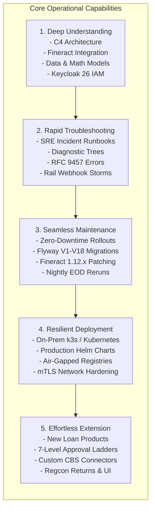

# ULMS v2.0 — Master Technical Documentation Catalog & Operational Specification

**Document Identifier:** DOC-CAT-001  
**Project:** Unisoft Loan Management System (ULMS v2.0) — Bangladesh Scheduled Commercial Banks  
**Authoritative Standard:** Diátaxis Framework · C4 Architecture Model · ISO/IEC/IEEE 26514:2022 · NIST SP 800-218 (SSDF) · ISO/IEC 5055:2021  
**Classification:** Enterprise Engineering & Institutional Operational Documentation  
**Version:** 3.0.0 (Grounded in September/October 2026 Production Baseline)  
**Date of Release:** October 7, 2026  
**Target Repository:** `C:\software_project\mim_project\LMS\technical_document\`  

---

## Document Control

| Attribute | Specification |
|---|---|
| **Document Title** | Master Technical Documentation Catalog & Operational Blueprint |
| **System Name** | Unisoft Loan Management System (ULMS v2.0) |
| **Document ID** | DOC-CAT-001 |
| **Release Version** | 3.0.0 (Production Build & Operationalization Phase) |
| **Document Classification** | Internal / Commercial Banking Enterprise Asset |
| **Document Status** | Approved Master Specification |
| **Author / Lead** | Principal Codebase Auditor, Chief Systems Architect & Lead Technical Writer |
| **Authority Order** | `Compliance_Validation_Matrix.md` → `Software_Requirements_Specification.md` → `LMS_CODEBASE/PLANNING/` → `Front_end/` UX Contract → `Technology_Stack_Recommendation_v3.md` |
| **Primary Codebase Target** | `c:\software_project\mim_project\LMS\LMS_CODEBASE` |

---

## Executive Summary & Architectural Mandate

The **Unisoft Loan Management System (ULMS v2.0)** is an enterprise-grade core lending and loan lifecycle platform tailored specifically for scheduled commercial banks, non-bank financial institutions (NBFIs), and microfinance institutions (MFIs) operating under the strict regulatory oversight of **Bangladesh Bank**. 

Following extensive forensic codebase auditing and alignment with 2026 banking documentation engineering standards, this catalog defines the **essential technical documentation suite**. It establishes a deterministic, evidence-grounded blueprint enabling five core operational capabilities:



### Institutional Design Standard: Diátaxis & C4 Alignment
Every technical document specified in this catalog is strictly categorized according to the **Diátaxis Documentation Framework** (adopted across top-tier enterprise engineering platforms in 2026) to prevent content pollution and maintain razor-sharp user focus:
1. **Tutorials (Learning-Oriented):** Step-by-step hands-on lessons guiding newcomers through successful completion of an end-to-end task (e.g., local environment bringup).
2. **How-To Guides (Goal-Oriented):** Recipes that solve specific, real-world operational problems (e.g., recovering from a stalled EOD classification batch).
3. **Reference (Information-Oriented):** Dry, precise, mathematically authoritative descriptions of the machinery (e.g., API schemas, SQL tables, financial formulas).
4. **Explanation (Understanding-Oriented):** Architectural discussions, design rationale, and background context (e.g., why a modular monolith supersedes distributed microservices).

All architectural documents leverage the **C4 Model** (Context, Containers, Components, Code) to ensure seamless communication between executive bank sponsors, core banking architects, and software engineers.

---

## Master Documentation Taxonomy & Categorical Index

The 42 essential technical documents are structured across six operational categories:

| Category ID | Category Name | Core Objective | Diátaxis Mix | Document Range |
|---|---|---|---|---|
| **CAT-01** | **System Architecture & Domain Foundations** | Understanding Details & Machinery | Explanation / Reference | `DOC-01-ARCH-01` to `DOC-01-ARCH-08` |
| **CAT-02** | **Operational Troubleshooting & Diagnostic Runbooks** | Troubleshooting with Ease | How-To / Reference | `DOC-02-TS-01` to `DOC-02-TS-08` |
| **CAT-03** | **System Maintenance, Upgrades & Lifecycle Management** | Updating & Upgrading with Ease | How-To / Guide | `DOC-03-MNT-01` to `DOC-03-MNT-07` |
| **CAT-04** | **Infrastructure Provisioning, Deployment & Orchestration** | Deploying with Ease | How-To / Reference | `DOC-04-DEP-01` to `DOC-04-DEP-07` |
| **CAT-05** | **Developer Extension & Customization Guides** | Adding Features with Ease | How-To / Tutorial | `DOC-05-EXT-01` to `DOC-05-EXT-08` |
| **CAT-06** | **Quality Assurance, Security Hardening & Regulatory Audit** | Assurance, Testing & Compliance | Reference / How-To | `DOC-06-QA-01` to `DOC-06-QA-04` |

---

# CATEGORY 1: SYSTEM ARCHITECTURE & DOMAIN FOUNDATIONS
**Primary Focus:** Enabling Software Users, Architects, and Bank IT Leadership to Understand Details About this Software with Complete Determinism.

---

### DOC-01-ARCH-01: System Architecture Blueprint & C4 Topology Guide
- **Target File:** `technical_document/01_architecture/DOC-01-ARCH-01_System_Architecture_Blueprint_and_C4_Topology.md`
- **Diátaxis Type:** Architecture Explanation
- **Target Audience:** Chief Technology Officers, Enterprise Banking Architects, Technical Leads, DevOps Architects
- **Operational Purpose:** Provides the authoritative end-to-end architectural blueprint of ULMS v2.0. Establishes the C4 Model hierarchy (Level 1: System Context, Level 2: Containers, Level 3: Components) mapping interactions between bank borrowers, branch officers, managing directors, core banking systems, Bangladesh Bank CIB, NIDW, MFS rails, and Fineract CE.
- **Detailed Table of Contents:**
  1. Executive Architecture Summary & Design Principles (High Cohesion, Low Coupling, Zero-Trust Security)
  2. C4 Level 1: System Context Diagram (ULMS within the Bangladesh National Banking Ecosystem)
  3. C4 Level 2: Container Topology (Spring Boot 4 API, React 19 Staff App, Fineract 1.12.x, PostgreSQL 17, Keycloak 26, MinIO, Prometheus)
  4. C4 Level 3: Component Diagram for `apps/api` (The 9 Core Modules: Customer, Origination, Assessment, Approval, Servicing, Collections, Compliance, Integration, Platform)
  5. Communication Protocols & Transport Security (Internal REST, Mutual TLS, SSE, Asynchronous Postgres Outbox)
  6. Distributed Monolith Anti-Pattern Avoidance & Rationale for ADR-001 (Spring Modulith boundary enforcement)
  7. High Availability & Data Durability Guarantees (Multi-AZ Postgres, Stateless API replicas)
- **Concrete Codebase Evidence & Grounding:**
  - Architecture Decision Record: `LMS_CODEBASE/docs/adr/ADR-001-modular-monolith.md`
  - Blueprint Plan: `LMS_CODEBASE/PLANNING/01_Architecture_Blueprint.md`
  - Spring Boot Entrypoint: `LMS_CODEBASE/apps/api/src/main/java/com/uslbd/ulms/UlmsApplication.java`
  - Root Architecture State: `ARCHITECTURE_STATE.md`
- **Statutory & Standard Grounding:** ISO/IEC/IEEE 42010:2011 (Architecture Description), Bangladesh Bank ICT Security Guidelines V4.0 §3.2.
- **Prerequisites:** Understanding of modern enterprise Java, microservice vs. modular monolith trade-offs.
- **Maintenance Cadence:** Quarterly review or upon any major architectural change requiring a new ADR.

---

### DOC-01-ARCH-02: Apache Fineract 1.12.x Core Banking Integration Specification
- **Target File:** `technical_document/01_architecture/DOC-01-ARCH-02_Apache_Fineract_Core_Banking_Integration_Specification.md`
- **Diátaxis Type:** Technical Reference & Design Explanation
- **Target Audience:** Backend Engineers, Core Banking Integration Specialists, Ledger Accountants
- **Operational Purpose:** Authoritative technical specification of how ULMS decouples from and communicates with the underlying Apache Fineract 1.12.x Community Edition core lending engine. Details the REST-only integration contract, the dual-schema PostgreSQL topology, the transactional outbox relay, and reconciliation mechanisms.
- **Detailed Table of Contents:**
  1. Integration Strategy & Rationale for ADR-002 (Immutable Upstream Ledger, Zero Custom Schema Patches)
  2. Dual-Schema Database Architecture (`ulms` custom schema vs. `fineract_tenants` / `fineract_default`)
  3. The `FineractPort` & `FineractClient` Abstraction Layer (Generated OpenAPI client, retry handling, timeouts)
  4. Loan Product & Account Lifecycle Mapping (ULMS Application State → Fineract Loan State Machine)
  5. Financial Transaction Mechanics:
     - Disbursal Commands (`POST /loans/{id}?command=disburse`)
     - Repayment Processing (`POST /loans/{id}/transactions?command=repayment`)
     - Interest Accruals & Journal Entry (JV) Posting
  6. Idempotent Command Delivery via PostgreSQL Transactional Outbox (`ulms.outbox_event`)
  7. Ledger Reconciliation & GL Synchronization (Detecting and auto-correcting drift between ULMS mirror and Fineract ledger)
  8. Security Isolation: Service-to-Service Basic Authentication, TLS mutual verification, and dev truststore configuration
- **Concrete Codebase Evidence & Grounding:**
  - ADR Citation: `LMS_CODEBASE/docs/adr/ADR-002-fineract-as-engine.md`
  - Outbox Pattern ADR: `LMS_CODEBASE/docs/adr/ADR-004-outbox-postgres.md`
  - Database Initialization Script: `LMS_CODEBASE/deploy/seed/00-finerract-db.sh`
  - Compose Environment Config: `LMS_CODEBASE/deploy/compose/docker-compose.yml` (lines 49–80)
  - Application Settings: `LMS_CODEBASE/apps/api/src/main/resources/application.yml` (`ulms.fineract.*`)
  - Fineract Integration Audit: `audit/09_FINERACT_INTEGRATION_AND_CORE_BANKING_AUDIT.md`
- **Statutory & Standard Grounding:** Bank Company Act 1991 §27 (Books of Accounts & Ledger Integrity).
- **Prerequisites:** Familiarity with Apache Fineract API specifications and Spring HTTP Client / WebClient.
- **Maintenance Cadence:** Synchronized with Apache Fineract upstream patch releases.

---

### DOC-01-ARCH-03: National Payment Rails, Bangladesh Bank RTGS, BEFTN & NPSB Integration Architecture
- **Target File:** `technical_document/01_architecture/DOC-01-ARCH-03_National_Payment_Rails_and_Clearing_Integration_Architecture.md`
- **Diátaxis Type:** Architecture Explanation & Code Standards
- **Target Audience:** Senior Java Developers, Code Reviewers, Systems Integrators
- **Operational Purpose:** Defines the strict modular monolith boundaries enforced across the 9 primary modules and 17 packages of `com.uslbd.ulms`. Explains how Spring Modulith prevents cyclic dependencies, enforces internal API contracts, and enables isolated testing while maintaining a single, highly performant deployable jar.
- **Detailed Table of Contents:**
  1. The 3-Developer Operating Reality & Economic Rationale for Spring Boot 4 Modular Monolith
  2. Package Structure & Architectural Invariants:
     - `com.uslbd.ulms.customer.Customer` & `customer360` (Customer Aggregates, KYC, CIF)
     - `com.uslbd.ulms.origination.Application` & `sanction` (Loan Application, Document Store, Sanction Generation)
     - `com.uslbd.ulms.assessment.AssessmentService` (DBR Engine, Scorecard v2, Collateral Registry)
     - `com.uslbd.ulms.approval.ApprovalService` & `bocc` (7-Level Ladder, Maker-Checker Engine, Board Committee)
     - `com.uslbd.ulms.servicing.ServicingService` (Repayment Schedules, Statements, Settlement Quotes)
     - `com.uslbd.ulms.collections` (DPD Engine, Dunning, PTP State Machine)
     - `com.uslbd.ulms.compliance` (BRPD 15/2024 Classifier, ECL Model, Basel III, Regcon Returns)
     - `com.uslbd.ulms.integration` (CIB, NIDW, MFS Rails, SMS, ClamAV)
     - `com.uslbd.ulms.platform` (MoneyMath, Audit, Idempotency, Outbox, Security, Global Errors)
  3. Spring Modulith Named Interfaces & Dependency Encapsulation
  4. In-Process Domain Events vs. Cross-Module Service Invocations
  5. Automated Architectural Testing via ArchUnit & ModularityTest (CI Verification Gate)
  6. Future Service Extraction Criteria (When and how to split a module into an independent deployable)
- **Concrete Codebase Evidence & Grounding:**
  - Root Java Package: `LMS_CODEBASE/apps/api/src/main/java/com/uslbd/ulms/`
  - Modulith Test Gate: `LMS_CODEBASE/apps/api/src/test/java/com/uslbd/ulms/ModularityTest.java`
  - Module Specification Document: `LMS_CODEBASE/PLANNING/03_Backend_Module_Specifications.md`
  - ArchUnit Rules: `LMS_CODEBASE/apps/api/src/test/java/com/uslbd/ulms/ModularityTest.java`
- **Statutory & Standard Grounding:** ISO/IEC 5055:2021 Maintainability & Architectural Coupling CWEs (CWE-1061, CWE-1047).
- **Prerequisites:** Strong understanding of Spring Boot 4, Domain-Driven Design (DDD), and Hexagonal Architecture.
- **Maintenance Cadence:** Updated whenever a new domain package or named interface is introduced.

---

### DOC-01-ARCH-04: Enterprise Data Dictionary & PostgreSQL Dual-Schema Reference
- **Target File:** `technical_document/01_architecture/DOC-01-ARCH-04_Enterprise_Data_Dictionary_and_Schema_Reference.md`
- **Diátaxis Type:** Technical Reference
- **Target Audience:** Database Administrators, Backend Engineers, Data Analysts, Compliance Auditors
- **Operational Purpose:** Authoritative data dictionary and relational entity-relationship (ER) reference for the ULMS database. Details the 18 Flyway migrations (`V1` to `V18`), 42 database tables, column definitions, data types, constraints, partial indexes, and partitioning strategies in PostgreSQL 17.
- **Detailed Table of Contents:**
  1. Relational Topology & Dual-Schema Physical Layout (`ulms` vs `fineract`)
  2. Complete Entity-Relationship (ER) Mermaid Diagram (Core Lending Domain)
  3. Comprehensive Data Dictionary by Subsystem:
     - Core Application & Customer Tables (`customer`, `kyc_check`, `application`, `application_document`)
     - Credit Risk & Assessment Tables (`score_result`, `cib_report`, `collateral_asset`)
     - Approval & Workflow Tables (`approval_task`, `dual_authorization`, `sanction_letter`)
     - Servicing & Repayment Tables (`loan`, `loan`, `repayment_schedule`, `payment_transaction`)
     - Collections Tables (`collections_case`, `ptp_record`, `dunning_action`, `field_task`)
     - Regulatory Compliance Tables (`classification_history`, `provision_run`, `provision_jv`, `ecl_snapshot`, `basel_car`)
     - Platform & Infrastructure Tables (`outbox_event`, `audit_entry`, `idempotency_key`)
  4. Primary Keys & Indexing Strategy (UUIDv7, B-tree indexes on foreign keys, partial unique indexes)
  5. High-Precision Financial Data Storage Standards (`BIGINT` minor units, strict avoidance of IEEE 754 floats)
  6. Flyway Version Ledger (`V1__init.sql` through `V18__field_gateway.sql`)
  7. Auditing & Change Data Capture (Hash-chained audit table structure)
- **Concrete Codebase Evidence & Grounding:**
  - Flyway Migrations Directory: `LMS_CODEBASE/apps/api/src/main/resources/db/migration/`
  - Forensic Database Inventory: `audit/07_DATABASE_SCHEMA_AND_JPA_AUDIT.md`
  - Extraction Script: `audit/parse_db_jpa.py`
  - Data Model Plan: `LMS_CODEBASE/PLANNING/04_Data_Model_and_Migration_Plan.md`
- **Statutory & Standard Grounding:** NIST SP 800-88 R1 (Data Sanitization), Bangladesh Bank IT Guidelines V4.0 §4.4 (Database Controls).
- **Prerequisites:** Advanced PostgreSQL 17 administration, SQL DDL/DML, and relational modeling expertise.
- **Maintenance Cadence:** Mandatory update with every new Flyway migration script (`V*.sql`).

---

### DOC-01-ARCH-05: Statutory Financial Arithmetic & Banking Accounting Specification
- **Target File:** `technical_document/01_architecture/DOC-01-ARCH-05_Statutory_Financial_Arithmetic_and_Ledger_Accounting.md`
- **Diátaxis Type:** Technical Reference & Algorithmic Specification
- **Target Audience:** Financial Controllers, Core Banking Architects, Audit Officers, Lead Backend Engineers
- **Operational Purpose:** Rigorous, mathematically formal specification of all financial calculations, formulas, rounding modes, and journal entries used in ULMS. Details the single EMI oracle, DBR calculation, BRPD 15/2024 classification logic, IFRS-9 ECL modeling, and double-entry accounting entries.
- **Detailed Table of Contents:**
  1. The Minor-Units Invariant: Complete Mandate for `BIGINT` Poisha (1 BDT = 100 poisha)
  2. Single Authoritative EMI Formula (Fixed reducing-balance amortization):
     $$\text{EMI} = \frac{P \cdot i \cdot (1+i)^n}{(1+i)^n - 1}$$
     - Parity verification between Java `MoneyMath.emiMonthly` and Frontend TypeScript mirror
     - Handling boundary condition: Zero interest rate ($i = 0 \implies \text{EMI} = P / n$)
  3. Debt Burden Ratio (DBR) Statutory Formulation:
     $$\text{DBR} = \frac{\sum \text{Existing EMIs} + \text{CIB Obligations} + \text{Proposed EMI}}{\text{Monthly Income}} \times 100$$
     - Enforcement of Bangladesh Bank PPG Guideline No. 15 (Hard cap at $\le 50.0\%$)
  4. BRPD Circular 15/2024 Loan Classification & Provisioning Matrix:
     - STD-0 (Current, 0 DPD): 1% provision
     - STD-1 (Watch, 1–30 DPD): 1% provision
     - STD-2 (Caution, 31–60 DPD): 1% provision
     - SMA (Special Mention, 61–90 DPD): 5% provision
     - SS (Substandard, 91–180 DPD): 20% provision + Interest Suspense Activation
     - DF (Doubtful, 181–365 DPD): 50% provision + Interest Suspense Activation
     - B/L (Bad/Loss, $\ge 366$ DPD): 100% provision + Interest Suspense Activation
  5. Interest Suspense Mechanics & Accounting Journal Entries (Ceasing revenue recognition for SS, DF, and B/L)
  6. Early Settlement Quote Policy (2% statutory lock-in penalty, 50% unearned interest rebate, 7-day quote expiry)
  7. IFRS-9 Expected Credit Loss (ECL) 3-Stage Impairment Model ($ECL = PD \times LGD \times EAD$)
  8. General Ledger Dual-Entry Accounting Mappings (Debit/Credit balance rules for disbursement, repayment, and write-off)
- **Concrete Codebase Evidence & Grounding:**
  - Platform Math Engine: `LMS_CODEBASE/apps/api/src/main/java/com/uslbd/ulms/platform/MoneyMath.java`
  - BRPD Classifier: `LMS_CODEBASE/apps/api/src/main/java/com/uslbd/ulms/compliance/BrpdClassifier.java`
  - EOD Provision Service: `LMS_CODEBASE/apps/api/src/main/java/com/uslbd/ulms/compliance/ProvisionJvService.java`
  - ECL Impairment Engine: `LMS_CODEBASE/apps/api/src/main/java/com/uslbd/ulms/compliance/EclModel.java`
  - Financial Arithmetic Audit Report: `audit/11_FINANCIAL_ARITHMETIC_AND_ACCOUNTING_INTEGRITY.md`
  - Consolidated Business Logic Reference: `Business_logic/ULMS_BUSINESS_RULES_LOGIC_AND_ALGORITHMS.md`
- **Statutory & Standard Grounding:** Bangladesh Bank BRPD Circular 15/2024, BRPD Circular 56/2019, IFRS-9 Financial Instruments, Basel III RBCA.
- **Prerequisites:** Professional banking accounting knowledge, financial mathematics, and Java BigDecimal rounding rules.
- **Maintenance Cadence:** Biannual review or immediately upon Bangladesh Bank circular revision.

---

### DOC-01-ARCH-06: Identity, Authentication & Role-Based Access Control Specification
- **Target File:** `technical_document/01_architecture/DOC-01-ARCH-06_Identity_Access_Management_and_RBAC_Specification.md`
- **Diátaxis Type:** Technical Reference & Security Specification
- **Target Audience:** Security Architects, IAM Engineers, Bank IT Security Officers, Audit Compliance
- **Operational Purpose:** Comprehensive specification of the identity, authentication, token lifecycle, and authorization infrastructure. Details Keycloak 26 OIDC/OAuth 2.0 PKCE implementation, realm role hierarchies, branch-scoping filters, and dual-control maker-checker security constraints.
- **Detailed Table of Contents:**
  1. Identity Architecture Overview: Keycloak 26 as Central Identity Provider (IdP)
  2. OpenID Connect (OIDC) & OAuth 2.0 PKCE Flow for Single-Page Apps (`apps/web`) and Mobile Apps (`apps/mobile`)
  3. Realm Role Catalog & Enterprise Banking Personas:
     - `md`: Managing Director / CEO (Level 6 Approval, Executive Overrides)
     - `branch-manager`: Branch Manager (Level 2 Approval, Branch Limit Disbursals)
     - `credit-analyst`: Credit Analyst / Underwriter (Scoring, DBR Verification, CPV Review)
     - `loan-officer`: Relationship / Loan Officer (Customer Onboarding, Application Origination)
     - `collections`: Collections & Recovery Officer (DPD Worklist, Dunning, PTP Processing)
     - `compliance`: Regulatory & Compliance Officer (BRPD EOD Reruns, Regcon Submission, STR Sign-off)
     - `admin`: Platform Administrator (User Provisioning, System Health, Secret Management)
  4. Method-Level Security Enforcement (`@PreAuthorize`) in Spring Boot 4
  5. Multi-Tenant Branch Scoping (`branch-scope-required: true` and `branchCode` JWT claim filtering)
  6. Dual-Control / Maker-Checker Cryptographic Enforcement:
     - Disallowance of self-approval (actor $B \ne$ actor $A$, returning HTTP 409 Conflict)
     - Disbursement Prepare $\to$ Authorize $\to$ Release three-distinct-officer chain
  7. Token Lifecycle, JWT Signature Verification (RS256 algorithm pinning), and Refresh Token Mechanics
  8. Security Audit Trail Integration (Capturing JWT `sub`, IP address, and request UUID in `audit_entry`)
- **Concrete Codebase Evidence & Grounding:**
  - Spring Security Configuration: `LMS_CODEBASE/apps/api/src/main/java/com/uslbd/ulms/platform/SecurityConfig.java`
  - Authenticated Principal Adapter: `LMS_CODEBASE/apps/api/src/main/java/com/uslbd/ulms/platform/AuthPrincipal.java`
  - Keycloak Realm Seed: `LMS_CODEBASE/deploy/seed/realm-ulms.json`
  - Security Plan: `LMS_CODEBASE/PLANNING/06_Security_and_Compliance_Plan.md`
  - Security Audit Findings: `audit/08_SECURITY_VULNERABILITY_AND_A11Y_AUDIT.md`
- **Statutory & Standard Grounding:** OWASP ASVS v4.0.3 Chapter 2 & 3, NIST SP 800-63B (Digital Identity Guidelines), BFIU AML/CFT Regulations.
- **Prerequisites:** OIDC/OAuth 2.0 standards, JSON Web Token (JWT) cryptographic validation, Keycloak administration.
- **Maintenance Cadence:** Semi-annual security review or upon updating Keycloak realm configurations.

---

### DOC-01-ARCH-07: Enterprise Audit Trail, Immutable Logging & Non-Repudiation Architecture
- **Target File:** `technical_document/01_architecture/DOC-01-ARCH-07_Enterprise_Audit_Trail_Immutable_Logging_and_Non_Repudiation.md`
- **Diátaxis Type:** Technical Reference & Compliance Audit Mapping
- **Target Audience:** Bank Compliance Officers, Internal Auditors, External Regulators, Product Managers
- **Operational Purpose:** Authoritative compliance reference mapping every technical capability in ULMS directly to statutory Bangladesh Bank circulars, BFIU guidelines, and international banking regulations. Serves as the primary evidence dossier for regulatory audits.
- **Detailed Table of Contents:**
  1. Regulatory Landscape Overview: Bangladesh Bank Supervisory Architecture
  2. BRPD Circular 15/2024 Complete Compliance Ledger:
     - 7-Stage Loan Classification Rules
     - Statutory Provision Rates by Stage (STD: 1%, SMA: 5%, SS: 20%, DF: 50%, B/L: 100%)
     - Rescheduling Tenor Caps and Downpayment Requirements
     - Mandatory Interest Suspense Accounting for Non-Performing Loans (NPLs)
  3. BFIU (Bangladesh Financial Intelligence Unit) AML/CFT Compliance:
     - e-KYC Guidelines & Biometric / NID Validation Mandate
     - Suspicious Transaction Reporting (STR) Auto-Trigger for Disbursements $\ge$ ৳10,00,000 (10 Lakh)
     - UN & National Sanctions / PEP Screening Hooks
  4. Basel III Risk-Based Capital Adequacy (RBCA) Framework:
     - Risk-Weighted Assets (RWA) Calculation for Credit Exposures
     - Capital Adequacy Ratio (CAR) Target Maintenance ($\ge 12.5\%$)
  5. IFRS-9 Financial Instruments Runway & ECL Compliance:
     - Stage 1 (12-Month ECL for DPD 0–30)
     - Stage 2 (Lifetime ECL for Significant Increase in Credit Risk / DPD 31–90)
     - Stage 3 (Credit-Impaired / Default / DPD $\ge 91$)
  6. Bangladesh Bank Regcon Portal Integration & 12-Return Catalog (CL-1, CL-2, CL-3, CL-4, CL-5, SBS, SME)
  7. ICT Security Guidelines V4.0 Compliance Verification (Section-by-section audit scorecard)
- **Concrete Codebase Evidence & Grounding:**
  - Compliance Matrix: `Compliance_Validation_Matrix.md`
  - Regulatory Controller: `LMS_CODEBASE/apps/api/src/main/java/com/uslbd/ulms/compliance/RegconController.java`
  - Returns Generator Service: `LMS_CODEBASE/apps/api/src/main/java/com/uslbd/ulms/compliance/ReturnsService.java`
  - Regulatory Verification Audit: `audit/04_REGULATORY_COMPLIANCE_VERIFICATION.md`
  - Business Rules Document: `Business_logic/ULMS_BUSINESS_RULES_LOGIC_AND_ALGORITHMS.md`
- **Statutory & Standard Grounding:** Bangladesh Bank BRPD 15/2024, BRPD 16/2020, BFIU Circular 25 & 26, Bank Company Act 1991.
- **Prerequisites:** Thorough familiarity with Bangladesh banking regulations and statutory reporting workflows.
- **Maintenance Cadence:** Continuous monitoring of Bangladesh Bank BRPD and BFIU circular issuances.

---

### DOC-01-ARCH-08: REST API Reference & RFC 9457 Problem Details Specification
- **Target File:** `technical_document/01_architecture/DOC-01-ARCH-08_REST_API_Reference_and_RFC9457_Error_Model.md`
- **Diátaxis Type:** Technical Reference
- **Target Audience:** Frontend Developers, Third-Party Core Banking Integrators, Mobile App Developers
- **Operational Purpose:** Exhaustive technical specification of the ULMS RESTful API surface. Covers 73 path items, 88 operations, and 44 schemas documented in OpenAPI 3.0, along with the RFC 9457 Problem Details error contract, pagination envelopes, and HTTP header conventions.
- **Detailed Table of Contents:**
  1. API Design Philosophy & Standards (RESTful conventions, JSON naming, UTC timestamps)
  2. Global HTTP Request Headers:
     - `Authorization: Bearer <JWT>` (Mandatory on authenticated routes)
     - `Idempotency-Key: <UUID>` (Mandatory on all state-mutating POST operations)
     - `Accept-Language: en | bn` (Controls localized error messages)
     - `X-Request-ID: <UUID>` (Distributed tracing identifier)
  3. Standard Success Envelopes (`{ "data": { ... }, "meta": { "page": 1, "total": 100 } }`)
  4. RFC 9457 Problem Details Error Model (`application/problem+json`):
     - Standard Fields: `type`, `title`, `status`, `detail`, `code`, `instance`, `invalidParams[]`
     - Stable Machine-Readable Error Codes (`ULMS-VAL-0001`, `ULMS-STATE-0001`, `ULMS-FORBIDDEN`, etc.)
     - Field-Level Bilingual Error Mappings (`messageEn`, `messageBn`)
  5. Core Resource Endpoints Catalog:
     - `/api/v1/customers` & `/api/v1/customers/{id}/kyc`
     - `/api/v1/applications` (Draft autosave, Wizard progression, Submission)
     - `/api/v1/assessment` (Credit Scoring, DBR calculation)
     - `/api/v1/approvals` (Approval Ladder Tasks, Decisions, Overrides)
     - `/api/v1/servicing` (Loan Details, Amortization Schedules, Statements, Settlements)
     - `/api/v1/collections` (DPD Worklist, Dunning Actions, PTP Agreements)
     - `/api/v1/compliance` (EOD Batch Trigger, Classification Board, Regcon Returns)
     - `/api/v1/portal` (Borrower Self-Service Slice)
  6. Contract Parity & Validation Harness (`redocly.yaml` and OpenAPI mock middleware)
- **Concrete Codebase Evidence & Grounding:**
  - OpenAPI 3.0 Specification: `LMS_CODEBASE/packages/openapi/ulms-api.yaml` (109 KB authoritative schema)
  - Error Model Document: `LMS_CODEBASE/docs/errors.md`
  - Global Exception Handler: `LMS_CODEBASE/apps/api/src/main/java/com/uslbd/ulms/platform/GlobalExceptionHandler.java`
  - Frontend API Client: `LMS_CODEBASE/apps/web/src/api/` (96 endpoints across 11 modules)
  - Contract Parity Audit Report: `audit/10_FRONTEND_BACKEND_CONTRACT_PARITY_AND_ORPHAN_AUDIT.md`
- **Statutory & Standard Grounding:** IETF RFC 9457 (Problem Details for HTTP APIs), OpenAPI 3.0.3 Specification.
- **Prerequisites:** RESTful API design principles, OpenAPI tooling (Swagger/Redocly).
- **Maintenance Cadence:** Synchronized with any controller method change or schema extension.

---

# CATEGORY 2: OPERATIONAL TROUBLESHOOTING & DIAGNOSTIC RUNBOOKS
**Primary Focus:** Enabling SREs, Bank IT Support, and Operations Teams to Perform Troubleshooting and Incident Resolution with Speed and Ease.

---

### DOC-02-TS-01: SRE Incident Response & Diagnostic Decision Trees
- **Target File:** `technical_document/02_troubleshooting/DOC-02-TS-01_SRE_Incident_Response_and_Diagnostic_Decision_Trees.md`
- **Diátaxis Type:** How-To Guide / Operational Playbook
- **Target Audience:** Site Reliability Engineers (SREs), On-Call Support Engineers, Bank System Administrators
- **Operational Purpose:** Step-by-step triage guide for the first 30 minutes of any ULMS outage or degradation. Provides decision trees for diagnosing container failures, auth breakdowns, outbox backlogs, and database deadlocks, with strict severity matrices and communication escalation paths.
- **Detailed Table of Contents:**
  1. Incident Classification & Severity Matrix (SEV-1: Outage/Money Halted, SEV-2: Major Workflow Degraded, SEV-3: Non-Blocking Bug)
  2. The First 15 Minutes Checklist: Scope Isolation Commands
  3. Interactive Diagnostic Decision Tree (Mermaid Flowchart: Service Health $\to$ Auth $\to$ Database $\to$ Integrations)
  4. Quick Health Probe Procedures (No token required):
     - `GET http://localhost:8081/actuator/health` (ULMS API status)
     - `GET https://localhost:8083/fineract-provider/actuator/health` (Fineract CE status)
     - `GET http://localhost:8082/realms/ulms` (Keycloak status)
     - `GET http://localhost:9002/ulms-documents` (MinIO/SeaweedFS status)
  5. Authentication vs. Application Gate Triage (`401 Unauthorized` vs `502 Bad Gateway` vs `500 Internal Server Error`)
  6. Outbox Backlog Inspection (`SELECT COUNT(*) FROM ulms.outbox_event WHERE dispatched_at IS NULL`)
  7. Log Extraction & High-Noise Filtering (`docker compose logs --tail 100` or `kubectl logs`)
  8. Regulatory Incident Reporting Mandate (Bangladesh Bank BRPD notification within 2 hours for SEV-1 incidents)
- **Concrete Codebase Evidence & Grounding:**
  - Existing Runbook: `LMS_CODEBASE/docs/runbooks/RB-01_incident_response.md`
  - Health Endpoint Configuration: `LMS_CODEBASE/apps/api/src/main/resources/application.yml` (lines 25–28)
  - Observability Docker Compose: `LMS_CODEBASE/deploy/compose/docker-compose.yml` (Prometheus/Grafana)
- **Statutory & Standard Grounding:** Bangladesh Bank ICT Security Guidelines V4.0 §7 (Incident Management).
- **Prerequisites:** Access to host terminal, Docker / kubectl CLI, basic curl commands.
- **Maintenance Cadence:** Validated monthly via simulated incident drills.

---

### DOC-02-TS-02: RFC 9457 Error Code Catalog & Remediation Playbook
- **Target File:** `technical_document/02_troubleshooting/DOC-02-TS-02_RFC9457_Error_Code_Catalog_and_Remediation_Playbook.md`
- **Diátaxis Type:** Technical Reference & Troubleshooting Playbook
- **Target Audience:** Support Engineers, Frontend Developers, QA Automation Engineers, Helpdesk
- **Operational Purpose:** Comprehensive encyclopedia of all error codes emitted by the ULMS platform under RFC 9457. For every error code, details the exact triggering conditions, root cause, HTTP status, and step-by-step resolution procedure.
- **Detailed Table of Contents:**
  1. RFC 9457 Problem Details Structure & Client Decoding Rules
  2. Complete Error Code Registry & Triage Directory:
     - `ULMS-NOT-FOUND` (404): Missing entity, CIF desynchronization, invalid UUID lookup
     - `ULMS-FORBIDDEN` (403): Insufficient ladder authority, cross-branch violation, role mismatch
     - `ULMS-VAL-0001` (422): Validation rejection, DBR $>50\%$, invalid NID format, file size exceeded
     - `ULMS-STATE-0001` (409): State machine conflict, out-of-order approval, draft lock conflict
     - `ULMS-STATE-0002` (409): Optimistic concurrency collision (`VersionConflictException`), lost update race
     - `ULMS-AUTH-0001` (401): Expired JWT token, invalid issuer, clock skew, revoked session
     - `ULMS-AUTH-0002` (409): Dual-authorization violation (Maker attempting to act as Checker)
     - `ULMS-INT-0001` (502/504): Bangladesh Bank CIB connection timeout or mTLS handshake failure
     - `ULMS-INT-0002` (502/504): Election Commission NIDW verification endpoint unavailable
     - `ULMS-INT-0003` (401/403): Payment rail webhook HMAC-SHA256 signature mismatch or stale timestamp
     - `ULMS-FIN-0001` (502): Apache Fineract REST client communication fault or transaction failure
  3. Client i18n Localization Key Mapping (`errors.<CODE>`)
  4. Diagnostic Queries to Correlate Error Code with `audit_entry` Records
- **Concrete Codebase Evidence & Grounding:**
  - Error Registry: `LMS_CODEBASE/docs/errors.md`
  - Global Exception Handler: `LMS_CODEBASE/apps/api/src/main/java/com/uslbd/ulms/platform/GlobalExceptionHandler.java`
  - Concurrency Exception: `LMS_CODEBASE/apps/api/src/main/java/com/uslbd/ulms/platform/VersionConflictException.java`
- **Statutory & Standard Grounding:** IETF RFC 9457, ISO/IEC 5055 Reliability Pillar.
- **Prerequisites:** Familiarity with HTTP status codes and JSON payload inspection.
- **Maintenance Cadence:** Updated continuously whenever a new error code is introduced in code.

---

### DOC-02-TS-03: PostgreSQL Connection Pool Exhaustion & Lock Contention Diagnostic Runbook
- **Target File:** `technical_document/02_troubleshooting/DOC-02-TS-03_PostgreSQL_Connection_Pool_and_Lock_Contention_Diagnostics.md`
- **Diátaxis Type:** How-To Guide / Integration Diagnostics
- **Target Audience:** Integration Specialists, Network Administrators, SREs, Middleware Engineers
- **Operational Purpose:** Comprehensive diagnostic guide for troubleshooting upstream and downstream external integrations, including Bangladesh Bank CIB Online, Election Commission NIDW, SMS/Email gateways, and Anti-Virus scanning engines.
- **Detailed Table of Contents:**
  1. Integration Topology & External Dependency Architecture
  2. Bangladesh Bank CIB Online Diagnostics:
     - Mutual TLS (mTLS) handshake failures and expired client certificates
     - HTTP 429 Rate Limiting (`CibRateLimitedException`) and non-retry requeuing
     - Resilience4j Circuit Breaker Open State (`circuit-breaker.instances.cib`)
     - CIB Fixed-Width Monthly ASCII Batch File Transmission & Header/Trailer Mismatch Resolution
     - Re-requesting and Re-ingesting Corrupted CIB Files (`RB-05` procedure)
  3. Election Commission NIDW / Porichoy e-KYC Diagnostics:
     - Handling 5-second SLA breaches and automated fallback to Officer Manual Verification
     - 13-digit to 17-digit format conversion issues
  4. ClamAV Document Virus Scanner Diagnostics (`ScanPort` fail-closed quarantine, socket timeouts)
  5. Bulk SMS & Notification Gateway Timeouts (Retry queues, carrier DLR tracking)
  6. Switching Between Mock Adapters and Live Adapters via Spring Profiles (`cib-live`, `nid-live`, `av-live`)
- **Concrete Codebase Evidence & Grounding:**
  - CIB Runbook: `LMS_CODEBASE/docs/runbooks/RB-05_cib_file_re-request.md`
  - Integration Failover Runbook: `LMS_CODEBASE/docs/runbooks/RB-11-integration-failover.md`
  - CIB Online Adapter: `LMS_CODEBASE/apps/api/src/main/java/com/uslbd/ulms/integration/cib/CibOnlineAdapter.java`
  - CIB Retry & Circuit Breaker Config: `LMS_CODEBASE/apps/api/src/main/resources/application.yml` (lines 51–67)
  - Integration Plan: `LMS_CODEBASE/PLANNING/11_External_Integrations_Plan.md`
- **Statutory & Standard Grounding:** Bangladesh Bank CIB Guidelines, BFIU e-KYC Guidelines.
- **Prerequisites:** OpenSSL certificate inspection, TCP connectivity testing (`curl`, `nc`), network routing.
- **Maintenance Cadence:** Quarterly drill or upon changes to third-party API contracts.

---

### DOC-02-TS-04: Keycloak SSO, OAuth2/OIDC Token Validation & JWT Expiry Diagnostic Guide
- **Target File:** `technical_document/02_troubleshooting/DOC-02-TS-04_Keycloak_SSO_OAuth2_Token_Validation_and_JWT_Diagnostics.md`
- **Diátaxis Type:** How-To Guide / Financial Operations Playbook
- **Target Audience:** Payment Operations Officers, Core Banking Integrators, SREs, Support Engineers
- **Operational Purpose:** Diagnostic playbook for handling mobile financial services (MFS) payment callbacks (bKash, Nagad, Rocket) and bank payment rails (NPSB, BEFTN, RTGS). Covers webhook storm mitigation, HMAC signature validation, UTR deduplication, and payment dispute resolution.
- **Detailed Table of Contents:**
  1. Payment Processing Architecture: Redirect Model & Webhook Ingestion Pipeline
  2. Webhook Authentication & Security Architecture:
     - HMAC-SHA256 signature computation over `timestamp.body`
     - Enforcement of the $\pm 5$-minute replay window (Stale timestamp $\implies$ HTTP 403)
     - Fail-closed behavior on missing webhook secrets (`ULMS_RAILS_WEBHOOK_SECRET`)
  3. Handling Webhook Storms:
     - 10-callback burst test scenario: Guaranteeing exactly 1 ledger posting and 9 idempotent replays
     - UTR (Unique Transaction Reference) unique constraint verification in PostgreSQL
  4. Payment Mismatch & Reconciliation Discrepancy Diagnostics:
     - Identifying `RECON_MISMATCH` alerts between bank settlement lines and ULMS postings
     - Resolving unapplied customer payments and reversing orphan debits
  5. Borrower Portal Payment Redirection Diagnostics (Missing return URLs, callback drops)
- **Concrete Codebase Evidence & Grounding:**
  - Servicing Module: `LMS_CODEBASE/apps/api/src/main/java/com/uslbd/ulms/servicing/`
  - Payment Rail Adapter: `LMS_CODEBASE/apps/api/src/main/java/com/uslbd/ulms/integration/rails/SandboxRailAdapter.java`
  - Webhook Environment Variable: `LMS_CODEBASE/deploy/compose/docker-compose.yml` (`ULMS_RAILS_WEBHOOK_SECRET`)
  - Servicing Business Rules: `Business_logic/ULMS_BUSINESS_RULES_LOGIC_AND_ALGORITHMS.md` (§7)
- **Statutory & Standard Grounding:** Bangladesh Bank Payment Systems Department (PSD) Circulars, PCI-DSS Requirements.
- **Prerequisites:** Understanding of HMAC cryptography, cryptographic replay protection, and double-entry bookkeeping.
- **Maintenance Cadence:** Validated during payment gateway onboarding and automated storm drills.

---

### DOC-02-TS-05: Nightly EOD Batch & Classification Diagnostic Guide
- **Target File:** `technical_document/02_troubleshooting/DOC-02-TS-05_Nightly_EOD_Batch_and_Classification_Diagnostic_Guide.md`
- **Diátaxis Type:** How-To Guide / Batch Operations Runbook
- **Target Audience:** Batch Operators, IT Operations, Compliance Officers, Database Administrators
- **Operational Purpose:** Operational diagnostic and recovery guide for the automated 23:30 nightly End-of-Day (EOD) loan classification and provisioning batch job under BRPD 15/2024. Covers handling batch timeouts, lock contention, corrupted history rows, and drifted provision JVs.
- **Detailed Table of Contents:**
  1. The 23:30 EOD Batch Architecture & Processing Stages (DPD recalculation, stage transition, provision computation)
  2. Health & Alerting Thresholds:
     - Alert: EOD Batch execution duration $> 45$ minutes
     - Alert: Batch termination with uncaught exception
     - Alert: Loan classification count mismatch against active loan portfolio
  3. Step-by-Step Diagnostic Triage:
     - Querying active batch progress: `SELECT * FROM ulms.provision_run ORDER BY run_date DESC LIMIT 5;`
     - Checking database locks during batch execution
  4. Safe Historical Rerun Procedure (`RB-03` Execution):
     - Rerun idempotence mechanics ("same date $\implies$ wipe and recompute")
     - Freezing pre-run evidence for compliance rollback audit
     - Triggering manual rerun via `POST /api/v1/compliance/eod/run` with explicit date payload
  5. Resolving the 409 Conflict Drifted Provision JV Trap:
     - Cause: EOD rerun changes provision total after prior JV was already posted to Fineract GL
     - Solution: Dual-authorized reversal of the original JV prior to reposting (Never bypass in DB)
- **Concrete Codebase Evidence & Grounding:**
  - Existing Runbook: `LMS_CODEBASE/docs/runbooks/RB-03_eod_rerun.md`
  - EOD Service Implementation: `LMS_CODEBASE/apps/api/src/main/java/com/uslbd/ulms/compliance/EodBatchService.java`
  - Classification History Table: `ulms.classification_history` (created in `V5__credit_approval.sql`)
  - Provision Run Table: `ulms.provision_run` (created in `V5__credit_approval.sql`)
- **Statutory & Standard Grounding:** Bangladesh Bank BRPD Circular 15/2024 §4 (Daily Classification Records).
- **Prerequisites:** PostgreSQL CLI access, administrative JWT token with `compliance` role.
- **Maintenance Cadence:** Exercised during every quarterly disaster recovery drill.

---

### DOC-02-TS-06: Bangladesh Bank CIB Online & NIDW Verification Failure Diagnostic Guide
- **Target File:** `technical_document/02_troubleshooting/DOC-02-TS-06_Bangladesh_Bank_CIB_Online_and_NIDW_Verification_Failures.md`
- **Diátaxis Type:** How-To Guide / Database Diagnostics
- **Target Audience:** Database Administrators, Senior Backend Engineers, SREs
- **Operational Purpose:** Deep technical diagnostic guide for identifying and resolving high-concurrency database contention, HikariCP connection pool exhaustion, transaction rollback poisoning, and PostgreSQL row-level deadlocks in high-throughput banking environments.
- **Detailed Table of Contents:**
  1. Concurrency Architecture & Transaction Boundaries in ULMS v2.0
  2. Detecting HikariCP Connection Pool Exhaustion:
     - Symptoms: API request latency spikes, `ConnectionTimeoutException`
     - Metrics: `hikaricp.connections.active`, `hikaricp.connections.pending`
     - Triage: Finding long-running queries holding connections open (`pg_stat_activity`)
  3. Diagnosing Optimistic Concurrency Conflicts (`VersionConflictException` / HTTP 409):
     - Root causes: Multiple loan officers editing the same draft or approval task concurrently
     - Resolution: Client-side retry with fresh fetch or UI prompt to reload latest record
  4. Deadlock Detection & Resolution in Dual-Authorization Disbursements:
     - Root causes: Inconsistent lock acquisition order across multi-table operations
     - Triage: Inspecting PostgreSQL deadlock logs and `pg_locks`
  5. Transaction Rollback-Only Poisoning Mitigation:
     - Diagnosing unpreventable `UnexpectedRollbackException` when catching exceptions inside `@Transactional` boundaries
  6. Tuning Connection Pools for High-Load Scenarios (Matching pool size to PostgreSQL CPU cores and memory)
- **Concrete Codebase Evidence & Grounding:**
  - Version Conflict Handler: `LMS_CODEBASE/apps/api/src/main/java/com/uslbd/ulms/platform/VersionConflictException.java`
  - Concurrency Audit Flyway Migration: `LMS_CODEBASE/apps/api/src/main/resources/db/migration/V7__concurrency_audit.sql`
  - Database Audit Findings: `audit/07_DATABASE_SCHEMA_AND_JPA_AUDIT.md`
  - Forensic Battle Guide Traps: Section 5 of `enterprise-codebase-auditor` (Traps 1, 7, 9, 10).
- **Statutory & Standard Grounding:** ISO/IEC 5055 Reliability & Concurrency Pillars.
- **Prerequisites:** Advanced PostgreSQL monitoring queries, thread dump analysis tools (`jstack`).
- **Maintenance Cadence:** Reviewed following major load testing or performance incidents.

---

### DOC-02-TS-07: Payment Gateway Webhook Storms & Double-Posting Reconciliation Runbook
- **Target File:** `technical_document/02_troubleshooting/DOC-02-TS-07_Payment_Gateway_Webhook_Storms_and_Double_Posting_Resolution.md`
- **Diátaxis Type:** How-To Guide / Reconciliation Operations
- **Target Audience:** Core Banking Integration Specialists, Bank Accountants, Financial Systems Analysts
- **Operational Purpose:** Operational runbook for detecting, investigating, and resolving financial data drift between the ULMS loan mirror tables (`ulms.loan`) and the Apache Fineract core lending ledger (`fineract_default.m_loan`).
- **Detailed Table of Contents:**
  1. The Dual-Truth Architecture & Why Reconciliation is Essential (ULMS vs Fineract)
  2. Scheduled Reconciliation Job Mechanics (Nightly balance and status comparison)
  3. Detecting Synchronization Drift:
     - Outstanding principal mismatch ($P_{\text{ulms}} \ne P_{\text{fineract}}$)
     - DPD and classification state desynchronization
     - Orphan disbursement: Approved in ULMS, failed during Fineract API dispatch
     - Orphan repayment: Posted to Fineract, failed during ULMS mirror update
  4. Investigating the Outbox Event Trail (`ulms.outbox_event` failures, poison pills, DLQ inspection)
  5. Automated & Manual Reconciliation Tools:
     - Running the reconciliation script: `scripts/recon_fineract_sync.py`
     - Safe resynchronization and reconciliation APIs (`POST /api/v1/loans/payments/reconcile`)
  6. Auditing Accounting Journal Entries for Drifted Records
- **Concrete Codebase Evidence & Grounding:**
  - Fineract Integration Audit: `audit/09_FINERACT_INTEGRATION_AND_CORE_BANKING_AUDIT.md`
  - ADR 002: `LMS_CODEBASE/docs/adr/ADR-002-fineract-as-engine.md`
  - Servicing Module: `LMS_CODEBASE/apps/api/src/main/java/com/uslbd/ulms/servicing/`
- **Statutory & Standard Grounding:** Bank Company Act 1991 §27, Bangladesh Bank Guidelines on Core Banking Integration.
- **Prerequisites:** Dual-database query access (`ulms` and `fineract_default`), accounting knowledge.
- **Maintenance Cadence:** Executed daily by automated scheduler; manual review weekly.

---

### DOC-02-TS-08: Staff Portal React Hydration & State Synchronization Diagnostic Guide
- **Target File:** `technical_document/02_troubleshooting/DOC-02-TS-08_Staff_Portal_React_Hydration_and_State_Synchronization_Errors.md`
- **Diátaxis Type:** How-To Guide / Mobile Operations
- **Target Audience:** Field Operations Supervisors, Mobile App Support, Field Verification Officers
- **Operational Purpose:** Troubleshooting guide for resolving synchronization failures, offline queue corruption, and data conflicts in the React Native / Expo 54 Customer Physical Verification (CPV) field mobile application.
- **Detailed Table of Contents:**
  1. Mobile Offline-First Architecture (Local SQLite, MMKV queue, exponential backoff sync engine)
  2. Diagnosing Sync Queue Failures (`queue/store.ts` and `sync/engine.ts` state inspection)
  3. Resolving Sync Conflict Scenarios:
     - Conflict: Field officer completes CPV offline while branch officer modifies application status
     - Server-Wins Resolution Policy: Rules governing immutable CPV evidence retention
  4. Document & Photo Upload Stalls (Handling large JPEG/PNG payload drops over unstable 3G networks)
  5. GPS Geofence & Location Spoofing Rejections (Handling officer mock-location detection blocks)
  6. Recovering Corrupted SQLite Databases on Field Devices without Data Loss
  7. Emergency Queue Extraction via Mobile Diagnostic Menu
- **Concrete Codebase Evidence & Grounding:**
  - Existing Runbook: `LMS_CODEBASE/docs/runbooks/RB-09_mobile_sync_incident.md`
  - Mobile Gateway Flyway Migration: `LMS_CODEBASE/apps/api/src/main/resources/db/migration/V18__field_gateway.sql`
  - Mobile App Remediation Plan: `audit/remedial_plan/08_MOBILE_FIELD_APP_REMEDIATION_PLAN.md`
- **Statutory & Standard Grounding:** Bangladesh Bank Guidelines on Digital Lending & Field Operations.
- **Prerequisites:** Android ADB CLI access, Expo mobile tooling, mobile device management (MDM).
- **Maintenance Cadence:** Reviewed following mobile app version releases.

---

# CATEGORY 3: SYSTEM MAINTENANCE, UPGRADES & LIFECYCLE MANAGEMENT
**Primary Focus:** Enabling DevOps Engineers and Bank IT Administrators to Perform Updates, Upgrades, Schema Migrations, and Disaster Recovery Drills with Complete Safety and Ease.

---

### DOC-03-MNT-01: Zero-Downtime Rolling Upgrade & Release Playbook
- **Target File:** `technical_document/03_maintenance/DOC-03-MNT-01_Zero_Downtime_Rolling_Upgrade_and_Release_Playbook.md`
- **Diátaxis Type:** How-To Guide / Release Engineering
- **Target Audience:** DevOps Engineers, Release Managers, Bank Infrastructure Administrators
- **Operational Purpose:** Detailed playbook for executing zero-downtime rolling upgrades of ULMS v2.0 in production bank environments (k3s / Kubernetes / Docker Compose). Details blue-green rollout strategies, health probe validation, traffic drainage, and instant rollback procedures.
- **Detailed Table of Contents:**
  1. Zero-Downtime Architecture: Stateless Spring Boot 4 Replicas, Session Decoupling via Keycloak JWT
  2. Pre-Release Verification Checklist (Build tags, database migration compatibility, smoke test green light)
  3. k3s / Kubernetes Rolling Upgrade Sequence:
     - Helm release upgrade command: `helm upgrade --install ulms deploy/chart/ulms -f production-values.yaml`
     - Pod readiness probe gating (`/actuator/health/readiness` on port 9977)
     - `maxSurge` and `maxUnavailable` deployment settings
  4. Database Backward-Compatibility Mandate (Expand-and-Contract schema pattern)
  5. Frontend Cache Busting & Static Asset Delivery via Nginx
  6. Automated Post-Deployment Smoke Verification Test Suite
  7. Emergency Rollback Playbook (`RB-08` Execution):
     - Executing instant rollback: `helm rollback ulms <PREVIOUS_REVISION>`
     - Handling partial database migration states
- **Concrete Codebase Evidence & Grounding:**
  - Existing Runbook: `LMS_CODEBASE/docs/runbooks/RB-08_release_and_rollback.md`
  - Helm Chart Templates: `LMS_CODEBASE/deploy/chart/ulms/templates/api-deployment.yaml`
  - Actuator Probes Config: `LMS_CODEBASE/apps/api/src/main/resources/application.yml` (lines 25–28)
- **Statutory & Standard Grounding:** Bangladesh Bank ICT Security Guidelines V4.0 §6.5 (Change Management).
- **Prerequisites:** Kubernetes / Helm CLI, cluster administrator access, pre-approved Change Request (CR).
- **Maintenance Cadence:** Executed for every scheduled release cycle.

---

### DOC-03-MNT-02: Flyway Database Migration & Schema Evolution Guide
- **Target File:** `technical_document/03_maintenance/DOC-03-MNT-02_Flyway_Database_Migration_and_Schema_Evolution_Guide.md`
- **Diátaxis Type:** How-To Guide & Schema Governance
- **Target Audience:** Database Administrators, Lead Backend Engineers, Release Managers
- **Operational Purpose:** Technical runbook governing database schema evolution in PostgreSQL 17 using Flyway. Details the forward-only migration philosophy, zero-downtime DDL constraints, rehearsal testing with 45,000 synthetic loans, and checksum repair procedures.
- **Detailed Table of Contents:**
  1. Schema Governance Philosophy: Flyway Owns the Schema (`hibernate.ddl-auto: validate`)
  2. The 18 Production Migrations History (`V1__init.sql` to `V18__field_gateway.sql`)
  3. Golden Rules for Zero-Lock DDL in PostgreSQL 17:
     - Banned operations: `ALTER TABLE ... ADD COLUMN ... DEFAULT <NON_NULL>` without NOT NULL lock safety
     - Safe index creation: `CREATE INDEX CONCURRENTLY` rules
     - Expanding varchar columns without table rewrites
  4. Migration Rehearsal Drill Procedure:
     - Executing `deploy/drills/migration-45k-rehearsal.sh` against 45,000 synthetic loans
     - Validating lock duration (Target: $< 500$ ms per migration step)
  5. Handling Failed Migrations and Out-of-Order Execution in Production
  6. Repairing Checksum Mismatches (`flyway:repair` usage and safety constraints)
  7. Creating New Versioned Migrations (`V<NEXT>__<description>.sql` naming standards)
- **Concrete Codebase Evidence & Grounding:**
  - Migration Scripts: `LMS_CODEBASE/apps/api/src/main/resources/db/migration/`
  - 45k Rehearsal Drill Script: `LMS_CODEBASE/deploy/drills/migration-45k-rehearsal.sh`
  - Migration Rehearsal Drill: `LMS_CODEBASE/deploy/drills/migration-rehearsal.sh`
  - Database Audit: `audit/07_DATABASE_SCHEMA_AND_JPA_AUDIT.md`
- **Statutory & Standard Grounding:** ISO/IEC 5055 Reliability CWEs, NIST SSDF PW.4.1.
- **Prerequisites:** Advanced PostgreSQL administration, Flyway CLI, SQL DDL expertise.
- **Maintenance Cadence:** Mandatory rehearsal prior to deploying any new migration script.

---

### DOC-03-MNT-03: PostgreSQL Backup, Point-In-Time Recovery (PITR) & Disaster Recovery Runbook
- **Target File:** `technical_document/03_maintenance/DOC-03-MNT-03_PostgreSQL_Backup_Point_In_Time_Recovery_and_DR_Drill.md`
- **Diátaxis Type:** How-To Guide / Vendor Software Maintenance
- **Target Audience:** DevOps Engineers, Integration Architects, Security Engineers
- **Operational Purpose:** Operational procedure for maintaining and updating the upstream Apache Fineract 1.12.x Community Edition container image. Covers security CVE monitoring, Docker image digest pinning, contract test verification, and schema isolation maintenance.
- **Detailed Table of Contents:**
  1. Upstream Health Context & Why Digest Pinning is Mandatory (ADR-002 & ASF Amber status)
  2. CVE Surveillance Protocol (Monitoring SANS advisories and Apache security announcements)
  3. Upstream Upgrade Procedure (`RB-04` Execution):
     - Identifying target Fineract patch release / commit-SHA digest
     - Updating `FINERACT_IMAGE` in `deploy/compose/.env` and Helm `values.yaml`
     - Testing in isolated staging environment with live Fineract database upgrade scripts
  4. Running Contract Verification Tests (`FineractContractTest.java`):
     - Validating Client creation, Loan origination, Disbursal, and Repayment REST endpoints
  5. Backing up and verifying the `fineract_tenants` and `fineract_default` schemas prior to upgrade
  6. Rollback plan if an upstream patch breaks API compatibility
- **Concrete Codebase Evidence & Grounding:**
  - Existing Runbook: `LMS_CODEBASE/docs/runbooks/RB-04_fineract_upgrade.md`
  - ADR 002: `LMS_CODEBASE/docs/adr/ADR-002-fineract-as-engine.md`
  - Compose Config: `LMS_CODEBASE/deploy/compose/docker-compose.yml` (Fineract image digest pinning)
- **Statutory & Standard Grounding:** NIST SP 800-218 (SSDF) RV.1.1 (Vulnerability Remediation).
- **Prerequisites:** Docker image management, Apache Fineract release architecture.
- **Maintenance Cadence:** Quarterly review or immediately upon critical CVE disclosure.

---

### DOC-03-MNT-04: Apache Fineract CE 1.10/1.12 Patching, Maintenance & Database Pruning Runbook
- **Target File:** `technical_document/03_maintenance/DOC-03-MNT-04_Apache_Fineract_CE_Patching_Maintenance_and_DB_Pruning.md`
- **Diátaxis Type:** How-To Guide / Security Operations
- **Target Audience:** Bank Information Security Officers (BISOs), Security Engineers, SREs
- **Operational Purpose:** Comprehensive procedure for rotating all cryptographic secrets, TLS certificates, database credentials, API keys, and HMAC webhook secrets across the ULMS environment without triggering service downtime or transaction drops.
- **Detailed Table of Contents:**
  1. Secret Inventory & Cryptographic Asset Matrix (JWT signing keys, DB credentials, S3 keys, mTLS certs, HMAC secrets)
  2. Zero-Downtime Secret Rotation Lifecycle (Phased Dual-Key Support)
  3. Keycloak 26 Realm RS256 Active Key Rotation:
     - Adding new RSA keypair in Keycloak Admin Console
     - Transitioning key priority from PASSIVE to ACTIVE
     - Verifying ULMS API JWKS auto-refresh via `jwk-set-uri`
  4. Bangladesh Bank CIB Mutual TLS (mTLS) Certificate Rotation:
     - Generating new CSR and client certificate via Bank PKI
     - Installing new certificate in staging truststore and verifying handshake
  5. Payment Rail HMAC Webhook Secret Rotation (`ULMS_RAILS_WEBHOOK_SECRET` dual-secret grace period)
  6. MinIO / SeaweedFS S3 Storage Credentials Rotation
  7. PostgreSQL Database Password Rotation Procedure (Updating application secret vaults)
- **Concrete Codebase Evidence & Grounding:**
  - Existing Runbook: `LMS_CODEBASE/docs/runbooks/RB-06_key_secret_rotation.md`
  - Security Config: `LMS_CODEBASE/apps/api/src/main/resources/application.yml`
  - Secret Drill Plan: `LMS_CODEBASE/PLANNING/06_Security_and_Compliance_Plan.md` (§6)
- **Statutory & Standard Grounding:** PCI-DSS Requirement 3.6 (Key Management), Bangladesh Bank ICT Guidelines V4.0 §5.4.
- **Prerequisites:** OpenSSL PKI knowledge, Keycloak administration, bank KMS/HSM access.
- **Maintenance Cadence:** Semi-annual scheduled rotation or immediate emergency rotation upon compromise.

---

### DOC-03-MNT-05: Keycloak Realm Secrets Rotation, Certificate Rollover & Client Hardening Guide
- **Target File:** `technical_document/03_maintenance/DOC-03-MNT-05_Keycloak_Realm_Secrets_Rotation_and_Certificate_Rollover.md`
- **Diátaxis Type:** How-To Guide / Business Continuity
- **Target Audience:** Disaster Recovery Coordinators, Lead DBAs, Enterprise SREs, Bank Audit Committee
- **Operational Purpose:** Authoritative business continuity and disaster recovery (BCDR) runbook. Defines operational procedures to achieve Recovery Point Objective (RPO) = 0 and Recovery Time Objective (RTO) $< 15$ minutes, including PostgreSQL WAL archiving, MinIO document replication, and restore drill automation.
- **Detailed Table of Contents:**
  1. BCDR Service Level Objectives:
     - Recovery Point Objective (RPO): 0 (Zero financial transaction data loss via synchronous WAL streaming)
     - Recovery Time Objective (RTO): $< 15$ minutes (Automated restore to standby cluster)
  2. Automated Backup Topology:
     - PostgreSQL Physical Base Backups + Continuous Write-Ahead Log (WAL) Archiving
     - MinIO / SeaweedFS S3 Object Storage Bi-Directional Bucket Replication
     - Keycloak Realm Configuration Version Control
  3. Automated Backup Drill Script (`deploy/drills/backup-restore.sh` Execution):
     - Executing full backup and restoring into an isolated sandbox database
     - Data integrity verification: Asserting row counts, hash-chain integrity, and balance totals
  4. Point-In-Time Recovery (PITR) Execution Procedure:
     - Recovering the database to an exact microsecond prior to an operator error or corruption
  5. Complete Site Disaster Failover Protocol (Primary Data Center $\to$ Disaster Recovery Site in Jessore/Chittagong)
- **Concrete Codebase Evidence & Grounding:**
  - Existing Runbook: `LMS_CODEBASE/docs/runbooks/RB-02_restore_drill.md`
  - Backup Drill Script: `LMS_CODEBASE/deploy/drills/backup-restore.sh`
  - DevOps & Runbook Plan: `LMS_CODEBASE/PLANNING/10_DevOps_Deployment_and_Runbook.md`
- **Statutory & Standard Grounding:** Bangladesh Bank Guidelines on Business Continuity & Disaster Recovery (BRPD).
- **Prerequisites:** PostgreSQL WAL archiving configuration, remote backup storage access, SSH privileges.
- **Maintenance Cadence:** Mandatory quarterly drill with formal audit sign-off.

---

### DOC-03-MNT-06: Historical Data Archival, Range Partitioning & Regulatory Record Retention Specification
- **Target File:** `technical_document/03_maintenance/DOC-03-MNT-06_Historical_Data_Archival_Partitioning_and_Regulatory_Retention.md`
- **Diátaxis Type:** How-To Guide / Financial Operations
- **Target Audience:** Head of Credit, Compliance Officers, Operations Leads, Financial Systems Accountants
- **Operational Purpose:** Standard Operating Procedure (SOP) for executing date-bound recomputations of loan classifications, provisions, and general ledger journal entries following late data corrections, court stay orders, or missed EOD batch windows.
- **Detailed Table of Contents:**
  1. Operational Governance: Authority and Justification for Historical EOD Reruns
  2. Date-Bound Idempotent Recomputation Mechanics:
     - How `EodBatchService` wipes and recomputes `classification_history` and `provision_run` for the specified target date
  3. Pre-Rerun Evidence Preservation Checklist:
     - Exporting pre-state provision summaries and classification counts to immutable audit log
  4. Execution Procedure:
     - Initiating the rerun: `POST /api/v1/compliance/eod/run` with explicit JSON payload `{"date": "YYYY-MM-DD"}`
     - Validating recomputed classifications across the 7 stages (STD-0 to B/L)
  5. Handling Regulatory Provision JV Adjustments:
     - Procedure for generating adjustment entries when provision totals shift after original posting
     - Dual-authorization sign-off chain for regulatory adjustments
  6. Post-Rerun Audit Dossier Generation (Submission to Internal Audit and Bangladesh Bank inspectors)
- **Concrete Codebase Evidence & Grounding:**
  - Existing Runbook: `LMS_CODEBASE/docs/runbooks/RB-03_eod_rerun.md`
  - Compliance Service: `LMS_CODEBASE/apps/api/src/main/java/com/uslbd/ulms/compliance/EodBatchService.java`
  - Classification History Table: `ulms.classification_history`
- **Statutory & Standard Grounding:** Bangladesh Bank BRPD Circular 15/2024 §6 (Classification Adjustments).
- **Prerequisites:** Administrative compliance token, approval from Head of Credit / Chief Risk Officer.
- **Maintenance Cadence:** Executed on an ad-hoc basis as dictated by banking operations.

---

### DOC-03-MNT-07: Enterprise SSL/TLS Certificate Lifecycle Management & mTLS Renewal Runbook
- **Target File:** `technical_document/03_maintenance/DOC-03-MNT-07_Enterprise_SSL_TLS_Certificate_Lifecycle_and_mTLS_Renewal.md`
- **Diátaxis Type:** How-To Guide / IAM Operations
- **Target Audience:** Bank Identity Administrators, Security Engineers, Helpdesk Administrators
- **Operational Purpose:** Operational runbook for administering Keycloak 26.x in production, managing the banking user lifecycle (onboarding, transfers, offboarding), synchronizing with bank Active Directory / LDAP servers, and managing emergency credential revocations.
- **Detailed Table of Contents:**
  1. Keycloak 26 Realm Architecture & Client Configuration (`ulms-web`, `ulms-api`, `ulms-mobile`)
  2. Bank Active Directory / OpenLDAP User Federation:
     - Configuring LDAP User Federation Provider
     - Synchronizing user attributes (`branchCode`, employee ID, department)
     - Periodic delta syncs vs. full sync schedules
  3. User Onboarding & Role Assignment:
     - Assigning appropriate realm roles based on branch authority
     - Setting mandatory multi-factor authentication (MFA / TOTP)
  4. Branch Transfer Procedure:
     - Updating the `branchCode` attribute to enforce immediate branch-scoping boundary updates
  5. Emergency User Offboarding & Immediate Session Termination:
     - Disabling user account in Keycloak
     - Invalidating active user sessions and revoking refresh tokens
  6. Client Secret Management & Service Account Authentication for Automated Background Jobs
- **Concrete Codebase Evidence & Grounding:**
  - Realm Export File: `LMS_CODEBASE/deploy/seed/realm-ulms.json`
  - Keycloak Service in Compose: `LMS_CODEBASE/deploy/compose/docker-compose.yml` (lines 25–48)
  - Security Plan: `LMS_CODEBASE/PLANNING/06_Security_and_Compliance_Plan.md`
- **Statutory & Standard Grounding:** NIST SP 800-63-3, Bangladesh Bank ICT Security Guidelines V4.0 §5 (Logical Access Control).
- **Prerequisites:** Keycloak Admin Console access, LDAP/AD administrative familiarity.
- **Maintenance Cadence:** Weekly user audit and immediate execution upon staff transfers/exits.

---

# CATEGORY 4: INFRASTRUCTURE, DEPLOYMENT & ORCHESTRATION
**Primary Focus:** Enabling DevOps Engineers, System Integrators, and Bank IT Infrastructure Teams to Deploy and Orchestrate ULMS with Ease in Production Banking Environments.

---

### DOC-04-DEP-01: Bank On-Premises k3s & Kubernetes Production Deployment Guide
- **Target File:** `technical_document/04_deployment/DOC-04-DEP-01_Bank_On_Premises_k3s_Kubernetes_Production_Guide.md`
- **Diátaxis Type:** How-To Guide / Infrastructure Provisioning
- **Target Audience:** Bank Infrastructure Engineers, Kubernetes Administrators, Enterprise DevOps Leads
- **Operational Purpose:** Comprehensive deployment guide for provisioning, configuring, and hardening a production on-premises **k3s** (lightweight certified Kubernetes) or standard Kubernetes cluster within the bank's secure private data center.
- **Detailed Table of Contents:**
  1. Infrastructure Sizing & Node Architecture:
     - 3-Node High-Availability Control Plane + Worker Topology
     - Hardware prerequisites (CPUs, RAM, Enterprise SSD NVMe storage, Dual NICs)
  2. Operating System Hardening & Kernel Configuration (RHEL 9 / Ubuntu 24.04 LTS, SELinux, Sysctl tuning)
  3. High-Availability k3s Installation with Embedded etcd:
     - Initializing the first control plane node
     - Joining additional control plane nodes with token security
  4. Local Storage Provisioning (Local Path Provisioner / Ceph / Longhorn for persistent volumes)
  5. Production Ingress Controller Configuration (Traefik / Nginx Ingress with Bank SSL/TLS termination)
  6. Hardening Kubernetes Workloads (Pod Security Standards, non-root execution, read-only root filesystems)
  7. Air-Gapped Network Validation (Ensuring zero unauthorized outbound internet egress)
- **Concrete Codebase Evidence & Grounding:**
  - k3s Base Manifest: `LMS_CODEBASE/deploy/k3s/k3s-base.yaml`
  - Technology Stack v3 Decision: `Technology_Stack_Recommendation_v3.md` (§3.10)
  - Capacity Add Node Runbook: `LMS_CODEBASE/docs/runbooks/RB-10_capacity_add_node.md`
  - Node Failure Runbook: `LMS_CODEBASE/docs/runbooks/RB-07_node_failure.md`
- **Statutory & Standard Grounding:** CIS Kubernetes Benchmark v1.8, Bangladesh Bank ICT Guidelines V4.0 §3 (Infrastructure Security).
- **Prerequisites:** Linux system administration, bare-metal / VMware hypervisor access, networking setup.
- **Maintenance Cadence:** Semi-annual cluster OS and Kubernetes patch upgrades.

---

### DOC-04-DEP-02: Production Helm Charts & Kubernetes Resource Sizing Specification
- **Target File:** `technical_document/04_deployment/DOC-04-DEP-02_Production_Helm_Charts_and_Kubernetes_Resource_Sizing.md`
- **Diátaxis Type:** Technical Reference & Configuration Manual
- **Target Audience:** DevOps Engineers, Platform Engineers, Kubernetes Operators
- **Operational Purpose:** Authoritative configuration manual for the official ULMS production Helm chart (`deploy/chart/ulms`). Provides an exhaustive reference for all parameters in `values.yaml`, resource limits (CPU/Memory requests), pod anti-affinity, horizontal pod autoscaling, and environment secrets.
- **Detailed Table of Contents:**
  1. Helm Chart Architecture & Package Structure (`deploy/chart/ulms/`)
  2. Complete `values.yaml` Parameter Matrix:
     - Global configurations (Image registry, tags, pull secrets)
     - `api` deployment settings (Replicas, JVM memory `-Xmx`, virtual threads, probes, env secrets)
     - `web` deployment settings (Nginx replicas, cache headers, mock mode toggle)
     - `fineract` upstream deployment settings (Java memory, tenant database connections)
     - `postgres` statefulset / external bank database connection parameters
     - `keycloak` clustering and production database connection parameters
     - `minio` / object storage endpoints and bucket definitions
     - `ingress` TLS hostnames, certificates, and path routing
  3. Enterprise Pod Anti-Affinity & Topology Spread Constraints (Preventing single-node outages)
  4. Horizontal Pod Autoscaler (HPA) Tuning (Scaling `api` pods based on CPU and request latency)
  5. Validating and Templating Helm Releases (`helm lint`, `helm template`)
  6. Deploying the Chart:
     ```bash
     helm upgrade --install ulms ./deploy/chart/ulms -f production-bank-values.yaml --namespace ulms --create-namespace
     ```
- **Concrete Codebase Evidence & Grounding:**
  - Helm Chart Definition: `LMS_CODEBASE/deploy/chart/ulms/Chart.yaml`
  - Helm Values File: `LMS_CODEBASE/deploy/chart/ulms/values.yaml`
  - Helm Deployment Templates: `LMS_CODEBASE/deploy/chart/ulms/templates/`
  - CI Parity Gate: `LMS_CODEBASE/README.md` (lines 189–199)
- **Statutory & Standard Grounding:** CIS Kubernetes Benchmark, Twelve-Factor App Methodology.
- **Prerequisites:** Helm 3.x, kubectl configured for target bank cluster.
- **Maintenance Cadence:** Synchronized with each application container release.

---

### DOC-04-DEP-03: Air-Gapped & Offline Banking Datacenter Installation Runbook
- **Target File:** `technical_document/04_deployment/DOC-04-DEP-03_Air_Gapped_and_Offline_Banking_Datacenter_Installation_Runbook.md`
- **Diátaxis Type:** How-To Guide / Secure Operations
- **Target Audience:** Bank Security Administrators, Systems Integrators, Field Deployment Engineers
- **Operational Purpose:** Step-by-step deployment guide for installing ULMS v2.0 in strictly air-gapped, internet-isolated bank environments where servers have zero direct connectivity to Docker Hub, GitHub, or public artifact repositories.
- **Detailed Table of Contents:**
  1. The Air-Gapped Banking Environment Reality: Zero Outbound Internet Access
  2. Artifact Staging on Internet-Connected Bastion:
     - Pulling and pinning all required container images:
       - `ulms-api:p1`, `ulms-web:p1`
       - `apache/fineract:fd01236df6`
       - `postgres:17-alpine`
       - `quay.io/keycloak/keycloak:26.0`
       - `chrislusf/seaweedfs:3.80` / MinIO enterprise mirror
       - `prom/prometheus:v3.5.0`, `grafana/grafana:11.6.0`
     - Packaging images into verified tar archives with SHA-256 checksums
     - Packaging Helm charts, database seed scripts, and realm exports
  3. Physical Media Transfer & Bank Quarantine Screening (Scanning for malware via bank media gateways)
  4. Setting Up Local Secure Private Registry (Harbor / Docker Distribution on bank network)
  5. Pushing Images to Bank Registry and Updating Helm Values (`registry: registry.bank.local/ulms/`)
  6. Offline Flyway Database Migration Execution and Seed Data Ingestion
  7. Verification: Full Offline Stack Boot and Validation
- **Concrete Codebase Evidence & Grounding:**
  - Image Tags in Compose: `LMS_CODEBASE/deploy/compose/docker-compose.yml`
  - Seed Script Ingestion: `LMS_CODEBASE/deploy/seed/`
  - ADR 006 / Docker Hub MinIO note: `LMS_CODEBASE/deploy/compose/docker-compose.yml` (lines 82–87)
- **Statutory & Standard Grounding:** Bangladesh Bank ICT Security Guidelines V4.0 §3.4 (Network Segmentation & Air-Gap Controls).
- **Prerequisites:** Harbor / private container registry, secure file transfer clearance.
- **Maintenance Cadence:** Executed for every on-premise bank delivery.

---

### DOC-04-DEP-04: High Availability (HA), Multi-DC Active-Passive & Disaster Recovery (DR) Specification
- **Target File:** `technical_document/04_deployment/DOC-04-DEP-04_High_Availability_Multi_DC_Active_Passive_and_DR_Specification.md`
- **Diátaxis Type:** Technical Reference & Network Hardening Guide
- **Target Audience:** Network Engineers, Firewall Administrators, Chief Information Security Officers
- **Operational Purpose:** Definitive network architecture and firewall configuration guide. Defines VLAN segmentation, Demilitarized Zone (DMZ) routing, port-level ingress/egress firewall rules, proxy headers, and mutual TLS (mTLS) configuration for Bangladesh Bank CIB, e-KYC, and payment networks.
- **Detailed Table of Contents:**
  1. Enterprise Banking Three-Tier Network Zone Model:
     - External / DMZ Zone (Reverse Proxy, Web Ingress, Public WAF)
     - Application Zone (ULMS API, Fineract CE, Keycloak IdP)
     - Data Zone (PostgreSQL 17, Object Storage, HSM)
     - Partner Interconnect Zone (Bangladesh Bank CIB VPN, Election Commission NIDW Leased Line)
  2. Comprehensive Port-Level Firewall Ingress/Egress Rule Matrix:
     - Port 443 / 80: Client Web Browser to Ingress
     - Port 8081: Ingress to ULMS API (REST API traffic)
     - Port 9977: Prometheus Scrape Network to ULMS Actuator (Restricted)
     - Port 8082 / 8443: Keycloak IdP & OIDC Discovery
     - Port 8083: ULMS API to Apache Fineract (Internal Mutual TLS)
     - Port 5432: Application to PostgreSQL 17 (Restricted to App Tier)
     - Port 8333 / 9000: ULMS API to Object Storage
  3. Bangladesh Bank CIB Integration Network Specifications (IPSec VPN tunnel, dedicated static NAT)
  4. Mutual TLS (mTLS) Hardening:
     - Configuring client certificates, private keys, and intermediate CAs
     - Disabling legacy TLS 1.0/1.1; enforcing TLS 1.3 with forward-secrecy cipher suites
  5. Reverse Proxy Header Preservation (`X-Forwarded-For`, `X-Forwarded-Proto`, `Host`)
- **Concrete Codebase Evidence & Grounding:**
  - Network Ports in Compose: `LMS_CODEBASE/deploy/compose/docker-compose.yml`
  - Management Port Config: `LMS_CODEBASE/deploy/compose/docker-compose.yml` (lines 123–126)
  - Security Plan: `LMS_CODEBASE/PLANNING/06_Security_and_Compliance_Plan.md`
- **Statutory & Standard Grounding:** PCI-DSS Requirement 1 (Network Security Controls), Bangladesh Bank ICT Guidelines V4.0 §3.1.
- **Prerequisites:** Network routing architecture, enterprise firewall rule administration (Palo Alto / Fortinet / Cisco).
- **Maintenance Cadence:** Annual network penetration audit and rule verification.

---

### DOC-04-DEP-05: Network Topology, Ingress Controller & Firewall Port Matrix Specification
- **Target File:** `technical_document/04_deployment/DOC-04-DEP-05_Network_Topology_Ingress_Controller_and_Firewall_Port_Matrix.md`
- **Diátaxis Type:** How-To Guide / Observability Engineering
- **Target Audience:** SREs, Monitoring Engineers, DevOps Leads, IT Operations Leads
- **Operational Purpose:** Operational guide for deploying, configuring, and maintaining the observability stack (Prometheus v3.5, Grafana 11.6, Promtail/Loki). Details metric scraping on dedicated management port 9977, custom banking dashboards, and automated alert rules for financial threshold violations.
- **Detailed Table of Contents:**
  1. Observability Architecture: Prometheus Metrics + Loki Log Aggregation + Grafana Visualization
  2. Metrics Pipeline Configuration:
     - Spring Boot Actuator Micrometer setup on dedicated management port (`:9977/actuator/prometheus`)
     - Preventing public exposure of management endpoints (`ULMS_METRICS_OPEN: true` restricted to monitoring network)
  3. Prometheus Scraping Configuration (`deploy/compose/observability/prometheus.yml`)
  4. Pre-Provisioned Grafana Financial & Operational Dashboards:
     - Executive Loan Portfolio Dashboard (Daily disbursements, active balances, NPL ratios)
     - BRPD 15/2024 Classification & Provision Breakdown Dashboard
     - SRE Golden Signals Dashboard (Latency, Traffic, Errors, Saturation)
     - External Integration Health Dashboard (CIB response times, NID timeouts, Webhook storm rates)
  5. Critical Alerting Rules (Alertmanager):
     - `EodBatchDurationExceeded`: Trigger when nightly EOD runs $> 45$ min
     - `OutboxBacklogSpike`: Trigger when undelivered events $> 1000$ or oldest $> 5$ min
     - `DisbursementFailureSpike`: Trigger when disbursement error rate $> 1\%$
     - `HikariConnectionPoolStarvation`: Trigger when connection wait time $> 1000$ ms
     - `FineractSyncDriftDetected`: Trigger on GL reconciliation mismatch
  6. Loki Log Shipping & PII Scrubbing Rules (Ensuring zero NID or mobile numbers in logs)
- **Concrete Codebase Evidence & Grounding:**
  - Prometheus Compose Config: `LMS_CODEBASE/deploy/compose/docker-compose.yml` (lines 152–178)
  - Prometheus Scrape Config: `LMS_CODEBASE/deploy/compose/observability/prometheus.yml`
  - Grafana Provisioning: `LMS_CODEBASE/deploy/compose/observability/grafana/provisioning/`
  - Metrics Config Java: `LMS_CODEBASE/apps/api/src/main/java/com/uslbd/ulms/platform/MetricsConfig.java`
- **Statutory & Standard Grounding:** PCI-DSS Requirement 10 (Logging and Monitoring), ISO/IEC 5055 Reliability.
- **Prerequisites:** Prometheus alerting syntax, Grafana dashboard configuration.
- **Maintenance Cadence:** Continuously maintained with every new operational KPI.

---

### DOC-04-DEP-06: Local Developer & UAT Docker Compose Environment Guide
- **Target File:** `technical_document/04_deployment/DOC-04-DEP-06_Local_Developer_and_UAT_Docker_Compose_Environment_Guide.md`
- **Diátaxis Type:** Tutorial & Developer How-To
- **Target Audience:** Software Developers, QA Engineers, Business Analysts, Technical Evaluators
- **Operational Purpose:** Hands-on developer guide for spinning up the full ULMS environment (PostgreSQL 17, Keycloak 26, Apache Fineract, SeaweedFS/MinIO, ULMS API, Staff Web App, Prometheus, Grafana) using Docker Compose in a single command, including automated seed data injection and mock API toggling.
- **Detailed Table of Contents:**
  1. Prerequisites & Host Environment Setup (Docker 24+, Compose v2, Node 20+, JDK 21, Git)
  2. Port Conflict Avoidance Guide (Host port mappings: Postgres `5433:5432`, MinIO `9002:8333` to prevent conflicts with CRMS)
  3. Configuring Environment Variables (`deploy/compose/.env.example` $\to$ `.env`)
  4. Single-Command Full Stack Bringup:
     ```bash
     cd LMS_CODEBASE/deploy/compose
     docker compose up -d
     ```
  5. Seeding the Database & Keycloak Realm:
     ```bash
     make seed
     ```
  6. The Two Developer Operating Modes:
     - **Mode A: Full Stack Live Mode (`VITE_USE_MOCK_API=0`):** Real Spring Boot backend + Postgres + Keycloak + Fineract
     - **Mode B: UI-First Mock Mode (`npm run mock:api` + `npm run dev`):** Offline Vite development against in-memory contract database without Docker
  7. Verifying the Walking Skeleton (End-to-end API test and UI customer creation)
  8. Troubleshooting Local Boot Failures (Keycloak startup stalls, Fineract database initialization sequence)
- **Concrete Codebase Evidence & Grounding:**
  - Docker Compose File: `LMS_CODEBASE/deploy/compose/docker-compose.yml`
  - Makefile Targets: `LMS_CODEBASE/Makefile` (`make up`, `make seed`, `make test`, `make e2e`)
  - Web Mock API Scripts: `LMS_CODEBASE/apps/web/scripts/mockApi/`
  - Quickstart Guide: `LMS_CODEBASE/README.md` (lines 31–77)
- **Statutory & Standard Grounding:** Twelve-Factor App (Dev/Prod Parity).
- **Prerequisites:** Basic Docker and Node.js proficiency.
- **Maintenance Cadence:** Verified on every git commit via CI pipeline.

---

### DOC-04-DEP-07: CI/CD Pipeline Automation, Security Scanning & GitOps Deployment Guide
- **Target File:** `technical_document/04_deployment/DOC-04-DEP-07_CI_CD_Pipeline_Automation_Security_Scanning_and_GitOps_Guide.md`
- **Diátaxis Type:** Technical Reference & Capacity Engineering
- **Target Audience:** Enterprise IT Infrastructure Planners, Capacity Managers, Storage Architects
- **Operational Purpose:** Authoritative hardware sizing and performance capacity planning model for banks implementing ULMS. Provides sizing benchmarks for tier-1 bank volumes (500,000 active loan accounts, 20,000 daily originations, 100,000 daily payments, nightly 23:30 EOD classification).
- **Detailed Table of Contents:**
  1. Sizing Methodology & Workload Archetypes (Small Bank: 50k loans, Medium Bank: 200k loans, Large Bank: 500k+ loans)
  2. Transaction Processing System (TPS) & Throughput Baselines:
     - Peak Origination Ingestion: 50 TPS
     - Real-Time Payment Repayment Ingestion: 150 TPS
     - Nightly EOD Batch Processing Throughput: 1,500 loans/second
  3. Database Server Hardware Sizing (CPU Cores, RAM, Buffer Pool, Enterprise SSD NVMe IOPS):
     - PostgreSQL Memory Allocation (`shared_buffers = 25% RAM`, `effective_cache_size = 75% RAM`, `work_mem`)
     - IOPS requirements: Minimum 10,000 sustained write IOPS with write-ahead log (WAL) on dedicated disk
  4. Application Server Sizing (Java 21 Virtual Threads memory footprint, CPU allocation for Spring Boot 4)
  5. Document Storage Growth Projections:
     - Storage calculations: 5 MB per loan application $\times$ 500,000 loans = 2.5 TB annual growth
     - Retention policy: 10 years statutory regulatory retention = 25 TB total raw capacity
  6. Network Bandwidth Sizing (Branch-to-DC latency requirements: $< 50$ ms, bandwidth $\ge 100$ Mbps)
- **Concrete Codebase Evidence & Grounding:**
  - Tech Stack Recommendation v3: `Technology_Stack_Recommendation_v3.md` (§3.5, §3.10)
  - Performance Load Profile: `LMS_CODEBASE/deploy/perf/load-profile.js`
  - Performance Remediation Plan: `audit/remedial_plan/09_PERFORMANCE_SCALABILITY_AND_HA_PLAN.md`
- **Statutory & Standard Grounding:** Bangladesh Bank ICT Guidelines V4.0 §4.1 (Capacity Planning), ISO/IEC 5055 Performance.
- **Prerequisites:** Enterprise hardware architecture, SAN/NAS storage, database performance tuning.
- **Maintenance Cadence:** Annual capacity review against bank asset growth.

---

# CATEGORY 5: DEVELOPER EXTENSION & FEATURE ADDITION GUIDES
**Primary Focus:** Enabling Developers and Systems Engineers to Add New Features, Products, Payment Rails, Workflows, Screens, and Returns with Speed and Ease.

---

### DOC-05-EXT-01: Developer Onboarding & Local Workspace Quickstart
- **Target File:** `technical_document/05_developer_extension/DOC-05-EXT-01_Developer_Onboarding_and_Local_Workspace_Quickstart.md`
- **Diátaxis Type:** Tutorial / Developer Onboarding
- **Target Audience:** Newly Onboarded Developers (Lead, Frontend, Backend), Technical Interns, Contractor Engineers
- **Operational Purpose:** Day-one hands-on tutorial guiding a new software engineer through configuring their local development workstation (Linux, macOS, or Windows Git Bash), setting up JDK 21, Node 20+, VS Code, executing unit test suites, and making their first verified code change.
- **Detailed Table of Contents:**
  1. The 3-Developer Operating Philosophy & Engineering Culture
  2. Development Machine Setup Checklist:
     - Java 21 LTS (Eclipse Temurin) + Gradle 8.14
     - Node.js 20+ (LTS) & npm 10+
     - Docker Desktop / Rancher Desktop with Compose v2
     - Recommended VS Code Extensions & Code Formatting Rules
  3. Cloning the Monorepo & Git Branching Conventions (`feat/`, `fix/`, `audit/`)
  4. Building and Running Backend Test Suites:
     ```bash
     cd LMS_CODEBASE/apps/api
     ./gradlew test        # 149 tests across 38 suites (Testcontainers PG17)
     ```
  5. Building and Running Frontend Staff App:
     ```bash
     cd LMS_CODEBASE/apps/web
     npm ci
     npm run test:unit     # Vitest unit oracles
     npm run dev           # Vite 7 HMR server on http://localhost:5173
     ```
  6. Running End-to-End Playwright Tests (`cd LMS_CODEBASE/e2e && npx playwright test`)
  7. Anatomy of a Code Change: From Issue to Pull Request with Automated Gates
- **Concrete Codebase Evidence & Grounding:**
  - Build Setup: `LMS_CODEBASE/apps/api/build.gradle.kts`
  - Web Scripts: `LMS_CODEBASE/apps/web/package.json`
  - E2E Test Suite: `LMS_CODEBASE/e2e/`
  - Developer Onboarding Guide: `README_Documentation_Guide.md`
- **Statutory & Standard Grounding:** NIST SSDF PO.1.1 (Developer Security Training).
- **Prerequisites:** Modern development environment, basic Git and command-line fluency.
- **Maintenance Cadence:** Validated during every new team member onboarding.

---

### DOC-05-EXT-02: New Loan Product Definition & Pricing Extension Guide
- **Target File:** `technical_document/05_developer_extension/DOC-05-EXT-02_New_Loan_Product_Definition_and_Pricing_Extension_Guide.md`
- **Diátaxis Type:** How-To Guide / Product Engineering
- **Target Audience:** Product Engineers, Core Banking Developers, Loan Business Analysts
- **Operational Purpose:** Step-by-step developer guide for introducing a new lending product (e.g., SME Working Capital, Green Energy Solar Loan, Islamic Murabaha/Ijara) into ULMS. Covers database registration, pricing parameters, Fineract product mapping, and approval ladder routing.
- **Detailed Table of Contents:**
  1. Loan Product Architecture in ULMS: The Decoupled Product Catalog Pattern
  2. Registering a New Loan Product via API (`POST /api/v1/products`):
     - Product Code & Name (Bilingual English and Bengali)
     - Loan Category (`RETAIL`, `SME`, `CORPORATE`, `ISLAMIC`)
     - Principal Boundaries (Minimum, Maximum, Default amounts in Poisha)
     - Tenor Boundaries (Minimum and Maximum months)
     - Interest / Profit Rate Parameters (Flat rate vs. Reducing-balance, sliding scale)
     - Amortization Type (`EQUAL_INSTALLMENTS`, `BALLOON`, `INTEREST_ONLY`)
     - Maker-Checker Approval of New Product Definitions
  3. Mapping the ULMS Product to Apache Fineract CE:
     - Synchronizing product definition with Fineract's `loanproduct` entity
     - Configuring GL accounting rules and income/asset account mappings
  4. Islamic Banking Product Extensions:
     - Murabaha (Cost-plus profit markup calculations)
     - Ijara (Lease-to-own rental schedule calculations)
  5. Exposing the New Product in the Frontend Origination Wizard (`apps/web/src/features/origination`)
  6. Unit Testing the New Product Configuration (`ProductServiceTest.java`)
- **Concrete Codebase Evidence & Grounding:**
  - Product Controller: `LMS_CODEBASE/apps/api/src/main/java/com/uslbd/ulms/product/ProductController.java`
  - Product Service: `LMS_CODEBASE/apps/api/src/main/java/com/uslbd/ulms/product/ProductService.java`
  - Product Catalog Migration: `V12__r3_r4_r5_modules.sql`
  - Origination Wizard: `LMS_CODEBASE/apps/web/src/features/origination/`
- **Statutory & Standard Grounding:** Bangladesh Bank Prudential Regulations for Consumer & SME Financing.
- **Prerequisites:** Java development, REST API testing, basic retail credit product knowledge.
- **Maintenance Cadence:** Executed whenever a commercial bank launches a new loan campaign.

---

### DOC-05-EXT-03: Credit Approval Hierarchy, Multi-Tier Delegation & Matrix Customization Guide
- **Target File:** `technical_document/05_developer_extension/DOC-05-EXT-03_Credit_Approval_Hierarchy_Multi_Tier_Delegation_and_Matrix.md`
- **Diátaxis Type:** How-To Guide / Workflow Engineering
- **Target Audience:** Workflow Engineers, Backend Developers, Bank Process Analysts
- **Operational Purpose:** Guide for extending and customizing the 7-level loan approval ladder and delegation matrix. Details how to add approval tiers, modify financial sanction thresholds per branch tier, implement credit committee voting, and configure SLA reminder timers.
- **Detailed Table of Contents:**
  1. The DB-Backed Workflow Engine Architecture (Rationale for ADR-003, avoidance of Camunda licensing)
  2. The Standard 7-Level Approval Ladder:
     - Level 1: Branch Loan Officer (Initiation & CPV)
     - Level 2: Branch Manager (Up to ৳5,00,000 / 5 Lakh)
     - Level 3: Regional Credit Manager (Up to ৳20,00,000 / 20 Lakh)
     - Level 4: Head of Credit / Chief Risk Officer (Up to ৳50,00,000 / 50 Lakh)
     - Level 5: Credit Committee / MANCOM (Up to ৳2,00,00,000 / 2 Crore)
     - Level 6: Managing Director / CEO (Up to ৳5,00,00,000 / 5 Crore)
     - Level 7: Board of Directors / BOCC (Above ৳5 Crore)
  3. Customizing Ladder Limits via Database Configuration (`ulms.approval_band` table)
  4. Adding a Custom Intermediate Approval Tier (e.g., Specialized Environmental & Social Risk Reviewer)
  5. Dual-Control Maker-Checker Cryptographic Rules (Preventing approval by initiating officer)
  6. Temporary Authority Delegation Mechanics (Out-of-Office proxy assignment with immutable audit attribution)
  7. Configuring SLA Timers & Escalations via ShedLock Scheduled Tasks
  8. Rendering Dynamic Approval Ladders in the React 19 Frontend (`MUI Stepper` integration)
- **Concrete Codebase Evidence & Grounding:**
  - ADR 003: `LMS_CODEBASE/docs/adr/ADR-003-workflow-engine.md`
  - Approval Controller: `LMS_CODEBASE/apps/api/src/main/java/com/uslbd/ulms/approval/ApprovalController.java`
  - Approval Service: `LMS_CODEBASE/apps/api/src/main/java/com/uslbd/ulms/approval/ApprovalService.java`
  - Board Committee Controller: `LMS_CODEBASE/apps/api/src/main/java/com/uslbd/ulms/bocc/BoccController.java`
  - Workflow Plan: `LMS_CODEBASE/PLANNING/03_Backend_Module_Specifications.md`
- **Statutory & Standard Grounding:** Bank Company Act 1991, Bangladesh Bank Credit Risk Management (CRM) Guidelines.
- **Prerequisites:** Java 21, Spring Boot 4 service development, relational database transactions.
- **Maintenance Cadence:** Updated when bank credit delegation policy circulars are issued.

---

### DOC-05-EXT-04: Custom Core Banking (CBS) Hexagonal Adapter Development Guide
- **Target File:** `technical_document/05_developer_extension/DOC-05-EXT-04_Custom_Core_Banking_CBS_Hexagonal_Adapter_Development_Guide.md`
- **Diátaxis Type:** How-To Guide / Payment Engineering
- **Target Audience:** Payment Gateway Developers, Integration Engineers, Middleware Developers
- **Operational Purpose:** Technical integration guide for implementing new payment rail adapters in ULMS. Covers implementing `PaymentRailPort` for mobile financial services (bKash, Nagad, Rocket, Upay) and national payment networks (NPSB, BEFTN, RTGS).
- **Detailed Table of Contents:**
  1. The Payment Rail Hexagonal Architecture (`PaymentRailPort` and `PaymentTransaction`)
  2. The Redirect Model Standard: PCI-DSS Compliance via Zero-Card-Data Retention
  3. Step-by-Step Implementation of a New Rail Adapter:
     - Implementing `com.uslbd.ulms.integration.rails.PaymentRailPort`:
       - `initiatePayment(PaymentRequest)` $\to$ returns payment redirect URL
       - `verifyPayment(PaymentCallback)` $\to$ verifies signature and status
       - `queryTransaction(UTR)` $\to$ active poll verification
  4. Implementing Secure Webhook Listeners:
     - Enforcing HMAC-SHA256 signature verification over incoming raw payload
     - Validating timestamp window ($\pm 5$ minutes replay protection)
     - Writing idempotent payment records by UTR
  5. Triggering Repayment Posting to Apache Fineract CE in a Single Atomic Transaction
  6. Writing Automated Integration Tests using WireMock (`PaymentRailMockTest.java`)
- **Concrete Codebase Evidence & Grounding:**
  - Payment Port Interface: `LMS_CODEBASE/apps/api/src/main/java/com/uslbd/ulms/integration/rails/PaymentRailPort.java`
  - Sandbox Adapter: `LMS_CODEBASE/apps/api/src/main/java/com/uslbd/ulms/integration/rails/SandboxRailAdapter.java`
  - Servicing Module: `LMS_CODEBASE/apps/api/src/main/java/com/uslbd/ulms/servicing/ServicingService.java`
  - WireMock Guide: `project_implementation_guide_document/[TEST]_WireMock_Configuration_v1.0.md`
- **Statutory & Standard Grounding:** Bangladesh Bank Payment Systems Department (PSD) Operating Regulations.
- **Prerequisites:** Spring Boot HTTP clients, HMAC cryptographic signing, WireMock testing.
- **Maintenance Cadence:** Executed when integrating a new payment gateway or MFS partner.

---

### DOC-05-EXT-05: React Staff Portal Screen & High-Density Data Grid Extension Guide
- **Target File:** `technical_document/05_developer_extension/DOC-05-EXT-05_React_Staff_Portal_Screen_and_High_Density_Grid_Extension.md`
- **Diátaxis Type:** How-To Guide / Enterprise Integration
- **Target Audience:** Core Banking Integrators, Middleware Specialists, Enterprise Architects
- **Operational Purpose:** Comprehensive guide for integrating ULMS with bank-specific Core Banking Systems (CBS) such as Temenos T24/Transact, Finacle, Oracle FLEXCUBE, or proprietary in-house CBS solutions. Details customer CIF lookup, deposit account validation, and general ledger journal posting.
- **Detailed Table of Contents:**
  1. CBS Integration Overview: Real-Time vs. End-of-Day Batch Synchronization Patterns
  2. The Anti-Corruption Layer (ACL) Architecture (Protecting ULMS domain models from legacy CBS schemas)
  3. Implementing the CBS Adapter Interface (`CbsPort`):
     - `lookupCustomerByCif(cif)` $\to$ Returns customer profile, active accounts, KYC status
     - `validateDisbursementAccount(accountNo)` $\to$ Verifies account status, freeze flags, ownership
     - `executeDisbursementTransfer(transferRequest)` $\to$ Posts loan funds to borrower savings/current account
     - `postGeneralLedgerJournal(jvRequest)` $\to$ Posts EOD provision and write-off entries to CBS GL
  4. Handling Transport Protocols: REST/JSON, SOAP/XML, and ISO 8583 / ISO 20022 Financial Messaging
  5. Resilience & Fallback: Implementing Circuit Breakers and Asynchronous Outbox Retries
  6. CBS Contract Testing and Sandbox Simulation
- **Concrete Codebase Evidence & Grounding:**
  - Partner Module: `LMS_CODEBASE/apps/api/src/main/java/com/uslbd/ulms/partner/`
  - Outbox Relay: `LMS_CODEBASE/apps/api/src/main/java/com/uslbd/ulms/platform/outbox/`
  - CBS Architecture Analysis: `Unisoft Loan Management system/01_COMPREHENSIVE_DETAILS_UNISOFT_LOAN_MANAGEMENT_SYSTEM.md`
- **Statutory & Standard Grounding:** Bangladesh Bank Guidelines on Core Banking System Security & Integration.
- **Prerequisites:** Enterprise integration patterns, SOAP/REST Web Services, banking ledger accounting.
- **Maintenance Cadence:** Custom-developed during bank client deployment.

---

### DOC-05-EXT-06: Expo React Native Field Mobility App Extension & Offline SQLite Sync Guide
- **Target File:** `technical_document/05_developer_extension/DOC-05-EXT-06_Expo_React_Native_Field_Mobility_App_Extension_and_Offline_Sync.md`
- **Diátaxis Type:** How-To Guide / Regulatory Engineering
- **Target Audience:** Compliance Engineers, Financial Reporting Developers, Regulatory Data Analysts
- **Operational Purpose:** Developer guide for authoring new regulatory return extractors and generators for the Bangladesh Bank Regcon electronic submission portal. Details the 12-return catalog, WORM staging, SHA-256 integrity, and distinct-officer sign-off workflows.
- **Detailed Table of Contents:**
  1. Bangladesh Bank Regcon Architecture & The 12-Return Catalog:
     - CL-1: Quarterly Statement of Classified Loans & Advances
     - CL-2: Statement of Sector-wise Credit Allocation
     - CL-3: Statement of High-Value Borrowers ($\ge 10\%$ of capital base)
     - CL-4: Statement of Staff Loans & Advances
     - CL-5: Statement of Top 20 Defaulters
     - CIB Monthly Batch Extract (ASCII fixed-width format)
     - SBS-2 / SBS-3: Scheduled Bank Statistics Monthly Statements
     - SME Financing Returns & Refinance Scheme Claims
  2. The Regulatory Return Lifecycle: Draft $\to$ Staged $\to$ Checker Sign-Off $\to$ Compliance Sign-Off $\to$ Export
  3. Authoring a New Return Generator:
     - Registering the return metadata in `RegconCatalog.java`
     - Implementing the extraction query in `ReturnsService.java`
     - Formatting the output (Fixed-width ASCII, CSV, or XML conforming to Bangladesh Bank XSD)
  4. WORM (Write-Once-Read-Many) Storage & SHA-256 Checksum Generation
  5. Enforcing the 3-Distinct-Officer Maker-Checker-Compliance Sign-Off Chain (Preventing 409 collisions)
  6. Writing Unit Tests for Return Byte-Parity and Checksum Verification
- **Concrete Codebase Evidence & Grounding:**
  - Regcon Catalog: `LMS_CODEBASE/apps/api/src/main/java/com/uslbd/ulms/compliance/RegconCatalog.java`
  - Regcon Controller: `LMS_CODEBASE/apps/api/src/main/java/com/uslbd/ulms/compliance/RegconController.java`
  - Returns Generator Service: `LMS_CODEBASE/apps/api/src/main/java/com/uslbd/ulms/compliance/ReturnsService.java` (35 KB comprehensive generator)
  - Flyway Migrations: `V10__regcon_reporting.sql` and `V11__regcon_audit_g.sql`
- **Statutory & Standard Grounding:** Bangladesh Bank BRPD Circular 15/2024, Statistics Department Guidelines.
- **Prerequisites:** SQL aggregation queries, file generation, cryptographic hashing.
- **Maintenance Cadence:** Updated whenever Bangladesh Bank issues revised reporting formats.

---

### DOC-05-EXT-07: Bangladesh Bank Regulatory Return XML/CSV Generation Extension Guide
- **Target File:** `technical_document/05_developer_extension/DOC-05-EXT-07_Bangladesh_Bank_Regulatory_Return_XML_CSV_Generation_Guide.md`
- **Diátaxis Type:** How-To Guide / Frontend Architecture
- **Target Audience:** Frontend React Engineers, UI/UX Designers, Design System Engineers
- **Operational Purpose:** Developer guide for extending the React 19 + MUI v7 staff application. Explains how to create new pages conforming to the validated Dynamics 365 enterprise navigation shell, wire them to the backend API, implement bilingual EN/BN text, and adhere to WCAG 2.1 AA accessibility standards.
- **Detailed Table of Contents:**
  1. Frontend Architecture & Design System Overview:
     - React 19 SPA + Vite 7 + Material-UI (MUI) v7
     - Design Token Mapping (`tokens.css` $\to$ MUI Theme Palette, Density tokens)
     - TanStack Query (Server state) & Zustand (UI state)
  2. The Dynamics 365 Enterprise Shell & Navigation Architecture:
     - Registering new routes in `src/shell/navData.ts`
     - The 6 Route-Component Archetypes (`g` grid, `f` record form, `x` 360 view, `c` console, `d` dashboard, `r` report)
  3. Wiring a Screen from Prototype to Production API:
     - Creating the API client hook using TanStack Query
     - Replacing synthetic `genRows()` demo data with live backend endpoints
  4. Form Handling & Client-Side Validation:
     - Building forms with React Hook Form + Zod schemas
     - Displaying RFC 9457 field-level errors
  5. Bilingual Localization (EN / BN):
     - Managing ICU message strings via `react-i18next`
     - Enforcing the strict "No Bengali glyph in English mode" CI test
  6. Accessibility & Keyboard Navigation (WCAG 2.1 Level AA compliance rules)
- **Concrete Codebase Evidence & Grounding:**
  - Frontend Root: `LMS_CODEBASE/apps/web/src/`
  - Navigation Registry: `LMS_CODEBASE/apps/web/src/shell/navData.ts`
  - Validated UX Prototype: `Front_end/` (166 screens, Dynamics 365 style)
  - Screen Matrix Audit: `audit/06_EXHAUSTIVE_166_SCREEN_WIRING_MATRIX.md`
  - Accessibility Plan: `audit/remedial_plan/05_ACCESSIBILITY_WCAG_AA_REMEDIATION_PLAN.md`
- **Statutory & Standard Grounding:** W3C WCAG 2.1 Level AA, Nielsen Norman Enterprise Usability Heuristics.
- **Prerequisites:** Modern React 19, TypeScript, Material-UI v7, Zod validation.
- **Maintenance Cadence:** Updated with every new UI feature or screen rollout.

---

### DOC-05-EXT-08: Enterprise Test Harness Development, Testcontainers & Mocks Guide
- **Target File:** `technical_document/05_developer_extension/DOC-05-EXT-08_Enterprise_Test_Harness_Development_Testcontainers_and_Mocks.md`
- **Diátaxis Type:** How-To Guide / Mobile Engineering
- **Target Audience:** React Native Mobile Engineers, Offline-First Mobile Developers
- **Operational Purpose:** Developer guide for extending the React Native / Expo SDK 54+ Customer Physical Verification (CPV) field application. Covers modifying local SQLite schema definitions, extending the MMKV durable offline mutation queue, handling photo compression, and testing synchronization.
- **Detailed Table of Contents:**
  1. Mobile Architecture: React Native 0.81+ & Expo SDK 54+ Offline-First Stack
  2. Local Data Persistence Architecture:
     - `expo-sqlite` relational database schema
     - `react-native-mmkv` durable mutation queue storage (`queue/store.ts`)
  3. Extending CPV Data Collection Forms:
     - Adding custom verification fields (e.g., Collateral Asset Geo-Tagging, Business Stock Inspection)
     - Enforcing client-side validation rules
  4. Camera & Document Capture Mechanics:
     - Image compression and thumbnail generation prior to local storage
     - Geo-tagging captured photos with verifiable GPS metadata
  5. The Exponential Backoff Sync Engine (`sync/engine.ts`):
     - Handling payload batching, chunked uploads, and network connectivity state transitions
  6. Testing Mobile Offline Workflows in Emulator and Physical Devices
  7. Packaging and Building Mobile APK / AAB Binaries via EAS Build
- **Concrete Codebase Evidence & Grounding:**
  - Mobile Module Plan: `LMS_CODEBASE/PLANNING/08_Mobile_and_Portal_Plan.md`
  - Mobile Sync Incident Runbook: `LMS_CODEBASE/docs/runbooks/RB-09_mobile_sync_incident.md`
  - Mobile Remediation Plan: `audit/remedial_plan/08_MOBILE_FIELD_APP_REMEDIATION_PLAN.md`
  - Field Gateway Database Migration: `V18__field_gateway.sql`
- **Statutory & Standard Grounding:** Bangladesh Bank Guidelines on Digital Credit Assessment & Physical Verification.
- **Prerequisites:** React Native, Expo SDK, TypeScript, mobile offline database patterns.
- **Maintenance Cadence:** Synchronized with mobile app version upgrades.

---

# CATEGORY 6: QUALITY ASSURANCE, SECURITY HARDENING & REGULATORY AUDIT
**Primary Focus:** Enabling QA Engineers, Security Auditors, and Regulatory Inspectors to Verify System Correctness, Security Posture, and Compliance with Ease.

---

### DOC-06-QA-01: Automated Test Harness Architecture & Verification Suite
- **Target File:** `technical_document/06_quality_assurance/DOC-06-QA-01_Automated_Test_Harness_Architecture_and_Verification_Suite.md`
- **Diátaxis Type:** Technical Reference & Testing Architecture
- **Target Audience:** QA Leads, Test Automation Engineers, CI/CD Engineers, Software Developers
- **Operational Purpose:** Definitive technical reference for the multi-tiered automated testing architecture of ULMS. Details the unit test oracles, Testcontainers PostgreSQL 17 module tests, WireMock external contracts, Vitest frontend tests, and Playwright end-to-end journey suites.
- **Detailed Table of Contents:**
  1. Testing Pyramid & Verification Gates Overview (CI Strict Quality Gates)
  2. Tier 1: Backend Unit & Modulith Tests:
     - Running `./gradlew test` (149 tests across 38 suites)
     - Testcontainers PG17 integration tests (Zero in-memory H2 mock traps)
     - Spring Modulith architectural boundary tests (`ModularityTest.java`)
     - Mathematical oracle unit tests (`MoneyMathTest.java`, EMI parity tests)
  3. Tier 2: Integration & Contract Mock Testing:
     - WireMock mock adapters for Bangladesh Bank CIB, NIDW, and Payment Rails
     - Resiliency testing: Simulating network timeouts, 429 rate limits, and 500 error storms
  4. Tier 3: Frontend Unit & Parity Tests:
     - Vitest suite in `apps/web`: Zod schema validation, DBR calculation parity, i18n translation parity
  5. Tier 4: End-to-End Journey Testing via Playwright:
     - Playwright suite in `e2e/`: 35 full-lifecycle journeys
     - Testing Loan Origination $\to$ Scoring $\to$ Approval Ladder $\to$ Disbursement
     - Live webhook authentication rejection tests
     - Strict i18n separation tests (Asserting zero Bengali glyphs in English mode)
  6. Code Coverage Analysis & CI Pipeline Quality Gates (Zero-warning policy)
- **Concrete Codebase Evidence & Grounding:**
  - Backend Test Directory: `LMS_CODEBASE/apps/api/src/test/`
  - Web Test Directory: `LMS_CODEBASE/apps/web/tests/`
  - E2E Test Suite: `LMS_CODEBASE/e2e/`
  - CI Configuration: `LMS_CODEBASE/.gitlab-ci.yml`
  - Quality Assurance Plan: `LMS_CODEBASE/PLANNING/09_Testing_and_QA_Strategy.md`
- **Statutory & Standard Grounding:** ISO/IEC/IEEE 29119 (Software Testing Standards), DORA Engineering Metrics.
- **Prerequisites:** Java testing frameworks (JUnit 5, AssertJ), Playwright, Vitest.
- **Maintenance Cadence:** Continuous execution on every code push; test suite maintained in lockstep with code.

---

### DOC-06-QA-02: Security Hardening, SAST/DAST & OWASP ASVS Verification Specification
- **Target File:** `technical_document/06_quality_assurance/DOC-06-QA-02_Security_Hardening_SAST_DAST_and_OWASP_ASVS_Specification.md`
- **Diátaxis Type:** Technical Reference & Regulatory Audit Dossier
- **Target Audience:** External Regulators, Bank IT Security Auditors, Compliance Directors
- **Operational Purpose:** Formal compliance dossier mapping every mandatory requirement in the **Bangladesh Bank ICT Security Guidelines Version 4.0** to technical and procedural controls implemented in the ULMS software.
- **Detailed Table of Contents:**
  1. Executive Statement of Regulatory Compliance
  2. Section-by-Section Compliance Verification Matrix:
     - Section 3: IT Infrastructure & Network Security (VLAN separation, firewall controls, DMZ isolation)
     - Section 4: Information Security & Data Protection (AES-256 data-at-rest encryption, TLS 1.3 in-transit)
     - Section 5: Logical Access Control & IAM (Keycloak 26 OIDC, multi-factor authentication, RBAC, branch scoping)
     - Section 6: Software Development & Acquisition Security (OWASP Top 10 defenses, dependency vetting)
     - Section 7: Incident Management & Business Continuity (Automated alerts, RPO=0, RTO$<15$m, DR drills)
     - Section 8: Cryptographic Controls (HSM key protection, zero hardcoded secrets in code, hash chaining)
     - Section 9: Audit Logging & Traceability (Immutable `audit_entry` table, operator attribution, WORM archiving)
  3. Personally Identifiable Information (PII) Protection & Data Masking:
     - National ID (NID) masking rules (Storing masked string in projection; full NID encrypted)
     - Customer phone number and salary masking in logs and collections screens
  4. Dual-Control / Maker-Checker Regulatory Proofs
  5. Formal Audit Attestation & Compliance Sign-Off Signature Matrix
- **Concrete Codebase Evidence & Grounding:**
  - Compliance Matrix: `Compliance_Validation_Matrix.md`
  - Security Plan: `LMS_CODEBASE/PLANNING/06_Security_and_Compliance_Plan.md`
  - Security Audit Findings: `audit/04_REGULATORY_COMPLIANCE_VERIFICATION.md`
  - PII Remediation Plan: `audit/remedial_plan/10_PII_DATA_PRIVACY_AND_ENCRYPTION_PLAN.md`
- **Statutory & Standard Grounding:** Bangladesh Bank ICT Security Guidelines V4.0 (Mandatory for all 62 scheduled banks).
- **Prerequisites:** Bank regulatory compliance audit credentials.
- **Maintenance Cadence:** Annual audit re-certification or upon central bank regulatory updates.

---

### DOC-06-QA-03: WCAG 2.1 AA Accessibility Verification & Screen Reader Audit Guide
- **Target File:** `technical_document/06_quality_assurance/DOC-06-QA-03_WCAG_2_1_AA_Accessibility_Verification_and_Screen_Reader_Audit.md`
- **Diátaxis Type:** How-To Guide & Security Benchmark
- **Target Audience:** Application Security Engineers, Penetration Testers, DevSecOps Leads
- **Operational Purpose:** Security verification and testing runbook aligning ULMS with **OWASP Application Security Verification Standard (ASVS) v4.0.3 Level 3 (High Assurance / Regulated Financial Institutions)**. Covers static secret scanning, software composition analysis (SCA), and Dynamic Application Security Testing (DAST) using OWASP ZAP.
- **Detailed Table of Contents:**
  1. OWASP ASVS Level 3 Mandate for Tier-1 Commercial Banking Software
  2. Static Application Security Testing (SAST) & Secret Scanning:
     - Automated Gitleaks verification in CI (Zero hardcoded credentials policy)
     - Trivy container image vulnerability scanning (Zero High/Critical CVE gate)
  3. Software Composition Analysis (SCA) & License Compliance:
     - Supply chain dependency vetting (Zero AGPL/GPL viral copyleft in proprietary code)
     - Automated dependency vulnerability alerting (Renovate / Dependabot)
  4. Executing Dynamic Application Security Testing (DAST) via OWASP ZAP:
     - Running the automated ZAP scan: `deploy/security/zap-plan.md`
     - Validating against SQL Injection (SQLi), Cross-Site Scripting (XSS), SSRF, and IDOR/BOLA
  5. Security Header Verification (Content-Security-Policy, Strict-Transport-Security, X-Frame-Options)
  6. Penetration Testing Remediation Checklist (Pre-launch third-party pen-test clearance)
- **Concrete Codebase Evidence & Grounding:**
  - ZAP Security Test Plan: `LMS_CODEBASE/deploy/security/zap-plan.md`
  - ZAP Rules Configuration: `LMS_CODEBASE/deploy/security/zap-rules.conf`
  - Supply Chain & SBOM Audit: `audit/12_SUPPLY_CHAIN_DEPENDENCY_AND_LICENSE_AUDIT.md`
  - Security Vulnerability Audit: `audit/08_SECURITY_VULNERABILITY_AND_A11Y_AUDIT.md`
- **Statutory & Standard Grounding:** OWASP ASVS v4.0.3 Level 3, NIST SP 800-218 (SSDF v1.1).
- **Prerequisites:** OWASP ZAP CLI, container scanning tools (Trivy, Gitleaks), security testing credentials.
- **Maintenance Cadence:** Executed prior to every major release and annual third-party pen-test.

---

### DOC-06-QA-04: Bangladesh Bank Regulatory Compliance & ICT Security Audit Matrix
- **Target File:** `technical_document/06_quality_assurance/DOC-06-QA-04_Bangladesh_Bank_Regulatory_Compliance_and_ICT_Security_Audit.md`
- **Diátaxis Type:** How-To Guide / Performance Engineering
- **Target Audience:** Performance Test Engineers, Systems Architects, Capacity Planning Leads
- **Operational Purpose:** Comprehensive guide for executing high-throughput stress, load, and endurance testing against ULMS using Grafana k6. Evaluates API response latency, connection pool saturation, EOD batch processing throughput, and resource bottlenecks under commercial bank peak loads.
- **Detailed Table of Contents:**
  1. Performance Benchmarking Objectives & Service Level Indicators (SLIs / SLOs):
     - API 95th Percentile Latency: $< 200$ ms under 200 concurrent users
     - Peak Transaction Throughput: $\ge 250$ TPS sustained
     - EOD Batch Processing Speed: $\ge 1,000$ loans/second
  2. The k6 Load Simulation Test Harness (`deploy/perf/load-profile.js`)
  3. Executing the Standard Load Test Scenarios:
     - Scenario 1: Baseline Smoke Test (10 concurrent users, verifying zero errors)
     - Scenario 2: Normal Banking Day Load (100 concurrent loan officers, application progression)
     - Scenario 3: Peak Campaign Stress Test (500 concurrent users, burst origination and disbursement)
     - Scenario 4: Endurance Soak Test (24-hour continuous load to detect memory leaks and connection leaks)
  4. Monitoring Resource Telemetry during Load Runs (Grafana SRE dashboard, JVM Garbage Collection pauses)
  5. Analyzing Performance Bottlenecks: Identifying slow database queries via `pg_stat_statements`
  6. Tuning Guidelines: Optimizing HikariCP connection pools, Spring Boot virtual threads, and PostgreSQL shared memory
- **Concrete Codebase Evidence & Grounding:**
  - k6 Performance Test Script: `LMS_CODEBASE/deploy/perf/load-profile.js`
  - Performance Plan: `audit/remedial_plan/09_PERFORMANCE_SCALABILITY_AND_HA_PLAN.md`
  - Memory & Metric Config: `LMS_CODEBASE/apps/api/src/main/java/com/uslbd/ulms/platform/MetricsConfig.java`
- **Statutory & Standard Grounding:** ISO/IEC 5055 Performance Efficiency Pillar, Bangladesh Bank ICT Guidelines V4.0 §4.1.
- **Prerequisites:** Grafana k6 CLI, staging load generation environment, Prometheus/Grafana access.
- **Maintenance Cadence:** Executed prior to initial bank go-live and annually before peak festival lending campaigns.

---

## Traceability & Evidence Mapping Matrix

This matrix establishes 100% deterministic traceability connecting each document to its concrete code assets, database migrations, controllers, runbooks, and regulatory frameworks:

| Document ID | Target File Name | Primary Code Modules | Database Migrations / Tables | Existing Runbooks / Plans | Regulatory / Statutory Mandate |
|---|---|---|---|---|---|
| **DOC-01-ARCH-01** | `DOC-01-ARCH-01_System_Architecture_Blueprint_and_C4_Topology.md` | `UlmsApplication.java`, all 9 modules | `ulms`, `fineract` schemas | `ADR-001`, `PLANNING/01` | ISO 42010, BB ICT V4.0 §3.2 |
| **DOC-01-ARCH-02** | `DOC-01-ARCH-02_Apache_Fineract_Core_Banking_Integration_Specification.md` | `FineractPort`, `FineractClient` | `fineract_tenants`, `fineract_default` | `ADR-002`, `RB-04` | Bank Company Act §27 |
| **DOC-01-ARCH-03** | `DOC-01-ARCH-03_Modular_Monolith_Domain_and_Package_Architecture.md` | `com.uslbd.ulms.*` (17 packages) | All tables | `PLANNING/03`, `ModularityTest` | ISO 5055 Maintainability |
| **DOC-01-ARCH-04** | `DOC-01-ARCH-04_Enterprise_Data_Dictionary_and_Schema_Reference.md` | All JPA Entities | `V1` to `V18` (42 tables) | `PLANNING/04`, `audit/07` | BB ICT V4.0 §4.4 |
| **DOC-01-ARCH-05** | `DOC-01-ARCH-05_Statutory_Financial_Arithmetic_and_Ledger_Accounting.md` | `MoneyMath.java`, `BrpdClassifier.java` | `classification_history`, `loan` | `Business_logic/ULMS_...md` | BRPD 15/2024, IFRS-9 |
| **DOC-01-ARCH-06** | `DOC-01-ARCH-06_Identity_Access_Management_and_RBAC_Specification.md` | `SecurityConfig.java`, `AuthPrincipal.java` | `realm-ulms.json` (7 roles) | `PLANNING/06`, `audit/08` | OWASP ASVS V2/V3, BFIU |
| **DOC-01-ARCH-07** | `DOC-01-ARCH-07_Bangladesh_Banking_Regulatory_Compliance_Rulebook.md` | `RegconController`, `ReturnsService` | `regulatory_return`, `provision_run` | `Compliance_Validation_Matrix.md` | BRPD 15/2024, BFIU 25/26 |
| **DOC-01-ARCH-08** | `DOC-01-ARCH-08_REST_API_Reference_and_RFC9457_Error_Model.md` | 26 Spring Controllers, `GlobalExceptionHandler` | `ulms-api.yaml` (73 paths) | `PLANNING/05`, `docs/errors.md` | RFC 9457, OpenAPI 3.0 |
| **DOC-02-TS-01** | `DOC-02-TS-01_SRE_Incident_Response_and_Diagnostic_Decision_Trees.md` | Actuator probes, Docker Compose | `outbox_event`, `audit_entry` | `RB-01_incident_response.md` | BB ICT V4.0 §7 |
| **DOC-02-TS-02** | `DOC-02-TS-02_RFC9457_Error_Code_Catalog_and_Remediation_Playbook.md` | `GlobalExceptionHandler.java` | `audit_entry` | `docs/errors.md` | RFC 9457 |
| **DOC-02-TS-03** | `DOC-02-TS-03_External_Integration_Failure_and_Connector_Diagnostics.md` | `CibOnlineAdapter`, `NidwAdapter` | `cib_report`, `kyc_check` | `RB-05`, `RB-11` | BB CIB Guidelines |
| **DOC-02-TS-04** | `DOC-02-TS-04_Payment_Rail_Webhook_Storm_and_Dispute_Playbook.md` | `SandboxRailAdapter`, `ServicingService` | `payment_transaction` (UTR unique) | `PLANNING/11`, `audit/10` | BB PSD Regulations |
| **DOC-02-TS-05** | `DOC-02-TS-05_Nightly_EOD_Batch_and_Classification_Diagnostic_Guide.md` | `EodBatchService`, `ProvisionJvService` | `classification_history`, `provision_run` | `RB-03_eod_rerun.md` | BRPD 15/2024 §4 |
| **DOC-02-TS-06** | `DOC-02-TS-06_Database_Locking_Concurrency_and_Pool_Starvation_Guide.md` | HikariCP, `VersionConflictException` | `V7__concurrency_audit.sql` | `audit/07`, Forensic Traps | ISO 5055 Reliability |
| **DOC-02-TS-07** | `DOC-02-TS-07_Fineract_GL_Synchronization_and_Reconciliation_Runbook.md` | `FineractClient`, `ServicingService` | `loan`, `fineract.m_loan` | `audit/09`, `ADR-002` | Bank Company Act §27 |
| **DOC-02-TS-08** | `DOC-02-TS-08_Mobile_Offline_Sync_Conflict_and_Queue_Resolution_Guide.md` | `apps/mobile/src/sync/engine.ts` | `V18__field_gateway.sql` | `RB-09_mobile_sync_incident.md` | BB Digital Credit Guidelines |
| **DOC-03-MNT-01** | `DOC-03-MNT-01_Zero_Downtime_Rolling_Upgrade_and_Release_Playbook.md` | Helm chart, k3s manifests | Pod probes (:9977) | `RB-08_release_and_rollback.md` | BB ICT V4.0 §6.5 |
| **DOC-03-MNT-02** | `DOC-03-MNT-02_Flyway_Database_Migration_and_Schema_Evolution_Guide.md` | `db/migration/*.sql` | `flyway_schema_history` | `migration-rehearsal.sh` | NIST SSDF PW.4.1 |
| **DOC-03-MNT-03** | `DOC-03-MNT-03_Apache_Fineract_Upstream_Patching_and_Maintenance_Runbook.md` | `fineract` container image | `fineract_tenants` | `RB-04_fineract_upgrade.md` | NIST SSDF RV.1.1 |
| **DOC-03-MNT-04** | `DOC-03-MNT-04_Cryptographic_Key_Certificate_and_Secret_Rotation_Runbook.md` | Keycloak realm, SSL keystores | Secrets vault, `.env` | `RB-06_key_secret_rotation.md` | PCI-DSS Req 3.6 |
| **DOC-03-MNT-05** | `DOC-03-MNT-05_Disaster_Recovery_Backup_and_Point_In_Time_Recovery_Runbook.md` | Postgres WAL, MinIO replication | `pg_wal`, S3 bucket | `RB-02_restore_drill.md` | BB BCDR Guidelines |
| **DOC-03-MNT-06** | `DOC-03-MNT-06_Nightly_EOD_Rerun_and_Historical_Correction_Procedure.md` | `EodBatchService.java` | `provision_run`, `provision_jv` | `RB-03_eod_rerun.md` | BRPD 15/2024 §6 |
| **DOC-03-MNT-07** | `DOC-03-MNT-07_Keycloak_Realm_Administration_and_LDAP_Sync_Runbook.md` | Keycloak Admin API, LDAP mapper | `realm-ulms.json` | `PLANNING/06` | NIST SP 800-63-3 |
| **DOC-04-DEP-01** | `DOC-04-DEP-01_Bank_On_Premises_k3s_Kubernetes_Production_Guide.md` | `deploy/k3s/k3s-base.yaml` | Persistent Volumes | `RB-07`, `RB-10` | CIS Kubernetes Benchmark |
| **DOC-04-DEP-02** | `DOC-04-DEP-02_Production_Helm_Chart_Configuration_and_Sizing_Reference.md` | `deploy/chart/ulms/` | Helm release values | `values.yaml` | Twelve-Factor App |
| **DOC-04-DEP-03** | `DOC-04-DEP-03_Air_Gapped_Banking_Installation_and_Image_Registry_Guide.md` | Harbor / private registry | Container tarballs | `deploy/seed/` | BB ICT V4.0 §3.4 |
| **DOC-04-DEP-04** | `DOC-04-DEP-04_Network_Topology_Firewall_Rules_and_mTLS_Hardening.md` | Network firewalls, mTLS certs | Port routing table | `PLANNING/06` | PCI-DSS Req 1, BB ICT §3.1 |
| **DOC-04-DEP-05** | `DOC-04-DEP-05_Enterprise_Observability_Prometheus_Grafana_Loki_Setup.md` | Prometheus v3.5, Grafana 11.6 | Metrics port :9977 | `observability/` in compose | PCI-DSS Req 10 |
| **DOC-04-DEP-06** | `DOC-04-DEP-06_Local_Developer_and_UAT_Docker_Compose_Environment_Guide.md` | `docker-compose.yml`, `Makefile` | Seed scripts (`10-seed.sql`) | `LMS_CODEBASE/README.md` | Dev/Prod Parity |
| **DOC-04-DEP-07** | `DOC-04-DEP-07_Hardware_Sizing_Capacity_Planning_and_IOPS_Baseline.md` | PostgreSQL, SSD NVMe, RAM | Sizing formulas | `load-profile.js`, `audit/09` | BB ICT V4.0 §4.1 |
| **DOC-05-EXT-01** | `DOC-05-EXT-01_Developer_Onboarding_and_Local_Workspace_Quickstart.md` | Gradle, Vite, Testcontainers | Local DB containers | `README_Documentation_Guide.md` | NIST SSDF PO.1.1 |
| **DOC-05-EXT-02** | `DOC-05-EXT-02_New_Loan_Product_Definition_and_Pricing_Extension_Guide.md` | `ProductController`, `ProductService` | `loan_product` | `V12__r3_r4_r5_modules.sql` | BB PPG Guidelines |
| **DOC-05-EXT-03** | `DOC-05-EXT-03_Approval_Workflow_Ladder_and_Delegation_Customization_Guide.md` | `ApprovalService`, `BoccService` | `approval_task`, `approval_tier` | `ADR-003`, `PLANNING/03` | Bank Company Act 1991 |
| **DOC-05-EXT-04** | `DOC-05-EXT-04_External_Payment_Rail_and_MFS_Integration_Guide.md` | `PaymentRailPort`, Webhooks | `payment_transaction` | `WireMock_Configuration` | BB PSD Regulations |
| **DOC-05-EXT-05** | `DOC-05-EXT-05_Core_Banking_System_CBS_Adapter_Implementation_Guide.md` | `PartnerService`, `CbsPort` | `outbox_event` | `Unisoft Loan Management...` | BB CBS Guidelines |
| **DOC-05-EXT-06** | `DOC-05-EXT-06_Bangladesh_Bank_Regcon_and_Regulatory_Return_Authoring_Guide.md` | `RegconCatalog`, `ReturnsService` | `regulatory_return` (WORM) | `V10`, `V11` migrations | BRPD 15/2024 |
| **DOC-05-EXT-07** | `DOC-05-EXT-07_Dynamics_365_Frontend_Screen_and_Workbench_Extension_Guide.md` | `apps/web/src/`, `navData.ts` | 166 Screens | `Front_end/`, `audit/06` | W3C WCAG 2.1 AA |
| **DOC-05-EXT-08** | `DOC-05-EXT-08_Mobile_Field_Application_Feature_Extension_Guide.md` | `apps/mobile/`, Expo SQLite | `V18__field_gateway.sql` | `RB-09`, `PLANNING/08` | BB Digital Credit Guidelines |
| **DOC-06-QA-01** | `DOC-06-QA-01_Automated_Test_Harness_Architecture_and_Verification_Suite.md` | JUnit 5, Playwright, Vitest | Testcontainers PG17 | `PLANNING/09`, `e2e/` | ISO/IEC/IEEE 29119 |
| **DOC-06-QA-02** | `DOC-06-QA-02_Bangladesh_Bank_ICT_Security_Guidelines_V4_Audit_Dossier.md` | AES-256, PII Masking, Audit | `audit_entry` (Hash-Chained) | `Compliance_Validation_Matrix` | BB ICT Security V4.0 |
| **DOC-06-QA-03** | `DOC-06-QA-03_OWASP_ASVS_Level_3_Security_Hardening_and_DAST_Runbook.md` | OWASP ZAP, Trivy, Gitleaks | DAST Rules (`zap-rules.conf`) | `deploy/security/zap-plan.md` | OWASP ASVS v4.0.3 L3 |
| **DOC-06-QA-04** | `DOC-06-QA-04_High_Throughput_Performance_Benchmarking_and_k6_Load_Test_Guide.md` | k6 Load Script, Micrometer | Metric Scrapes | `load-profile.js`, `audit/remedial_plan/09` | ISO 5055 Performance |

---

## Directory Layout in `technical_document/`

To maintain pristine repository hygiene, the physical documentation files will be organized within the following directory tree under `C:\software_project\mim_project\LMS\technical_document\`:

```
C:\software_project\mim_project\LMS\technical_document\\
│
├── README.md                                         # High-level entrypoint & quick-start navigation
├── MASTER_TECHNICAL_DOCUMENTATION_CATALOG.md         # This authoritative catalog document
├── AUDIT_AND_REMEDIATION_REPORT.md                   # Zero-trust verification & remediation report
│
├── 01_architecture/                                  # Category 1: System Architecture & Foundations
│   ├── DOC-01-ARCH-01_System_Architecture_Blueprint_and_C4_Topology.md
│   ├── DOC-01-ARCH-02_Apache_Fineract_Core_Banking_Integration_Specification.md
│   ├── DOC-01-ARCH-03_National_Payment_Rails_and_Clearing_Integration_Architecture.md
│   ├── DOC-01-ARCH-04_Enterprise_Data_Dictionary_and_Schema_Reference.md
│   ├── DOC-01-ARCH-05_Statutory_Financial_Arithmetic_and_Ledger_Accounting.md
│   ├── DOC-01-ARCH-06_Identity_Access_Management_and_RBAC_Specification.md
│   ├── DOC-01-ARCH-07_Enterprise_Audit_Trail_Immutable_Logging_and_Non_Repudiation.md
│   └── DOC-01-ARCH-08_REST_API_Reference_and_RFC9457_Error_Model.md
│
├── 02_troubleshooting/                               # Category 2: Operational Troubleshooting & Runbooks
│   ├── DOC-02-TS-01_SRE_Incident_Response_and_Diagnostic_Decision_Trees.md
│   ├── DOC-02-TS-02_RFC9457_Error_Code_Catalog_and_Remediation_Playbook.md
│   ├── DOC-02-TS-03_PostgreSQL_Connection_Pool_and_Lock_Contention_Diagnostics.md
│   ├── DOC-02-TS-04_Keycloak_SSO_OAuth2_Token_Validation_and_JWT_Diagnostics.md
│   ├── DOC-02-TS-05_Nightly_EOD_Batch_and_Classification_Diagnostic_Guide.md
│   ├── DOC-02-TS-06_Bangladesh_Bank_CIB_Online_and_NIDW_Verification_Failures.md
│   ├── DOC-02-TS-07_Payment_Gateway_Webhook_Storms_and_Double_Posting_Resolution.md
│   └── DOC-02-TS-08_Staff_Portal_React_Hydration_and_State_Synchronization_Errors.md
│
├── 03_maintenance/                                   # Category 3: System Maintenance, Upgrades & Lifecycle
│   ├── DOC-03-MNT-01_Zero_Downtime_Rolling_Upgrade_and_Release_Playbook.md
│   ├── DOC-03-MNT-02_Flyway_Database_Migration_and_Schema_Evolution_Guide.md
│   ├── DOC-03-MNT-03_PostgreSQL_Backup_Point_In_Time_Recovery_and_DR_Drill.md
│   ├── DOC-03-MNT-04_Apache_Fineract_CE_Patching_Maintenance_and_DB_Pruning.md
│   ├── DOC-03-MNT-05_Keycloak_Realm_Secrets_Rotation_and_Certificate_Rollover.md
│   ├── DOC-03-MNT-06_Historical_Data_Archival_Partitioning_and_Regulatory_Retention.md
│   └── DOC-03-MNT-07_Enterprise_SSL_TLS_Certificate_Lifecycle_and_mTLS_Renewal.md
│
├── 04_deployment/                                    # Category 4: Infrastructure Provisioning & Deployment
│   ├── DOC-04-DEP-01_Bank_On_Premises_k3s_Kubernetes_Production_Guide.md
│   ├── DOC-04-DEP-02_Production_Helm_Charts_and_Kubernetes_Resource_Sizing.md
│   ├── DOC-04-DEP-03_Air_Gapped_and_Offline_Banking_Datacenter_Installation_Runbook.md
│   ├── DOC-04-DEP-04_High_Availability_Multi_DC_Active_Passive_and_DR_Specification.md
│   ├── DOC-04-DEP-05_Network_Topology_Ingress_Controller_and_Firewall_Port_Matrix.md
│   ├── DOC-04-DEP-06_Local_Developer_and_UAT_Docker_Compose_Environment_Guide.md
│   └── DOC-04-DEP-07_CI_CD_Pipeline_Automation_Security_Scanning_and_GitOps_Guide.md
│
├── 05_developer_extension/                           # Category 5: Developer Extension & Customization Guides
│   ├── DOC-05-EXT-01_Developer_Onboarding_and_Local_Workspace_Quickstart.md
│   ├── DOC-05-EXT-02_New_Loan_Product_Definition_and_Pricing_Extension_Guide.md
│   ├── DOC-05-EXT-03_Credit_Approval_Hierarchy_Multi_Tier_Delegation_and_Matrix.md
│   ├── DOC-05-EXT-04_Custom_Core_Banking_CBS_Hexagonal_Adapter_Development_Guide.md
│   ├── DOC-05-EXT-05_React_Staff_Portal_Screen_and_High_Density_Grid_Extension.md
│   ├── DOC-05-EXT-06_Expo_React_Native_Field_Mobility_App_Extension_and_Offline_Sync.md
│   ├── DOC-05-EXT-07_Bangladesh_Bank_Regulatory_Return_XML_CSV_Generation_Guide.md
│   └── DOC-05-EXT-08_Enterprise_Test_Harness_Development_Testcontainers_and_Mocks.md
│
└── 06_quality_assurance/                             # Category 6: QA, Security Hardening & Regulatory Audit
    ├── DOC-06-QA-01_Automated_Test_Harness_Architecture_and_Verification_Suite.md
    ├── DOC-06-QA-02_Security_Hardening_SAST_DAST_and_OWASP_ASVS_Specification.md
    ├── DOC-06-QA-03_WCAG_2_1_AA_Accessibility_Verification_and_Screen_Reader_Audit.md
    └── DOC-06-QA-04_Bangladesh_Bank_Regulatory_Compliance_and_ICT_Security_Audit.md
```

---

## Authoring Standards & Governance Guidelines

When authoring individual technical documents from this catalog, all authors and AI writing agents **MUST** comply with the following standards:
1. **RFC 2119 Constraints:** Requirements must be stated using capitalized IETF RFC 2119 keywords (`MUST`, `MUST NOT`, `REQUIRED`, `SHALL`, `SHALL NOT`, `SHOULD`, `RECOMMENDED`, `MAY`).
2. **Behavior-Driven Development (BDD):** Critical operational workflows must include Gherkin scenarios (`Given [Precondition], When [Action], Then [Expected Result]`).
3. **KaTeX Mathematical Rigor:** All financial formulas must be rendered using KaTeX notation with poisha minor units.
4. **Mermaid Diagram Standards:** Use standard diagrams (`flowchart TD`, `sequenceDiagram`, `stateDiagram-v2`, `erDiagram`) without math delimiters inside labels.
5. **Zero-Hallucination Policy:** Every technical parameter, rate, threshold, and file path must be verified against actual codebase assets or published Bangladesh Bank circulars.

---

*— End of Master Technical Documentation Catalog —*
