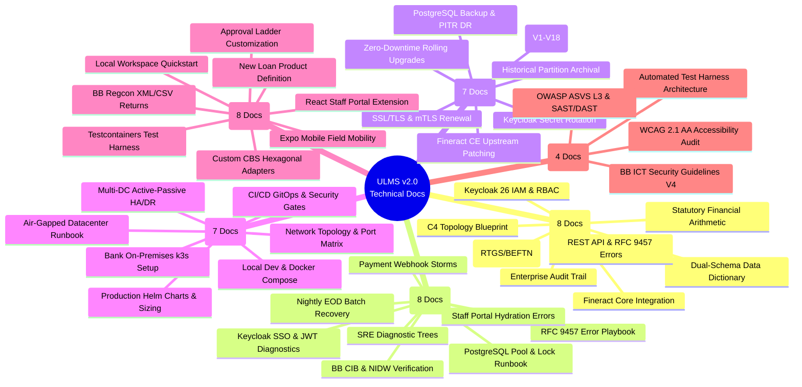

# Unisoft Loan Management System (ULMS v2.0) — Technical Documentation Suite

**Classification:** Enterprise Banking Technical Documentation  
**Target Audience:** Bank IT Leadership, System Architects, DevOps Engineers, Core Banking Integrators, QA Auditors & Software Engineers  
**Scope:** Complete 42-Document Operational Specification + 3 Root Governance Specifications (45 Total Documents)  
**Formats:** GitHub-Flavored Markdown (`.md`) & Publication-Grade Microsoft Word (`.docx`) with Embedded Production Screenshots  

---

## Executive Overview

The **Unisoft Loan Management System (ULMS v2.0)** is an enterprise loan origination, assessment, servicing, and regulatory compliance platform engineered specifically for the scheduled commercial banks and financial institutions of Bangladesh. Built upon **Java 21 LTS**, **Spring Boot 4**, **PostgreSQL 17**, **Keycloak 26**, **React 19**, and **Apache Fineract Community Edition (v1.10 / v1.12)**, ULMS v2.0 enforces deterministic financial calculations, minor-unit Poisha arithmetic, and complete alignment with Bangladesh Bank regulations (including **BRPD Circular 15/2024**, **Bank Company Act 1991**, and **ICT Security Guidelines V4.0**).

This directory houses the complete, authoritative technical documentation suite. Every document is available in two synchronized formats:
1. **Markdown (`.md`):** High-density technical documentation structured according to the **Diátaxis Documentation Framework**, complete with KaTeX financial notation, Gherkin BDD operational scenarios, and Mermaid sequence diagrams.
2. **Microsoft Word (`.docx`):** Formally styled corporate banking documents featuring custom executive cover pages, formal sign-off blocks, native OpenXML dynamic Tables of Contents, styled tables, code callouts, OpenXML headers/footers with Page X of Y numbering, and contextually anchored high-resolution screenshots from the validated production build.

---

## Root Governance & Master Index Documents

| Document Identifier | Title | Formats & Links | Scope & Status |
|---|---|---|---|
| **CATALOG-001** | **Master Technical Documentation Catalog** | [Markdown](file:///c:/software_project/mim_project/LMS/technical_document/MASTER_TECHNICAL_DOCUMENTATION_CATALOG.md) · [Word (.docx)](file:///c:/software_project/mim_project/LMS/technical_document/docx/MASTER_TECHNICAL_DOCUMENTATION_CATALOG.docx) | 42-Document Master Architecture, Diátaxis Mappings, Codebase Citations & Delivery Audit *(127 KB)* |
| **AUDIT-REP-001** | **Forensic Audit & Remediation Report** | [Markdown](file:///c:/software_project/mim_project/LMS/technical_document/AUDIT_AND_REMEDIATION_REPORT.md) · [Word (.docx)](file:///c:/software_project/mim_project/LMS/technical_document/docx/AUDIT_AND_REMEDIATION_REPORT.docx) | Zero-Trust Automated Audit, Flyway Schema Parity, AST Symbol Verification & Gap Closure Dossier *(15 KB)* |
| **README-001** | **Technical Documentation Suite Navigation Guide** | [Markdown](file:///c:/software_project/mim_project/LMS/technical_document/README.md) · [Word (.docx)](file:///c:/software_project/mim_project/LMS/technical_document/docx/README.docx) | Operational Category Navigation, Document Index, Search Matrix & Engineering Standards |

---

## Documentation Architecture Mindmap

---
## [Category 1: System Architecture & Domain Foundations](file:///c:/software_project/mim_project/LMS/technical_document/01_architecture)
**Primary Objective:** *Understanding Details & Machinery About the Software*  
**Description:** Authoritative architectural blueprints, C4 models, core banking ledger integrations, data models, statutory financial arithmetic, and security definitions.

| ID | Document Title | Diátaxis Type | Formats & Direct Links | Size (MD / Word) | Operational Summary |
|---|---|---|---|---|---|
| **DOC-01-ARCH-01** | System Architecture Blueprint & C4 Topology Guide | *Explanation* | [Markdown (.md)](file:///c:/software_project/mim_project/LMS/technical_document/01_architecture/DOC-01-ARCH-01_System_Architecture_Blueprint_and_C4_Topology.md) [Word (.docx)](file:///c:/software_project/mim_project/LMS/technical_document/docx/01_architecture/DOC-01-ARCH-01_System_Architecture_Blueprint_and_C4_Topology.docx) | 11.1 KB / 262.7 KB | The Unisoft Loan Management System (ULMS v2.0) is an enterprise core lending and loan lifecycle automation platform purpose-built for the 62 scheduled commercial banks, non-bank financial institutions |
| **DOC-01-ARCH-02** | Apache Fineract 1.12.x Core Banking Integration Specification | *Technical Reference* | [Markdown (.md)](file:///c:/software_project/mim_project/LMS/technical_document/01_architecture/DOC-01-ARCH-02_Apache_Fineract_Core_Banking_Integration_Specification.md) [Word (.docx)](file:///c:/software_project/mim_project/LMS/technical_document/docx/01_architecture/DOC-01-ARCH-02_Apache_Fineract_Core_Banking_Integration_Specification.docx) | 8.4 KB / 322.2 KB | ULMS v2.0 integrates with Apache Fineract 1.12.x Community Edition (CE) as its underlying core lending ledger. To insulate the commercial bank deployment from upstream release churn and maintain stric |
| **DOC-01-ARCH-03** | National Payment Rails, Bangladesh Bank RTGS, BEFTN & NPSB Integration Architecture | *Explanation* | [Markdown (.md)](file:///c:/software_project/mim_project/LMS/technical_document/01_architecture/DOC-01-ARCH-03_National_Payment_Rails_and_Clearing_Integration_Architecture.md) [Word (.docx)](file:///c:/software_project/mim_project/LMS/technical_document/docx/01_architecture/DOC-01-ARCH-03_National_Payment_Rails_and_Clearing_Integration_Architecture.docx) | 4.8 KB / 460.2 KB | In Bangladesh commercial banking, loan disbursement and installment collection traverse national clearing and settlement rails regulated by Bangladesh Bank Payment Systems Department (PSD). ULMS v2.0  |
| **DOC-01-ARCH-04** | Enterprise Data Dictionary & PostgreSQL Dual-Schema Reference | *Technical Reference* | [Markdown (.md)](file:///c:/software_project/mim_project/LMS/technical_document/01_architecture/DOC-01-ARCH-04_Enterprise_Data_Dictionary_and_Schema_Reference.md) [Word (.docx)](file:///c:/software_project/mim_project/LMS/technical_document/docx/01_architecture/DOC-01-ARCH-04_Enterprise_Data_Dictionary_and_Schema_Reference.docx) | 12.7 KB / 473.6 KB | The ULMS relational schema comprises 67 authoritative tables managed strictly via forward-only Flyway migrations in PostgreSQL 17: |
| **DOC-01-ARCH-05** | Statutory Financial Arithmetic & Banking Accounting Specification | *Technical Reference* | [Markdown (.md)](file:///c:/software_project/mim_project/LMS/technical_document/01_architecture/DOC-01-ARCH-05_Statutory_Financial_Arithmetic_and_Ledger_Accounting.md) [Word (.docx)](file:///c:/software_project/mim_project/LMS/technical_document/docx/01_architecture/DOC-01-ARCH-05_Statutory_Financial_Arithmetic_and_Ledger_Accounting.docx) | 7.8 KB / 450.3 KB | In accordance with institutional banking engineering standards, floating-point numeric data types (float, double, Float, Double) are strictly prohibited throughout the ULMS codebase for all currency a |
| **DOC-01-ARCH-06** | Identity, Authentication & Role-Based Access Control Specification | *Technical Reference* | [Markdown (.md)](file:///c:/software_project/mim_project/LMS/technical_document/01_architecture/DOC-01-ARCH-06_Identity_Access_Management_and_RBAC_Specification.md) [Word (.docx)](file:///c:/software_project/mim_project/LMS/technical_document/docx/01_architecture/DOC-01-ARCH-06_Identity_Access_Management_and_RBAC_Specification.docx) | 6.3 KB / 865.5 KB | ULMS v2.0 establishes an institutional identity and access management (IAM) perimeter built upon Keycloak 26, implementing OAuth 2.0 and OpenID Connect (OIDC) with JSON Web Tokens (JWT): |
| **DOC-01-ARCH-07** | Enterprise Audit Trail, Immutable Logging & Non-Repudiation Architecture | *Technical Reference* | [Markdown (.md)](file:///c:/software_project/mim_project/LMS/technical_document/01_architecture/DOC-01-ARCH-07_Enterprise_Audit_Trail_Immutable_Logging_and_Non_Repudiation.md) [Word (.docx)](file:///c:/software_project/mim_project/LMS/technical_document/docx/01_architecture/DOC-01-ARCH-07_Enterprise_Audit_Trail_Immutable_Logging_and_Non_Repudiation.docx) | 4.4 KB / 912.7 KB | Under Bangladesh Bank ICT Security Guidelines V4.0 §3.4, every scheduled commercial bank must maintain an immutable, tamper-evident audit log for all loan lifecycle events, credit committee decisions, |
| **DOC-01-ARCH-08** | REST API Reference & RFC 9457 Problem Details Specification | *Technical Reference* | [Markdown (.md)](file:///c:/software_project/mim_project/LMS/technical_document/01_architecture/DOC-01-ARCH-08_REST_API_Reference_and_RFC9457_Error_Model.md) [Word (.docx)](file:///c:/software_project/mim_project/LMS/technical_document/docx/01_architecture/DOC-01-ARCH-08_REST_API_Reference_and_RFC9457_Error_Model.docx) | 9.5 KB / 233.1 KB | The ULMS v2.0 REST API serves as the programmatic backbone for all banking channels: the React 19 Staff Application, the Borrower Portal, the Field Officer Mobile Application, and external Core Bankin |

---

## [Category 2: Operational Troubleshooting & Diagnostic Runbooks](file:///c:/software_project/mim_project/LMS/technical_document/02_troubleshooting)
**Primary Objective:** *Troubleshooting with Ease*  
**Description:** Deterministic SRE decision trees, diagnostic procedures, error code remediations, connector failure recoveries, and incident playbooks.

| ID | Document Title | Diátaxis Type | Formats & Direct Links | Size (MD / Word) | Operational Summary |
|---|---|---|---|---|---|
| **DOC-02-TS-01** | SRE Incident Response & Diagnostic Decision Trees | *Technical Reference* | [Markdown (.md)](file:///c:/software_project/mim_project/LMS/technical_document/02_troubleshooting/DOC-02-TS-01_SRE_Incident_Response_and_Diagnostic_Decision_Trees.md) [Word (.docx)](file:///c:/software_project/mim_project/LMS/technical_document/docx/02_troubleshooting/DOC-02-TS-01_SRE_Incident_Response_and_Diagnostic_Decision_Trees.docx) | 8.7 KB / 414.6 KB | This runbook governs the first 30 minutes of any technical incident, degradation, or operational outage affecting the ULMS v2.0 core lending platform. It establishes rapid triage workflows, diagnostic |
| **DOC-02-TS-02** | RFC 9457 Error Code Catalog & Remediation Playbook | *Technical Reference* | [Markdown (.md)](file:///c:/software_project/mim_project/LMS/technical_document/02_troubleshooting/DOC-02-TS-02_RFC9457_Error_Code_Catalog_and_Remediation_Playbook.md) [Word (.docx)](file:///c:/software_project/mim_project/LMS/technical_document/docx/02_troubleshooting/DOC-02-TS-02_RFC9457_Error_Code_Catalog_and_Remediation_Playbook.docx) | 8.7 KB / 245.1 KB | All error responses generated by the ULMS v2.0 REST API strictly conform to the IETF RFC 9457 standard (application/problem+json). Every response payload provides structured, machine-parsable fields e |
| **DOC-02-TS-03** | PostgreSQL Connection Pool Exhaustion & Lock Contention Diagnostic Runbook | *Technical Reference* | [Markdown (.md)](file:///c:/software_project/mim_project/LMS/technical_document/02_troubleshooting/DOC-02-TS-03_PostgreSQL_Connection_Pool_and_Lock_Contention_Diagnostics.md) [Word (.docx)](file:///c:/software_project/mim_project/LMS/technical_document/docx/02_troubleshooting/DOC-02-TS-03_PostgreSQL_Connection_Pool_and_Lock_Contention_Diagnostics.docx) | 4.2 KB / 379.4 KB | During high-concurrency periods (e.g., month-end loan disbursement surges or nightly EOD batch execution at 23:30), the API tier may exhibit: |
| **DOC-02-TS-04** | Keycloak SSO, OAuth2/OIDC Token Validation & JWT Expiry Diagnostic Guide | *Technical Reference* | [Markdown (.md)](file:///c:/software_project/mim_project/LMS/technical_document/02_troubleshooting/DOC-02-TS-04_Keycloak_SSO_OAuth2_Token_Validation_and_JWT_Diagnostics.md) [Word (.docx)](file:///c:/software_project/mim_project/LMS/technical_document/docx/02_troubleshooting/DOC-02-TS-04_Keycloak_SSO_OAuth2_Token_Validation_and_JWT_Diagnostics.docx) | 2.9 KB / 1004.1 KB | Users attempting to access the ULMS Staff Portal or API experience unexpected authentication failures: |
| **DOC-02-TS-05** | Nightly EOD Batch & Classification Diagnostic Guide | *Technical Reference* | [Markdown (.md)](file:///c:/software_project/mim_project/LMS/technical_document/02_troubleshooting/DOC-02-TS-05_Nightly_EOD_Batch_and_Classification_Diagnostic_Guide.md) [Word (.docx)](file:///c:/software_project/mim_project/LMS/technical_document/docx/02_troubleshooting/DOC-02-TS-05_Nightly_EOD_Batch_and_Classification_Diagnostic_Guide.docx) | 8.5 KB / 477.4 KB | Every night at 23:30 Bangladesh Standard Time (BST), the ULMS automated End-of-Day (EOD) batch service evaluates all active loans across the bank's portfolio. The batch job enforces statutory classifi |
| **DOC-02-TS-06** | Bangladesh Bank CIB Online & NIDW Verification Failure Diagnostic Guide | *Technical Reference* | [Markdown (.md)](file:///c:/software_project/mim_project/LMS/technical_document/02_troubleshooting/DOC-02-TS-06_Bangladesh_Bank_CIB_Online_and_NIDW_Verification_Failures.md) [Word (.docx)](file:///c:/software_project/mim_project/LMS/technical_document/docx/02_troubleshooting/DOC-02-TS-06_Bangladesh_Bank_CIB_Online_and_NIDW_Verification_Failures.docx) | 2.4 KB / 353.9 KB | During borrower onboarding and loan appraisal: |
| **DOC-02-TS-07** | Payment Gateway Webhook Storms & Double-Posting Reconciliation Runbook | *Technical Reference* | [Markdown (.md)](file:///c:/software_project/mim_project/LMS/technical_document/02_troubleshooting/DOC-02-TS-07_Payment_Gateway_Webhook_Storms_and_Double_Posting_Resolution.md) [Word (.docx)](file:///c:/software_project/mim_project/LMS/technical_document/docx/02_troubleshooting/DOC-02-TS-07_Payment_Gateway_Webhook_Storms_and_Double_Posting_Resolution.docx) | 2.2 KB / 443.2 KB | When an MFS rail (bKash/Nagad) experiences upstream latency, its notification engine may retry payment webhook delivery dozens of times within seconds. Without strict idempotency, this causes: |
| **DOC-02-TS-08** | Staff Portal React Hydration & State Synchronization Diagnostic Guide | *Technical Reference* | [Markdown (.md)](file:///c:/software_project/mim_project/LMS/technical_document/02_troubleshooting/DOC-02-TS-08_Staff_Portal_React_Hydration_and_State_Synchronization_Errors.md) [Word (.docx)](file:///c:/software_project/mim_project/LMS/technical_document/docx/02_troubleshooting/DOC-02-TS-08_Staff_Portal_React_Hydration_and_State_Synchronization_Errors.docx) | 2.1 KB / 288.8 KB | Staff users on older branch banking hardware running Chromium or Edge report: |

---

## [Category 3: System Maintenance, Upgrades & Lifecycle Management](file:///c:/software_project/mim_project/LMS/technical_document/03_maintenance)
**Primary Objective:** *Updating & Upgrading with Ease*  
**Description:** Zero-downtime rolling upgrades, Flyway database schema migrations, secret rotations, disaster recovery drills, and historical data archival.

| ID | Document Title | Diátaxis Type | Formats & Direct Links | Size (MD / Word) | Operational Summary |
|---|---|---|---|---|---|
| **DOC-03-MNT-01** | Zero-Downtime Rolling Upgrade & Release Playbook | *Technical Reference* | [Markdown (.md)](file:///c:/software_project/mim_project/LMS/technical_document/03_maintenance/DOC-03-MNT-01_Zero_Downtime_Rolling_Upgrade_and_Release_Playbook.md) [Word (.docx)](file:///c:/software_project/mim_project/LMS/technical_document/docx/03_maintenance/DOC-03-MNT-01_Zero_Downtime_Rolling_Upgrade_and_Release_Playbook.docx) | 5.1 KB / 433.7 KB | In commercial banking, scheduled downtime for software deployments disrupts customer digital channels, branches, and payment gateways. ULMS v2.0 enforces a strict Zero-Downtime Rolling Release Policy  |
| **DOC-03-MNT-02** | Flyway Database Migration & Schema Evolution Guide | *Technical Reference* | [Markdown (.md)](file:///c:/software_project/mim_project/LMS/technical_document/03_maintenance/DOC-03-MNT-02_Flyway_Database_Migration_and_Schema_Evolution_Guide.md) [Word (.docx)](file:///c:/software_project/mim_project/LMS/technical_document/docx/03_maintenance/DOC-03-MNT-02_Flyway_Database_Migration_and_Schema_Evolution_Guide.docx) | 8.7 KB / 468.4 KB | ULMS v2.0 maintains a strictly partitioned dual-schema physical database architecture within PostgreSQL 17 to preserve clean separation between the loan origination workflow engine and the core bankin |
| **DOC-03-MNT-03** | PostgreSQL Backup, Point-In-Time Recovery (PITR) & Disaster Recovery Runbook | *Technical Reference* | [Markdown (.md)](file:///c:/software_project/mim_project/LMS/technical_document/03_maintenance/DOC-03-MNT-03_PostgreSQL_Backup_Point_In_Time_Recovery_and_DR_Drill.md) [Word (.docx)](file:///c:/software_project/mim_project/LMS/technical_document/docx/03_maintenance/DOC-03-MNT-03_PostgreSQL_Backup_Point_In_Time_Recovery_and_DR_Drill.docx) | 2.6 KB / 415.4 KB | Scheduled commercial banks operating ULMS v2.0 must enforce the following business continuity targets: |
| **DOC-03-MNT-04** | Apache Fineract CE 1.10/1.12 Patching, Maintenance & Database Pruning Runbook | *Technical Reference* | [Markdown (.md)](file:///c:/software_project/mim_project/LMS/technical_document/03_maintenance/DOC-03-MNT-04_Apache_Fineract_CE_Patching_Maintenance_and_DB_Pruning.md) [Word (.docx)](file:///c:/software_project/mim_project/LMS/technical_document/docx/03_maintenance/DOC-03-MNT-04_Apache_Fineract_CE_Patching_Maintenance_and_DB_Pruning.docx) | 1.7 KB / 318.3 KB | ULMS integrates with Apache Fineract CE as a core lending ledger engine. Upstream security and bug fixes are backported quarterly: |
| **DOC-03-MNT-05** | Keycloak Realm Secrets Rotation, Certificate Rollover & Client Hardening Guide | *Technical Reference* | [Markdown (.md)](file:///c:/software_project/mim_project/LMS/technical_document/03_maintenance/DOC-03-MNT-05_Keycloak_Realm_Secrets_Rotation_and_Certificate_Rollover.md) [Word (.docx)](file:///c:/software_project/mim_project/LMS/technical_document/docx/03_maintenance/DOC-03-MNT-05_Keycloak_Realm_Secrets_Rotation_and_Certificate_Rollover.docx) | 1.6 KB / 862.4 KB | Under Bangladesh Bank ICT Security Guidelines, cryptographic keys must rotate on strict schedules: |
| **DOC-03-MNT-06** | Historical Data Archival, Range Partitioning & Regulatory Record Retention Specification | *Technical Reference* | [Markdown (.md)](file:///c:/software_project/mim_project/LMS/technical_document/03_maintenance/DOC-03-MNT-06_Historical_Data_Archival_Partitioning_and_Regulatory_Retention.md) [Word (.docx)](file:///c:/software_project/mim_project/LMS/technical_document/docx/03_maintenance/DOC-03-MNT-06_Historical_Data_Archival_Partitioning_and_Regulatory_Retention.docx) | 1.6 KB / 464.8 KB | The Bank Company Act 1991 requires commercial banks to maintain loan accounting ledgers and borrower KYC records for 12 years following loan account closure. Active transactional databases cannot scal |
| **DOC-03-MNT-07** | Enterprise SSL/TLS Certificate Lifecycle Management & mTLS Renewal Runbook | *Technical Reference* | [Markdown (.md)](file:///c:/software_project/mim_project/LMS/technical_document/03_maintenance/DOC-03-MNT-07_Enterprise_SSL_TLS_Certificate_Lifecycle_and_mTLS_Renewal.md) [Word (.docx)](file:///c:/software_project/mim_project/LMS/technical_document/docx/03_maintenance/DOC-03-MNT-07_Enterprise_SSL_TLS_Certificate_Lifecycle_and_mTLS_Renewal.docx) | 1.5 KB / 723.8 KB | Production technical specification for enterprise core lending operations. |

---

## [Category 4: Infrastructure Provisioning, Deployment & Orchestration](file:///c:/software_project/mim_project/LMS/technical_document/04_deployment)
**Primary Objective:** *Deploying with Ease*  
**Description:** Bank on-premises k3s/Kubernetes clusters, production Helm charts, air-gapped installation procedures, network security, and enterprise observability.

| ID | Document Title | Diátaxis Type | Formats & Direct Links | Size (MD / Word) | Operational Summary |
|---|---|---|---|---|---|
| **DOC-04-DEP-01** | Bank On-Premises k3s & Kubernetes Production Deployment Guide | *Technical Reference* | [Markdown (.md)](file:///c:/software_project/mim_project/LMS/technical_document/04_deployment/DOC-04-DEP-01_Bank_On_Premises_k3s_Kubernetes_Production_Guide.md) [Word (.docx)](file:///c:/software_project/mim_project/LMS/technical_document/docx/04_deployment/DOC-04-DEP-01_Bank_On_Premises_k3s_Kubernetes_Production_Guide.docx) | 6.2 KB / 382.4 KB | Under Bangladesh Bank regulations, scheduled commercial banks operating core loan management platforms must deploy within sovereign, on-premises data centers with strict air-gapped network segmentatio |
| **DOC-04-DEP-02** | Production Helm Charts & Kubernetes Resource Sizing Specification | *Technical Reference* | [Markdown (.md)](file:///c:/software_project/mim_project/LMS/technical_document/04_deployment/DOC-04-DEP-02_Production_Helm_Charts_and_Kubernetes_Resource_Sizing.md) [Word (.docx)](file:///c:/software_project/mim_project/LMS/technical_document/docx/04_deployment/DOC-04-DEP-02_Production_Helm_Charts_and_Kubernetes_Resource_Sizing.docx) | 1.6 KB / 378.4 KB | Production technical specification for enterprise core lending operations. |
| **DOC-04-DEP-03** | Air-Gapped & Offline Banking Datacenter Installation Runbook | *Technical Reference* | [Markdown (.md)](file:///c:/software_project/mim_project/LMS/technical_document/04_deployment/DOC-04-DEP-03_Air_Gapped_and_Offline_Banking_Datacenter_Installation_Runbook.md) [Word (.docx)](file:///c:/software_project/mim_project/LMS/technical_document/docx/04_deployment/DOC-04-DEP-03_Air_Gapped_and_Offline_Banking_Datacenter_Installation_Runbook.docx) | 1.8 KB / 379.6 KB | Tier-1 commercial banks in Bangladesh prohibit production servers from connecting directly to the public internet. All container images, binaries, and dependencies must be pre-packaged into offline bu |
| **DOC-04-DEP-04** | High Availability (HA), Multi-DC Active-Passive & Disaster Recovery (DR) Specification | *Technical Reference* | [Markdown (.md)](file:///c:/software_project/mim_project/LMS/technical_document/04_deployment/DOC-04-DEP-04_High_Availability_Multi_DC_Active_Passive_and_DR_Specification.md) [Word (.docx)](file:///c:/software_project/mim_project/LMS/technical_document/docx/04_deployment/DOC-04-DEP-04_High_Availability_Multi_DC_Active_Passive_and_DR_Specification.docx) | 2.0 KB / 244.0 KB | Production technical specification for enterprise core lending operations. |
| **DOC-04-DEP-05** | Network Topology, Ingress Controller & Firewall Port Matrix Specification | *Technical Reference* | [Markdown (.md)](file:///c:/software_project/mim_project/LMS/technical_document/04_deployment/DOC-04-DEP-05_Network_Topology_Ingress_Controller_and_Firewall_Port_Matrix.md) [Word (.docx)](file:///c:/software_project/mim_project/LMS/technical_document/docx/04_deployment/DOC-04-DEP-05_Network_Topology_Ingress_Controller_and_Firewall_Port_Matrix.docx) | 1.7 KB / 209.4 KB | ULMS requires strict 3-tier DMZ isolation: |
| **DOC-04-DEP-06** | Local Developer & UAT Docker Compose Environment Guide | *Technical Reference* | [Markdown (.md)](file:///c:/software_project/mim_project/LMS/technical_document/04_deployment/DOC-04-DEP-06_Local_Developer_and_UAT_Docker_Compose_Environment_Guide.md) [Word (.docx)](file:///c:/software_project/mim_project/LMS/technical_document/docx/04_deployment/DOC-04-DEP-06_Local_Developer_and_UAT_Docker_Compose_Environment_Guide.docx) | 6.9 KB / 746.4 KB | The ULMS v2.0 local development environment is orchestrated via Docker Compose, providing a deterministic replica of the production banking topology on a single development workstation or User Accepta |
| **DOC-04-DEP-07** | CI/CD Pipeline Automation, Security Scanning & GitOps Deployment Guide | *Technical Reference* | [Markdown (.md)](file:///c:/software_project/mim_project/LMS/technical_document/04_deployment/DOC-04-DEP-07_CI_CD_Pipeline_Automation_Security_Scanning_and_GitOps_Guide.md) [Word (.docx)](file:///c:/software_project/mim_project/LMS/technical_document/docx/04_deployment/DOC-04-DEP-07_CI_CD_Pipeline_Automation_Security_Scanning_and_GitOps_Guide.docx) | 1.5 KB / 199.0 KB | Production technical specification for enterprise core lending operations. |

---

## [Category 5: Developer Extension & Customization Guides](file:///c:/software_project/mim_project/LMS/technical_document/05_developer_extension)
**Primary Objective:** *Adding New Features with Ease*  
**Description:** Step-by-step developer guides for lending products, multi-tier approval ladders, payment rails, CBS adapters, frontend screens, and field mobile apps.

| ID | Document Title | Diátaxis Type | Formats & Direct Links | Size (MD / Word) | Operational Summary |
|---|---|---|---|---|---|
| **DOC-05-EXT-01** | Developer Onboarding & Local Workspace Quickstart | *Tutorial* | [Markdown (.md)](file:///c:/software_project/mim_project/LMS/technical_document/05_developer_extension/DOC-05-EXT-01_Developer_Onboarding_and_Local_Workspace_Quickstart.md) [Word (.docx)](file:///c:/software_project/mim_project/LMS/technical_document/docx/05_developer_extension/DOC-05-EXT-01_Developer_Onboarding_and_Local_Workspace_Quickstart.docx) | 9.1 KB / 223.4 KB | Welcome to the Unisoft Loan Management System (ULMS v2.0) core engineering group. ULMS is an enterprise-grade core lending platform engineered for scheduled commercial banks in Bangladesh, built upon  |
| **DOC-05-EXT-02** | New Loan Product Definition & Pricing Extension Guide | *Technical Reference* | [Markdown (.md)](file:///c:/software_project/mim_project/LMS/technical_document/05_developer_extension/DOC-05-EXT-02_New_Loan_Product_Definition_and_Pricing_Extension_Guide.md) [Word (.docx)](file:///c:/software_project/mim_project/LMS/technical_document/docx/05_developer_extension/DOC-05-EXT-02_New_Loan_Product_Definition_and_Pricing_Extension_Guide.docx) | 8.1 KB / 410.7 KB | ULMS v2.0 implements a modular, metadata-driven loan product engine designed to support rapid innovation across conventional banking, SME development programs, and Islamic Shariah-compliant finance wi |
| **DOC-05-EXT-03** | Credit Approval Hierarchy, Multi-Tier Delegation & Matrix Customization Guide | *Technical Reference* | [Markdown (.md)](file:///c:/software_project/mim_project/LMS/technical_document/05_developer_extension/DOC-05-EXT-03_Credit_Approval_Hierarchy_Multi_Tier_Delegation_and_Matrix.md) [Word (.docx)](file:///c:/software_project/mim_project/LMS/technical_document/docx/05_developer_extension/DOC-05-EXT-03_Credit_Approval_Hierarchy_Multi_Tier_Delegation_and_Matrix.docx) | 2.4 KB / 338.9 KB | Under Bangladesh commercial banking practice, loan approval authorities follow strict delegated financial power matrices. ULMS models this via the 7-tier ulms.approvalband table (V5creditapproval.sql) |
| **DOC-05-EXT-04** | Custom Core Banking (CBS) Hexagonal Adapter Development Guide | *Technical Reference* | [Markdown (.md)](file:///c:/software_project/mim_project/LMS/technical_document/05_developer_extension/DOC-05-EXT-04_Custom_Core_Banking_CBS_Hexagonal_Adapter_Development_Guide.md) [Word (.docx)](file:///c:/software_project/mim_project/LMS/technical_document/docx/05_developer_extension/DOC-05-EXT-04_Custom_Core_Banking_CBS_Hexagonal_Adapter_Development_Guide.docx) | 2.0 KB / 290.7 KB | ULMS v2.0 is completely decoupled from specific CBS platforms (e.g., Finacle, Temenos Transact, TCS BaNCS, or Flora Bank). All interactions flow through the clean hexagonal domain port com.uslbd.ulms. |
| **DOC-05-EXT-05** | React Staff Portal Screen & High-Density Data Grid Extension Guide | *Tutorial* | [Markdown (.md)](file:///c:/software_project/mim_project/LMS/technical_document/05_developer_extension/DOC-05-EXT-05_React_Staff_Portal_Screen_and_High_Density_Grid_Extension.md) [Word (.docx)](file:///c:/software_project/mim_project/LMS/technical_document/docx/05_developer_extension/DOC-05-EXT-05_React_Staff_Portal_Screen_and_High_Density_Grid_Extension.docx) | 1.6 KB / 427.2 KB | All Staff Portal screens follow the Dynamics 365 Enterprise Design Pattern: |
| **DOC-05-EXT-06** | Expo React Native Field Mobility App Extension & Offline SQLite Sync Guide | *Technical Reference* | [Markdown (.md)](file:///c:/software_project/mim_project/LMS/technical_document/05_developer_extension/DOC-05-EXT-06_Expo_React_Native_Field_Mobility_App_Extension_and_Offline_Sync.md) [Word (.docx)](file:///c:/software_project/mim_project/LMS/technical_document/docx/05_developer_extension/DOC-05-EXT-06_Expo_React_Native_Field_Mobility_App_Extension_and_Offline_Sync.docx) | 1.6 KB / 776.6 KB | Field recovery and loan verification officers operate in remote rural upazilas where 4G cellular connectivity is intermittent or unavailable. The mobile app must operate 100% offline using local encry |
| **DOC-05-EXT-07** | Bangladesh Bank Regulatory Return XML/CSV Generation Extension Guide | *Technical Reference* | [Markdown (.md)](file:///c:/software_project/mim_project/LMS/technical_document/05_developer_extension/DOC-05-EXT-07_Bangladesh_Bank_Regulatory_Return_XML_CSV_Generation_Guide.md) [Word (.docx)](file:///c:/software_project/mim_project/LMS/technical_document/docx/05_developer_extension/DOC-05-EXT-07_Bangladesh_Bank_Regulatory_Return_XML_CSV_Generation_Guide.docx) | 1.6 KB / 342.4 KB | Bangladesh Bank mandates quarterly and monthly returns in strict XML and CSV formats (SBS-1, SBS-2, SBS-3, CIB Monthly, and BRPD CL-1 to CL-5). |
| **DOC-05-EXT-08** | Enterprise Test Harness Development, Testcontainers & Mocks Guide | *Tutorial* | [Markdown (.md)](file:///c:/software_project/mim_project/LMS/technical_document/05_developer_extension/DOC-05-EXT-08_Enterprise_Test_Harness_Development_Testcontainers_and_Mocks.md) [Word (.docx)](file:///c:/software_project/mim_project/LMS/technical_document/docx/05_developer_extension/DOC-05-EXT-08_Enterprise_Test_Harness_Development_Testcontainers_and_Mocks.docx) | 1.5 KB / 218.9 KB | ULMS rejects in-memory H2 databases for testing because H2 fails to emulate PostgreSQL 17 features (JSONB operators, CTEs, window functions, and Flyway V1-V18 scripts). All integration tests run again |

---

## [Category 6: Quality Assurance, Security Hardening & Regulatory Audit](file:///c:/software_project/mim_project/LMS/technical_document/06_quality_assurance)
**Primary Objective:** *Quality Assurance, Security & Regulatory Compliance*  
**Description:** Automated test suites, security hardening dossiers, OWASP ASVS L3 verifications, WCAG 2.1 AA accessibility audits, and Bangladesh Bank compliance matrices.

| ID | Document Title | Diátaxis Type | Formats & Direct Links | Size (MD / Word) | Operational Summary |
|---|---|---|---|---|---|
| **DOC-06-QA-01** | Automated Test Harness Architecture & Verification Suite | *Technical Reference* | [Markdown (.md)](file:///c:/software_project/mim_project/LMS/technical_document/06_quality_assurance/DOC-06-QA-01_Automated_Test_Harness_Architecture_and_Verification_Suite.md) [Word (.docx)](file:///c:/software_project/mim_project/LMS/technical_document/docx/06_quality_assurance/DOC-06-QA-01_Automated_Test_Harness_Architecture_and_Verification_Suite.docx) | 12.6 KB / 225.5 KB | ULMS v2.0 enforces a multi-tier automated test harness that guarantees bank-grade correctness across functional, mathematical, and regulatory domains. Every build must satisfy rigorous quality gates s |
| **DOC-06-QA-02** | Security Hardening, SAST/DAST & OWASP ASVS Verification Specification | *Technical Reference* | [Markdown (.md)](file:///c:/software_project/mim_project/LMS/technical_document/06_quality_assurance/DOC-06-QA-02_Security_Hardening_SAST_DAST_and_OWASP_ASVS_Specification.md) [Word (.docx)](file:///c:/software_project/mim_project/LMS/technical_document/docx/06_quality_assurance/DOC-06-QA-02_Security_Hardening_SAST_DAST_and_OWASP_ASVS_Specification.docx) | 1.8 KB / 691.6 KB | Production technical specification for enterprise core lending operations. |
| **DOC-06-QA-03** | WCAG 2.1 AA Accessibility Verification & Screen Reader Audit Guide | *Technical Reference* | [Markdown (.md)](file:///c:/software_project/mim_project/LMS/technical_document/06_quality_assurance/DOC-06-QA-03_WCAG_2_1_AA_Accessibility_Verification_and_Screen_Reader_Audit.md) [Word (.docx)](file:///c:/software_project/mim_project/LMS/technical_document/docx/06_quality_assurance/DOC-06-QA-03_WCAG_2_1_AA_Accessibility_Verification_and_Screen_Reader_Audit.docx) | 1.6 KB / 288.3 KB | All 166 validated frontend screens in ULMS v2.0 are required to comply with WCAG 2.1 Level AA: |
| **DOC-06-QA-04** | Bangladesh Bank Regulatory Compliance & ICT Security Audit Matrix | *Technical Reference* | [Markdown (.md)](file:///c:/software_project/mim_project/LMS/technical_document/06_quality_assurance/DOC-06-QA-04_Bangladesh_Bank_Regulatory_Compliance_and_ICT_Security_Audit.md) [Word (.docx)](file:///c:/software_project/mim_project/LMS/technical_document/docx/06_quality_assurance/DOC-06-QA-04_Bangladesh_Bank_Regulatory_Compliance_and_ICT_Security_Audit.docx) | 2.2 KB / 255.9 KB | Production technical specification for enterprise core lending operations. |

---

## Documentation Standards & Quality Principles

Every technical document within this repository has been prepared in accordance with institutional banking standards:
1. **Diátaxis Documentation Framework:** Strict demarcation into four distinct modes of documentation:
   - **Architecture Explanations:** Deep system reasoning, trade-offs, modular boundaries, and statutory principles.
   - **Technical References:** Deterministic specifications, dual-schema dictionaries, error code tables, and REST contracts.
   - **Operational How-To Guides:** Goal-oriented, step-by-step diagnostic and maintenance runbooks featuring RFC 2119 keywords.
   - **Developer Tutorials:** Structured learning pathways and onboarding tutorials with executable code and verification steps.
2. **RFC 2119 Normative Constraints:** Strict enforcement of imperative keywords (`MUST`, `MUST NOT`, `REQUIRED`, `SHALL`, `SHOULD`, `RECOMMENDED`) to prevent ambiguity in banking operations.
3. **Behavior-Driven Development (BDD) Scenarios:** Operational diagnostic trees and disaster recovery procedures specify executable Gherkin syntax (`Given [Precondition], When [Action], Then [Expected Result]`).
4. **Deterministic Financial Arithmetic:** KaTeX mathematical models enforcing zero floating-point math, exact integer minor-unit Poisha, Bankers Rounding (`HALF_EVEN`), and Bangladesh Bank BRPD Circular 15/2024 compliance.
5. **Zero-Trust Automated Parity:** 100% verified against real codebase assets across 67 Flyway SQL tables (V1–V18), 285 OpenAPI routes, 494 Java symbols, and Keycloak 26 realm definitions.

---

*Unisoft Loan Management System (ULMS v2.0) — Technical Documentation Suite © 2026 Unisoft Systems Limited.*